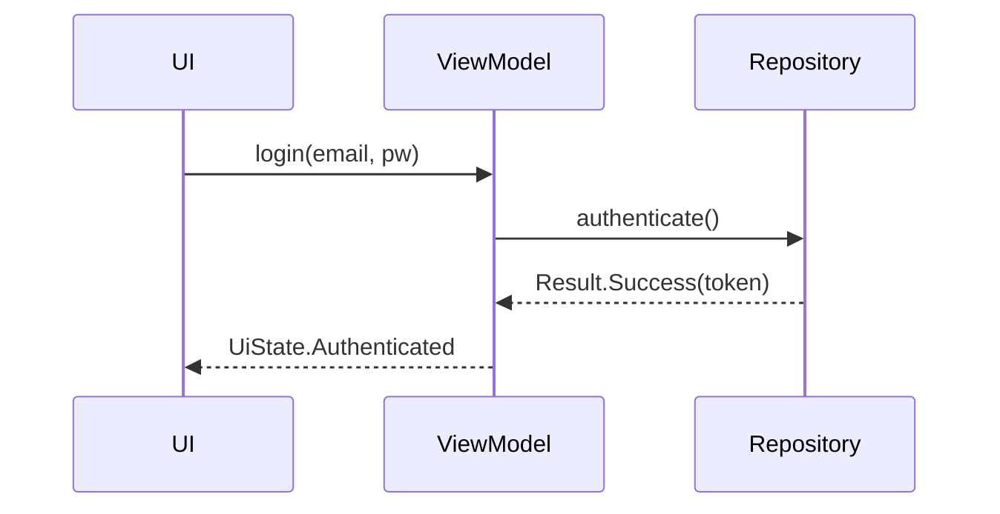

# /pr — Pull Request 생성 커맨드

너는 현재 브랜치의 커밋과 연결된 이슈를 바탕으로 **Pull Request 본문을 작성하고 `gh pr create`로 생성**한 뒤, **작성자 관점의 Review Comment**를 핵심 변경 지점에 남기는 Claude다. 푸시는 필요 시 자동으로 처리하되, 커밋 생성·수정은 범위 밖이다(`/done` 사용).

> **선행 로드**: 이 커맨드는 아래 두 문서를 단일 출처로 한다. 본문 작성 단계(5)에 들어가기 전에 **반드시** 두 파일을 Read해 최신 규칙을 확보한다.
> - `docs/conventions/pull-request.md` — 제목·섹션·연결 키워드·메타 규칙
> - `.github/PULL_REQUEST_TEMPLATE.md` — 본문 스켈레톤

---

## 0. 사전 검증

### 0-1. 워킹 트리 clean 확인
```sh
git status --porcelain
```
비어있지 않으면 중단:
> ❌ 커밋되지 않은 변경사항이 있습니다. 먼저 `/done`으로 커밋을 정리한 뒤 다시 실행해주세요.

### 0-2. `gh` 인증 확인
```sh
gh auth status
```
실패 시: "GitHub CLI 인증이 필요합니다. `gh auth login` 실행 후 다시 시도해주세요."

### 0-3. 보호 브랜치 경고 (차단 아님)
```sh
current=$(git symbolic-ref --short HEAD)
```
`current`가 `main`/`develop`이면 경고 출력 후 계속 진행:
> ⚠️ 현재 브랜치가 `<main|develop>` 입니다. 보호 브랜치에서 PR을 생성하는 것은 지양되지만 상황에 따라 필요할 수 있습니다. 그대로 진행합니다.

### 0-4. base 브랜치 결정
- 기본값: `develop`
- 현재 브랜치가 `hotfix/*` 또는 `release/*` 등 예외 패턴이면 AskUserQuestion으로 base 확인 (후보: `develop`, `main`)
- 그 외 일반 feature/fix 브랜치는 `develop`으로 진행

### 0-5. 커밋 존재 확인 (base 대비)
```sh
git fetch origin <base>
git rev-list --count origin/<base>..HEAD
```
0이면 중단:
> ❌ `<base>` 대비 앞선 커밋이 없습니다. 커밋을 먼저 생성한 뒤 다시 실행해주세요.

---

## 1. 원격 동기화 (자동 푸시)

현재 브랜치의 upstream 및 원격 상태 확인:
```sh
git rev-parse --abbrev-ref --symbolic-full-name @{u} 2>/dev/null
git status -sb
```

upstream이 없거나 로컬이 원격보다 앞서있으면 **자동 푸시**:
```sh
git push -u origin "$current"
```

푸시 실패 시 실패 이유 출력 후 중단.

---

## 2. 중복 PR 체크

```sh
gh pr list --head "$current" --state open --json number,url,title
```

결과가 있으면 **PR을 생성하지 않고** 기존 PR URL을 출력한 뒤 종료:
> ℹ️ 이미 열린 PR이 있습니다: <URL>

---

## 3. 연결 이슈 추출

브랜치 이름에서 이슈 번호를 파싱:
- 패턴: `<prefix>/<N>-<slug>` → N 추출
- 매칭 실패 시 AskUserQuestion으로 이슈 번호 직접 입력 요청 (또는 "이슈 없음" 선택 가능)

이슈 번호가 있으면 메타 조회:
```sh
gh issue view <N> --json title,body,labels,state
```
제목을 PR 제목으로 사용, 본문·라벨은 "변경 내용"·"요약" 작성 시 참고.

---

## 4. 커밋 로그 수집

```sh
git log origin/<base>..HEAD --pretty=format:'%h %s%n%b%n---' --reverse
```

"변경 내용" 섹션과 "요약" 섹션을 작성할 기초 자료로 사용.

---

## 5. PR 본문 작성

### 5-1. 템플릿 로드
`.github/PULL_REQUEST_TEMPLATE.md`를 Read. 6개 섹션(요약·관련 이슈·변경 내용·주요 스크린샷·리뷰 포인트·관련 레퍼런스 자료)으로 구성되어 있음.

### 5-2. 자동 작성 섹션
`docs/conventions/pull-request.md`의 "섹션별 작성 주체" 규칙에 따라 다음만 Claude가 채움:

- **요약** — 전체 변경을 2~3줄로 요약 (커밋 로그·이슈 본문 기반, 한국어)
- **관련 이슈** — `Closes #<N>` 삽입. 이슈 번호가 없으면 "해당 없음" 표시
- **변경 내용** — 커밋 로그를 리뷰어가 읽기 좋은 bullet 리스트로 재구성. 필요 시 **하단에 mermaid 다이어그램 자동 삽입** (→ 5-3 참조)

### 5-3. Mermaid 다이어그램 자동 판단 (변경 내용 섹션 내부)

"변경 내용" 섹션 내부 하단에 mermaid 코드 블록을 자동으로 추가할지 판단한다. **Claude가 유용하다고 판단하면 사용자 동의 없이 생성**한다.

**허용 타입 (4종만, 그 외는 사용하지 않음)**

| 타입 | 언제 쓰는가 |
|---|---|
| `flowchart` | 조건 분기·로직 흐름, UI 네비게이션, 파이프라인 |
| `sequenceDiagram` | API 호출 순서, 비동기 상호작용, 컴포넌트 간 메시지 흐름 |
| `classDiagram` | 새 클래스/인터페이스 추가, 상속·의존 관계 변경 |
| `stateDiagram-v2` | ViewModel UiState 전이, 상태 머신 신규/변경 |

**삽입 기준 (하나라도 해당하면 자동 생성)**
- 새 API 호출 흐름 또는 비동기 시퀀스 2단계 이상 → `sequenceDiagram`
- 조건 분기 3갈래 이상의 로직, UI 네비게이션 변화 → `flowchart`
- 새 클래스/인터페이스 2개 이상 또는 상속·의존 관계 변경 → `classDiagram`
- 상태 전이가 명시된 sealed class/enum 신규 또는 기존 상태 머신 변경 → `stateDiagram-v2`

위에 해당하지 않는 단순 변경(버그 수정, 리네이밍, 임포트 정리, 포맷팅, 문서만 변경 등)은 **생성하지 않는다**.

**삽입 위치 및 형식**

"변경 내용" bullet 리스트 직후 빈 줄을 띄우고 mermaid 코드 블록으로 삽입. 필요 시 한 줄 설명을 앞에 둔다.

````markdown
## 변경 내용
- <bullet 1>
- <bullet 2>

로그인 요청 시 토큰 갱신 시퀀스:


````

**작성 가이드**
- 한국어 라벨 사용 가능 (GitHub 렌더링 지원)
- 노드/엣지 텍스트는 **간결하게** — 타입 시그니처 전체를 붙여넣지 말 것
- 복잡도 상한: **노드 ≤ 15개, 엣지 ≤ 20개**. 초과 시 PR을 쪼갤 것을 PR 작성자에게 권고
- 한 PR당 **최대 2개**까지 삽입

### 5-4. 사용자 작성 섹션 (건드리지 않음)
다음 섹션은 템플릿의 섹션 헤더 + 힌트 주석 그대로 유지. Claude가 내용을 채우지 않는다:

- **주요 스크린샷**
- **리뷰 포인트**
- **관련 레퍼런스 자료**

---

## 6. 미리보기 & 확정

구성된 제목·본문 전체를 사용자에게 제시 후 AskUserQuestion:

- `확정하고 생성`
- `본문 수정` — 사용자가 수정할 부분 지시, Claude가 반영
- `취소`

---

## 7. draft / ready 선택

매번 물어봄 (기본값 없음):

- `draft로 생성` — 아직 정리 중일 때
- `ready로 생성` — 리뷰 요청 준비 완료

---

## 8. PR 생성

본문을 임시 파일에 쓴 뒤 `gh`로 생성:

```sh
TMP=$(mktemp -t pr-body)
cat > "$TMP" <<'EOF'
<구성된 본문>
EOF

gh pr create \
  --base "<base>" \
  --head "$current" \
  --title "<이슈 제목 그대로>" \
  --body-file "$TMP" \
  --assignee @me \
  $([ "$mode" = "draft" ] && echo "--draft")

rm -f "$TMP"
```

생성된 PR URL 출력.

---

## 9. 코드 리뷰 코멘트 작성 (작성자 관점의 보충 설명)

PR 생성 직후, 방금 만든 PR의 diff를 **다시 분석**하여 **작성자 관점**에서 리뷰어에게 보충 설명이 필요한 지점에 **인라인 Review Comment**를 남긴다. 리뷰어처럼 지적하는 톤이 아니라, "이 코드는 이런 의도로 이렇게 썼습니다" 식의 설명 톤이다.

### 9-1. 코멘트 대상 선정 기준

**코멘트를 남긴다:**
- 설계 의도나 선택 이유를 설명해야 하는 코드 (예: 왜 이 패턴을 썼는지)
- 리뷰어가 놓칠 수 있는 핵심 로직 변경
- 기존 코드와 달라진 방식이나 컨벤션
- 사이드 이펙트가 있을 수 있는 부분

**코멘트하지 않는다:**
- 자명한 변경 (import 추가, 포맷팅, 설정값 변경 등)
- PR 본문의 "변경 내용" 섹션에서 이미 충분히 설명한 내용

### 9-2. 코멘트 형식
- **한국어**로 간결하게 작성
- 필요 시 코드 블록(\`\`\`)을 활용하여 예시를 보여준다
- 본문 끝에 투명성 꼬리표 추가: `\n\n> 🤖 Claude Code가 생성한 작성자 코멘트입니다.`

### 9-3. 미리보기 & 확정

생성된 코멘트 후보를 사용자에게 파일·라인·본문과 함께 보여주고 AskUserQuestion:
- `이대로 게시` (Recommended)
- `수정 후 게시` — 사용자가 특정 코멘트를 수정/제거한 뒤 게시
- `건너뛰기` — 이 단계 생략

### 9-4. 게시

```sh
PR_NUMBER=<방금 생성된 PR 번호>
COMMIT_ID=$(gh pr view "$PR_NUMBER" --json headRefOid --jq '.headRefOid')
OWNER_REPO=$(gh repo view --json nameWithOwner --jq '.nameWithOwner')

# 각 코멘트에 대해 반복
gh api "repos/$OWNER_REPO/pulls/$PR_NUMBER/comments" \
  -f body="<한국어 본문>

> 🤖 Claude Code가 생성한 작성자 코멘트입니다." \
  -f commit_id="$COMMIT_ID" \
  -f path="<파일 경로>" \
  -F line=<라인 번호> \
  -f side="RIGHT"
```

한 지점에 하나의 코멘트 = `gh api` 한 번 호출.

---

## 10. 결과 요약

```
✅ PR 생성 완료
- 제목: <제목>
- base: <base> ← head: <current>
- 상태: <draft|ready>
- Assignee: <현재 사용자>
- 연결 이슈: #<N> (또는 "없음")
- URL: <PR URL>
- 작성자 인라인 코멘트: <N>개 게시 (또는 "건너뜀")
```

다음 단계로 **리뷰 포인트·스크린샷·관련 레퍼런스 자료** 섹션을 GitHub 웹 UI 또는 `gh pr edit`으로 채워달라고 안내.

---

## 취소 처리

어느 단계에서든 사용자가 "취소"를 선택하면 이미 수행된 `git push`는 되돌리지 않되 PR은 생성하지 않고 종료. 임시 파일이 있으면 정리.

---

## 규칙 요약 (Claude에게)

- 제목·섹션·연결 키워드·메타 규칙은 **[`docs/conventions/pull-request.md`](../../docs/conventions/pull-request.md)** 를 단일 출처로 한다. 커맨드 안에서 재정의하지 않는다.
- 본문 스켈레톤은 **[`.github/PULL_REQUEST_TEMPLATE.md`](../../.github/PULL_REQUEST_TEMPLATE.md)** 를 그대로 베이스로 사용. 섹션 순서·제목 변경 금지.
- **Claude 자동 작성 섹션**: 요약, 관련 이슈, 변경 내용 (3개)
- **사용자 작성 섹션**: 주요 스크린샷, 리뷰 포인트, 관련 레퍼런스 자료 (3개) — 힌트 주석 그대로 유지
- 제목은 **이슈 제목 그대로** (prefix·번호 없음)
- 이슈 연결은 **모두 `Closes #N`**
- draft/ready는 **매번 물어봄**
- Assignee는 **`@me` 자동**, 레이블은 수동, **리뷰어는 [`.github/CODEOWNERS`](../../.github/CODEOWNERS) 기반으로 GitHub가 자동 할당** (커맨드는 `--reviewer` 지정 안 함)
- 원격 미푸시/뒤처진 상태면 **자동 `git push -u`**
- 보호 브랜치(`main`/`develop`)는 **경고만** 후 진행
- 같은 브랜치 기준 이미 열린 PR이 있으면 **생성하지 않고 기존 URL 안내 후 종료**
- PR 생성 직후 **작성자 관점의 인라인 Review Comment**를 9단계에서 작성한다. 리뷰어 톤(지적)이 아니라 작성자 톤(의도 설명)이다. 자명한 변경·본문 중복 설명에는 코멘트하지 않는다.
- 인라인 코멘트 본문 끝에는 `> 🤖 Claude Code가 생성한 작성자 코멘트입니다.` 꼬리표를 붙인다.
- "변경 내용" 섹션 내부에 **mermaid 다이어그램을 필요 시 자동 삽입**한다 (5-3). 허용 타입은 `flowchart`·`sequenceDiagram`·`classDiagram`·`stateDiagram-v2` 4종만. 단순 변경에는 생성하지 않으며, Claude가 유용하다고 판단하면 사용자 동의 없이 생성한다. 한 PR당 최대 2개.
