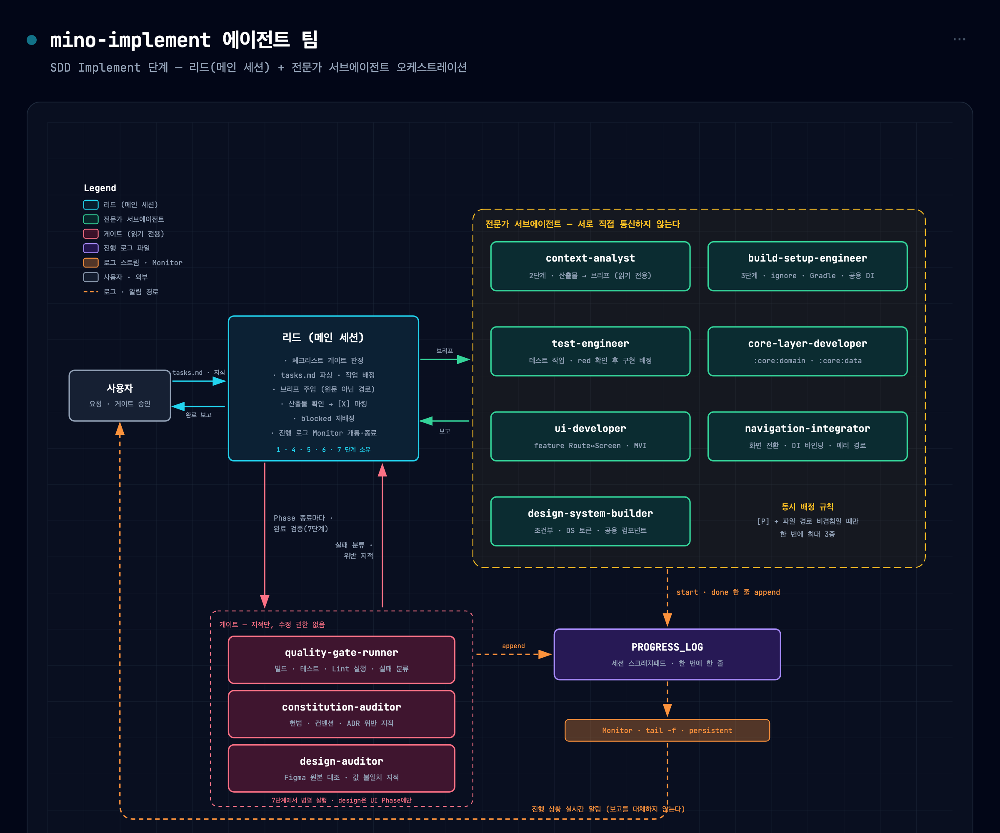
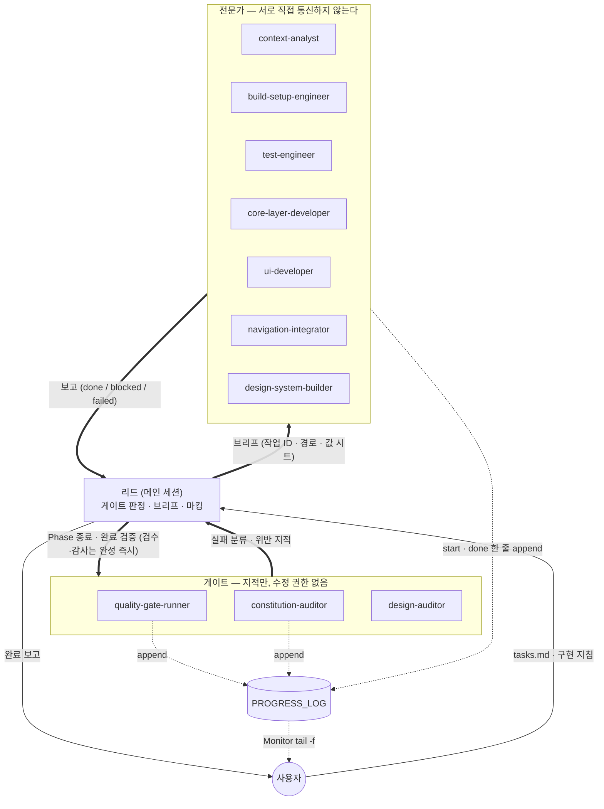
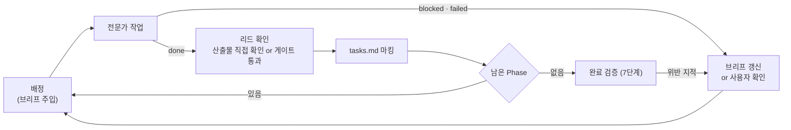

# mino-implement — SDD Implement 단계

## 입력

```text
$ARGUMENTS
```

진행하기 전에 사용자 입력을 **반드시** 고려해야 한다(비어 있지 않은 경우).

위 자리에 `$ARGUMENTS`가 문자 그대로 보이더라도, 그 내용은 **항상 이 대화 안에 있다** — 스킬을 호출한 사용자 메시지를 그대로 대상 지목으로 삼는다.
인자가 없으면 `docs/specs/` 하위 디렉터리 목록을 제시해 대상을 고르게 한다(`AskUserQuestion`). 고른 디렉터리가 `{SPEC_DIR}`이며, 이 스킬이 읽고 마킹하는 모든 경로의 기준이다.

## 범위 가드 (Scope Guard)

이 스킬의 작업 범위는 `{SPEC_DIR}/tasks.md`에 적힌 작업의 실행과 그 `[X]` 마킹으로 한정한다. 전문가에게 거는 제약(§에이전트 공통 계약)은 **리드에게도 그대로 적용된다.**

- `spec.md`·`plan.md`와 그 부속 산출물은 **고치지 않는다.** 구현이 명세와 어긋나면 코드를 고치거나 사용자에게 확인한다 — 실패한 작업을 통과시키려고 명세를 손대지 않는다.
- 규약 문서(`docs/conventions/`·`docs/architecture/`)와 헌법을 고치지 않는다.
- tasks.md에 없는 개선·리팩터링을 하지 않는다.
- 커밋은 실행하지 않는다([헌법](../../../docs/constitution.md) §에이전트 행동 규칙).

## 에이전트 팀

구현은 **리드(메인 세션) + 전문가 서브에이전트** 구조로 실행한다. 전문가끼리 직접 메시지를 주고받지 않는다 — 조율은 작업 배정 시점의 브리프와 완료 시점의 보고, 두 지점에서만 일어난다. 작업 중 전제가 깨지면 피어 협상이 아니라 리드에 `blocked`로 반환하고, 리드가 브리프를 갱신해 재배정한다([ADR 2026-08-09](../../../docs/adr/2026-08-09-implement-agent-orchestration.md)).



> 위 이미지는 [`agent-team.html`](agent-team.html)을 렌더링해 캡처한 것이다. 구조가 바뀌면 HTML을 고치고 다시 캡처한다.

<details>
<summary>구조도 원본 (mermaid)</summary>



</details>

리드가 도는 제어 루프. `[X]` 마킹은 이 루프의 확인 지점을 통과한 작업에만 붙는다:



| 에이전트 | 담당 단계 |
|---|---|
| **리드**(메인 세션) | 1 · 4 · 5 · 6 · 7 |
| `context-analyst` | 2 |
| `build-setup-engineer` | 3 · 셋업 Phase |
| `test-engineer` | 각 Phase의 테스트 작업 |
| `core-layer-developer` | 각 Phase의 구현 작업 |
| `ui-developer` | 각 Phase의 구현 작업 |
| `navigation-integrator` | 각 Phase의 통합 작업 |
| `design-system-builder` | 조건부 |
| `quality-gate-runner` | 각 Phase 종료 · 7 |
| `constitution-auditor` | 모듈·레이어가 완성되는 즉시 · 7(교차 감사) |
| `design-auditor` | 컴포넌트·화면이 완성되는 즉시 · 7(통합 대조) |

리드의 몫은 게이트 판정, 작업 배정과 브리프, tasks.md `[X]` 마킹, 완료 보고다. 각 전문가가 무엇을 소유하고 무엇을 금지당하는지는 `.claude/agents/<이름>.md`가 단일 출처이며, 그 `description`은 배정 시점에 이미 리드에게 보인다. 이 표에 다시 풀어쓰지 않는다.

**소유자가 표에 없는 모듈**을 건드리는 작업은 다음 기준으로 배정한다 — `:core:common:kotlin`·`:core:common:android`·`:core:error-handling`·`:core:map`·`:core:analytics`처럼 레이어 성격이 강한 공용 모듈은 `core-layer-developer`(`:core:common:ui`는 `ui-developer`가 소유하므로 이 기준의 대상이 아니다), `:core:navigation`은 `navigation-integrator`, 빌드 스크립트만 손대면 `build-setup-engineer`다. 어느 쪽도 아니면 배정하지 말고 사용자에게 확인한다.

### 에이전트 공통 계약

아래 계약은 게이트 3종을 포함해 **리드가 띄우는 모든 서브에이전트**에 적용된다. 이 절에서 "전문가"는 그 전부를 가리킨다.

**리드가 배정할 때 주입하는 브리프** — tasks.md나 산출물 원문을 통째로 넘기지 않는다:

- 대상 작업 ID와 tasks.md 원문 줄(파일 경로 포함)
- 근거가 되는 spec 조항·plan 섹션의 **경로와 위치**
- 이 작업에서 지켜야 할 규약 문서의 **경로** (본문을 옮겨 적지 않는다 — 헌법 원칙 I)
- 선행 작업이 만든 산출물의 **파일 경로** — 모듈명이나 패키지가 아니라 전문가가 그대로 `Read`할 수 있는 경로다
- 앞선 시도가 있었다면 그 발견 — 단, **확인된 사실과 확인 실패를 갈라 적는다.** "X는 여기 있다"는 다음 전문가가 딛고 서도 되는 사실이지만, **"X는 어디에도 없다"는 못 찾았다는 보고이지 부재의 증명이 아니다.** 후자를 사실처럼 넘기면 다음 전문가가 그 자리를 다시 보지 않아 오류가 그대로 굳는다. 부재 결론은 `미확인 — 재확인 대상`으로 표기해 넘기고, "거기는 보지 마라"로 바꾸지 않는다
- UI를 만드는 작업이면 **대조할 Figma 노드 ID**. tasks.md 줄이 노드를 달고 있으면 그것을, 없으면 그 작업의 `[US*]` 마커로 `context-analyst` 브리프의 `## 대조 노드` 표에서 찾는다. 양쪽 다 없으면 배정하지 말고 사용자에게 확인한다
- UI를 만드는 작업이면 **그 노드를 담은 값 시트 조각의 절대 경로**(2-b). **값은 시트를 먼저 읽는다.** 시트에 없거나 시트가 코드와 어긋나 보이면 원본을 조회해도 되지만, **그때는 조회한 노드와 사유를 보고에 적는다** — 아래 `sheet-miss` 줄이다. 조회 도구를 회수하지 않는 것은 시트가 틀렸을 때의 안전망이자, 시트의 구멍을 드러내는 장치이기 때문이다

**전문가가 반환하는 보고** — 사람에게 하는 설명이 아니라 리드가 파싱할 줄이다. 작업 하나당 한 줄:

```text
T012 done    | core/data/.../RoomRepositoryImpl.kt | :core:data 컴파일 통과
T013 done    | core/data/.../RoomMapper.kt         | 유닛테스트 3/3
T014 blocked | -                                   | contracts/room.yaml에 삭제 응답 코드 미정의
```

- 상태는 `done` · `blocked` · `failed` 셋 중 하나다. 부분 완료는 `done`이 아니라 `blocked`다
- 값 시트를 두고 Figma 원본을 조회했다면 보고 줄 **앞에** 조회 하나당 한 줄을 덧붙인다. 이 줄이 시트 품질의 유일한 관측 수단이므로 **빠뜨리면 시트를 못 고친다.** 사유는 `시트에 없음`·`시트와 코드 불일치`처럼 무엇이 부족했는지를 적는다:

  ```text
  sheet-miss | <노드 ID> | <조회한 항목> | <사유>
  ```

- 게이트를 돌린 전문가가 실패를 보고하면 보고 줄 **앞에** 로그 파일의 절대 경로를 한 줄로 덧붙인다. 리드가 재배정 브리프에 그 경로를 넘길 수 있어야 한다:

  ```text
  log: <경로>
  ```

- 위 `sheet-miss`·`log:` 같은 부가 줄은 보고 줄 앞에 오고, **판정 줄이 마지막에 온다**
- 세 번째 칸은 **확인 근거**다. "구현했다"는 근거가 아니다. 근거의 최소선은 자기 소유 모듈이 실제로 서는 것을 확인한 결과이며, 무엇을 돌려 무엇을 통과로 볼지는 [헌법](../../../docs/constitution.md) §품질 게이트를 단일 출처로 한다

**리드가 내는 출력** — 위 보고 형식이 전문가에게 거는 제약은 리드에게도 적용된다(§범위 가드). 리드가 **산문을 쓰는 지점은 셋뿐이다**:

- 게이트 판정(착수 게이트·Phase 종료·완료 검증)
- 사용자에게 묻는 질문과 `blocked` 처리
- 완료 보고

그 사이의 진행 상황은 **전문가 보고 줄을 그대로 옮기고 재작성하지 않는다.** 받은 보고를 표로 다시 그리거나 산문으로 요약하지 않으며, 무엇이 끝났고 무엇이 남았는지는 TodoWrite가 들고 있으므로 본문에 다시 적지 않는다.

**전문가가 실시간으로 남기는 진행 로그** — 위 보고는 배정받은 작업을 다 끝낸 뒤에야 리드에 닿는다. 진행 중인 상태를 사용자가 실시간으로 보려면 별도의 로그 파일이 필요하다:

- 로그 경로(`PROGRESS_LOG`)는 리드가 브리프에 절대 경로로 명시한다. 저장소를 오염시키지 않도록 세션 스크래치패드 디렉터리 아래에 둔다. 아래 예시의 `$PROGRESS_LOG`는 **그 절대 경로로 치환해서** 쓴다 — Bash 호출 간에 셸 변수는 유지되지 않으므로 그대로 두면 빈 문자열로 리다이렉트된다
- **배정받은 직후 `start` 한 줄**(배정 전체의 작업 ID를 한 번에 적는다)과, **작업이 끝날 때마다 한 줄**을 append 한다. 작업마다 `start`를 따로 남기지 않는다. 종료 줄의 상태 칸은 보고와 같은 `done`·`blocked`·`failed`다:

  ```sh
  echo "$(date +%H:%M:%S) core-layer-developer T012,T013,T014 start | - | -" >> "$PROGRESS_LOG"
  echo "$(date +%H:%M:%S) core-layer-developer T012 done | core/data/.../RoomRepositoryImpl.kt | :core:data 컴파일 통과" >> "$PROGRESS_LOG"
  ```

- **한 번에 한 줄만** append 한다. 여러 전문가가 같은 파일에 동시에 쓰므로 여러 줄을 한 번에 흘리면 섞인다
- `note`는 **오래 일했는데 아직 아무 작업도 끝나지 않았을 때** 남긴다 — 배정받고 **10분이 지나도록 `done`·`blocked`를 한 줄도 내지 못했다면** 그 시점에 한 줄. 리드가 무응답으로 오판해 재배정하는 것을 막는 용도다(§6)
- **도구 호출을 예고하는 용도로 쓰지 않는다.** 이 저장소의 Gradle 태스크는 대개 30초 안에 끝난다. 그런 줄은 알림만 만들고 정보를 주지 않는다 — 한 줄이 사용자에게 알림 하나다
- 한 배정에서 `note`는 **최대 1회**다. 그 밖의 중간 경과는 남기지 않는다
- 이 로그는 **보고를 대체하지 않는다.** 최종 반환은 위 보고 형식 그대로 한다
- **로그를 남길 도구가 없는 전문가**(`context-analyst` · `design-auditor`)는 이 로그를 남기지 않는다. 배정·수신 시점은 리드가 대신 찍는다. `context-analyst` 값 시트 모드의 `Write`는 자기 시트 조각 전용이며 로그에 쓰지 않는다

**모든 전문가에게 공통으로 금지되는 것**:

- `tasks.md` 수정 — `[X]` 마킹은 리드만 한다
- `git commit` 실행 ([헌법](../../../docs/constitution.md) §에이전트 행동 규칙)
- 자기 소유 범위 밖의 파일 수정 — 필요하면 `blocked`로 반환한다. `PROGRESS_LOG` append는 예외다
- 배정된 작업에 없는 개선·리팩터링
- **이미 조회한 Figma 노드를 다시 부르는 것** — 한 번 받은 응답을 다시 읽는다. 이 금지는 **한 에이전트 안**에서만 적용된다. 다른 전문가가 이미 봤다는 이유로 조회를 건너뛰라는 뜻이 아니며, `design-auditor`의 독립 재조회는 그대로다

## 개요(Outline)

1. **착수 게이트** — 아래 1-a, 1-b를 순서대로 확인한다.

   **1-a. 버전 체인 대조**: `plan.md`의 **버전**과 `{SPEC_DIR}/tasks.md`가 적어 둔 **기준 plan 버전**을 헤더만 읽어 맞춰 본다. 판정 기준과 심각도는 [`mino-analyze` §2 버전 체인 대조](../mino-analyze/SKILL.md)를 단일 출처로 한다. 앞 단계들과 달리 이 단계의 산출물은 문서가 아니라 코드이므로, 뒤처진 tasks.md로 진행하면 되돌리는 비용이 재생성 비용이 아니다.

   - **MAJOR 뒤처짐, 또는 기준 버전이 plan 버전보다 높음**: **중단**하고 `/mino-task` 재실행을 안내한다
   - **MINOR 뒤처짐, 또는 기준 버전 필드가 비어 판정 불가**: `AskUserQuestion`으로 중단·계속을 묻는다
   - **PATCH 뒤처짐 또는 일치**: 1-b로 진행한다

   **1-b. 체크리스트 상태 확인**(`{SPEC_DIR}/quality/`가 존재하는 경우):
   - quality/ 디렉터리의 모든 체크리스트 파일을 스캔한다
   - 각 체크리스트에 대해 다음을 센다:
     - 전체 항목: `- [ ]`, `- [X]`, `- [x]`와 일치하는 모든 줄
     - 완료 항목: `- [X]` 또는 `- [x]`와 일치하는 줄
     - 미완료 항목: `- [ ]`와 일치하는 줄
   - 상태 표를 만든다:

     ```text
     | 체크리스트 | 전체 | 완료 | 미완료 | 상태 |
     |-----------|-------|-----------|------------|--------|
     | ux.md     | 12    | 12        | 0          | ✓ PASS |
     | test.md   | 8     | 5         | 3          | ✗ FAIL |
     | security.md | 6   | 6         | 0          | ✓ PASS |
     ```

   - 전체 상태를 계산한다:
     - **PASS**: 모든 체크리스트의 미완료 항목이 0개
     - **FAIL**: 하나 이상의 체크리스트에 미완료 항목이 있음

   - **미완료 체크리스트가 있는 경우**:
     - 미완료 항목 수를 포함한 표를 표시한다
     - **중단**하고 질문한다: "일부 체크리스트가 미완료입니다. 그래도 구현을 진행할까요? (yes/no)"
     - 계속하기 전에 사용자 응답을 기다린다
     - 사용자가 "중단"과 관련된 응답을 하면 실행을 중단한다
     - 사용자가 "진행"과 관련된 응답을 하면 2단계로 진행한다

   - **모든 체크리스트가 완료된 경우**:
     - 모든 체크리스트가 통과했음을 보여주는 표를 표시한다
     - 자동으로 2단계로 진행한다

2. 구현 컨텍스트를 로드하고 분석한다 — **담당**: `context-analyst`. **브리프 모드 1명과 값 시트 모드 3~5명을 한 번에 띄운다.** 둘은 서로를 기다리지 않는다:

   **2-a. 구현 브리프**(브리프 모드 1명)

   - 리드는 아래 산출물의 원문을 직접 쌓지 않는다. 분석가에게 위임하고 **구현 브리프**만 받는다
   - 브리프에 담길 것: 모듈별 변경 대상 목록 / 반드시 지켜야 할 제약 목록 / **US별 대조 Figma 노드 표** / 미해결·모순 지점
   - 브리프에 모순이나 `[TBD]`가 남아 있으면 **중단**하고 사용자에게 확인한다(헌법 원칙 IV)
   - 분석가가 읽을 산출물의 목록은 `context-analyst` 정의가 단일 출처다. 리드는 `{SPEC_DIR}` 경로만 브리프로 넘긴다
   - tasks.md는 분석가에게 넘기지 않고 리드가 직접 읽는다(4단계) — 배정 권한이 리드에 있기 때문이다

   **2-b. Figma 값 시트**(값 시트 모드 3~5명. `{SPEC_DIR}/quickstart.md`가 대조 대상 노드를 열거하는 경우)

   같은 노드를 구현자마다 다시 파는 것을 없애기 위해, **값은 착수 시점에 한 번만 뽑아 파일로 공유한다.**

   - 리드가 시트 디렉터리(`VALUE_SHEET_DIR`)를 세션 스크래치패드 아래에 정한다. `quickstart.md` §4의 대조 대상 노드를 **화면·컴포넌트 단위로 3~5 그룹으로 나눠** 한 그룹씩 배정하고, 각 인스턴스에 **자기 조각 파일의 절대 경로**를 준다. 한 파일을 여럿이 쓰지 않는다
   - 시트에 무엇이 어떤 형식으로 담기는지는 `context-analyst` 정의가 단일 출처다
   - **시트를 받으면 리드가 노드당 필수 줄의 존재만 훑는다**(무엇이 필수이고 무엇이 조건부인지는 위 정의가 표시한다). 값의 옳고 그름은 보지 않는다 — 통째로 빠진 줄만 찾아 그 그룹을 다시 띄운다. Round 3의 누락은 규칙 부재가 아니라 이 점검이 없어서 나왔다
   - **이 단계가 Figma 노드 개통 확인을 겸한다.** 컴포넌트 정의 노드는 사용자에게 링크를 받는 것 외에 뚫는 방법이 없고([`figma-design-fidelity.md` §1.1](../../../docs/conventions/figma-design-fidelity.md#11-클라우드의-제약--컴포넌트-정의-노드)), **그 요청이 구현 도중에 발생하면 실행 전체가 그 자리에서 멈춘다.** 막힌 노드가 하나라도 돌아오면 **`AskUserQuestion`으로 한 번에 묻는다.** 노드별로 나눠 묻지 않는다 — 사용자가 링크를 뜨는 비용은 노드 수가 아니라 질문 횟수에 비례한다. 링크를 받으면 그 그룹만 다시 띄운다
   - **막힌 노드를 남긴 채 UI 작업을 배정하지 않는다.** 값 없이 착수하면 구현자가 값을 추측하고, 그건 `design-auditor`가 뒤늦게 잡아 전량 재작업이 된다
   - 시트는 **이 실행 동안만 유효한 캐시**다. 실행이 끝나면 버리고, 중단된 실행을 이어받을 때는 재사용하지 않고 다시 뽑는다 — 그 사이 Figma 원본이 바뀌었을 수 있다

3. **프로젝트 셋업 검증** — **담당**: `build-setup-engineer`:
   - **모듈·빌드 골격**: plan.md가 새 모듈을 요구하면 `settings.gradle.kts`·모듈 `build.gradle.kts`·버전 카탈로그·컨벤션 플러그인을 먼저 세운다. 판단 기준은 이 전문가가 시작 시 읽는 문서를 따른다
   - **ignore 파일**: 이미 있는 파일은 재작성하지 않고 누락된 핵심 패턴만 덧붙인다. 새로 만들어야 한다면 패턴을 기억으로 작성하지 말고 gitignore.io에서 받는다:

     ```sh
     curl -sL "https://www.toptal.com/developers/gitignore/api/android,kotlin,gradle,androidstudio,macos,windows" > .gitignore
     ```

     요청이 실패하면 생성을 건너뛰고 사용자에게 보고한다. 서명 키·로컬 설정 같은 프로젝트 고유의 비밀 파일은 API 응답에 없으므로 생성 후 따로 덧붙인다
   - 셋업 Phase가 끝나기 전에는 다른 전문가를 띄우지 않는다. **빌드가 실제로 서는 것**이 이 단계의 완료 근거다

4. tasks.md 구조를 파싱해 다음을 추출한다:
   - **작업 단계**: Phase 구분과 명칭은 [`tasks-template.md`](../../../mino-sdd/template/tasks-template.md)가 단일 출처다. 여기서 이름을 재정의하지 않는다
   - **이미 완료된 작업**: `[X]`가 붙은 작업은 배정 대상에서 뺀다. 중단된 실행을 이어받는 경우 tasks.md의 체크 상태가 유일한 진행 기록이므로, 다시 돌린다고 처음부터 배정하지 않는다
   - **작업 의존성**: 순차 실행 규칙과 병렬 실행 규칙
   - **작업 세부사항**: ID, 설명, 파일 경로, 병렬 마커 [P]
   - **실행 흐름**: 순서와 의존성 요구사항

5. 작업 계획에 따라 구현을 실행한다:
   - **진행 로그 개통**: 첫 배정 **전에** `PROGRESS_LOG` 경로를 정하고(세션 스크래치패드 디렉터리 아래 `implement-progress.log`. 스크래치패드가 없으면 저장소 밖 임시 경로를 정해 사용자에게 알린다) 그 파일을 감시하는 Monitor를 `persistent: true`로 띄운다. 전문가가 남기는 줄이 찍히는 즉시 사용자에게 알림으로 뜬다. Monitor의 `command`는 다음이다:

     ```sh
     touch "$PROGRESS_LOG" && tail -f -n +1 "$PROGRESS_LOG"
     ```

   - **리드가 쓰는 기록 파일 둘을 같은 자리에 연다**. 둘 다 리드만 쓰고, 로그 파일과 함께 완료 보고 후 남기지 않는다(7단계)
     - `DECISIONS_LOG`(스크래치패드 아래 `decisions.log`) — 검수·감사 지적을 **코드 변경 없이 닫을 때** 그 근거를 한 줄로 남긴다. 한 줄의 형식은 `<지적 출처> | <지적 내용> | <닫은 근거> | <완료 보고에 올릴 문구>`다. 이 줄이 없으면 그 지적은 닫을 수 없다
     - `SHEET_MISS_LOG`(`sheet-miss.log`) — 전문가 보고의 `sheet-miss` 줄을 **받은 그대로** 모은다. 값 시트를 2단계(구현자 도구 회수)로 진전시킬지 판단하는 유일한 근거이며, 시트를 지우면 사유만 남는다
   - **기다리는 기준은 Phase가 아니라 의존성이다**: 어떤 작업이 선행 작업의 산출물을 **실제로 읽거나 컴파일 대상으로 삼을 때만** 그것을 기다린다. 같은 Phase에 있다는 이유로 기다리지 않는다
   - **검수는 컴포넌트가 완성되는 즉시 붙인다**: Phase가 끝나기를 기다리지 않는다. UI 산출물 하나가 `done`으로 돌아오면 그 자리에서 `design-auditor`를 띄우고, **대조 노드 그룹별로 여러 인스턴스를 병렬로** 쓴다. 한 인스턴스가 Phase 전체를 훑으면 그 시간이 통째로 사슬에 얹힌다
   - **검수를 기다리며 다음 작업을 착수한다**: 검수 결과는 `[X]` 마킹의 전제일 뿐 다음 배정의 전제가 아니다. 검수자는 코드를 고치지 않으므로 다음 작업과 겹쳐 돈다. 단, 검수 대상 파일을 고치는 작업은 검수가 끝난 뒤에 배정한다
   - **검수의 깊이는 앞당긴다고 줄지 않는다.** 전수 대조도 독립 재조회도 그대로다 — 바꾸는 것은 시점뿐이다(`design-auditor` 정의와 [`figma-design-fidelity.md` §4](../../../docs/conventions/figma-design-fidelity.md#4-대조--무엇을-어디까지-보는가))
   - **규범 감사도 완성되는 즉시 붙인다**: `constitution-auditor`를 완료 검증까지 미루지 않는다. **모듈·레이어 하나가 완성되면** 그 범위를 지목해 감사를 띄우고, 감사자는 코드를 고치지 않으므로 다음 작업과 겹쳐 돈다. 지적된 코드가 확정된 지 수십 분 뒤에 MUST 위반이 나오면 그 재작업은 전량 재작업이 된다
   - **감사의 깊이도 앞당긴다고 줄지 않는다.** `constitution-auditor` 정의의 §Audit Axes 4축은 그대로다 — 바꾸는 것은 **시점과 범위**뿐이며, 범위는 그 정의대로 리드가 지목한 작업 ID·`git diff` 범위다
   - **지적을 코드 변경 없이 닫는 것은 리드가 판정한다**: 근거를 `DECISIONS_LOG`에 남기고 완료 보고의 `남는 위반`으로 올리는 조건이면 **사용자에게 묻지 않는다.** 사용자는 완료 보고에서 한 번에 확인한다. **막힌 Figma 노드(2-b)는 이 판정의 대상이 아니다** — 사용자 손이 실제로 필요한 유일한 종류다
   - **`design-auditor`에게는 값 시트 경로를 주지 않는다.** 시트는 구현자가 쓴 것과 같은 출처이므로, 그것으로 판정하면 시트의 오류가 검수를 그대로 통과한다. 검수자가 노드를 다시 여는 중복은 **비용이 아니라 이 구조의 목적**이다
   - **TDD 방식 준수**: 대응되는 구현 작업보다 테스트 작업을 먼저 실행한다
   - **파일 기반 조정**: 같은 파일에 영향을 주는 작업은 **한 전문가에게 한 배정으로 묶어** 순차 실행시킨다. 여러 배정으로 나눠 순서만 지키는 것이 아니다
   - **검증 체크포인트**: 마킹 전에 각 작업의 완료 근거를 확인한다(§6)

   **Phase별 배정**:

   | Phase | 배정 |
   |---|---|
   | 셋업 | `build-setup-engineer` 단독. 빌드가 서기 전에는 다른 전문가를 띄우지 않는다 |
   | 기반 | (테스트 작업이 있으면 `test-engineer` 선행) → `core-layer-developer`. 공용 인프라가 걸리면 `build-setup-engineer` |
   | 사용자 스토리 | (테스트 작업이 있으면 `test-engineer` 선행) → `core-layer-developer` ∥ `ui-developer` ∥ `design-system-builder` → 배선은 `navigation-integrator` |
   | 다듬기 | 작업이 건드리는 모듈의 소유 전문가에게 배정. 문서화 작업도 그 모듈의 소유 전문가가 한다 |

   **동시 배정 규칙**:
   - **동시에 띄우는 전문가는 최대 5명**이다. 세는 단위는 **종이 아니라 인스턴스**이며, 같은 종을 여러 명 띄운다
   - 이 상한은 **코드를 만드는 배정**을 센다. **`context-analyst`(2단계)와 `design-auditor`·`constitution-auditor`는 이 수에 넣지 않는다** — 저장소에 쓰지 않아 서로의 산출물을 덮어쓸 수 없고, 상한의 목적인 리드의 대조 부담도 이들은 한 줄짜리 판정만 돌려주므로 늘리지 않는다. 다만 **검수·감사 인스턴스는 합쳐 동시 3명까지**로, 상한을 없애지는 않는다
   - 동시 배정의 유일한 조건은 **파일 경로가 겹치지 않는 것**이다. `[P]` 마커가 있어도 경로가 겹치면 한 전문가에게 순차 배정하고, `[P]`가 없어도 경로가 겹치지 않고 의존성이 없으면 동시에 띄운다
   - **한 배정이 건드리는 서로 다른 파일은 최대 3개**다. 세는 단위는 작업이 아니라 파일이며, **같은 파일을 건드리는 작업은 개수와 무관하게 한 배정으로 묶는다.** 파일을 한 번 읽고 여러 요구를 한꺼번에 반영하는 쪽이 배정마다 같은 파일을 다시 읽는 것보다 가볍고, 그 사이에 끼던 인계도 사라진다. 파일이 3개를 넘으면 쪼개서 여러 인스턴스에 나눈다
   - **지적이 확정된 수정의 재배정에는 파일 수 상한을 적용하지 않는다.** 상한의 목적은 컨텍스트 억제인데, 무엇을 어떻게 고칠지가 이미 정해진 기계적 수정은 파일 수만큼 컨텍스트를 늘리지 않는다. 판정이 남아 있는 재작업은 예외가 아니다
   - 위 상한 안에서는 **같은 모듈의 작업을 같은 전문가에게 몰아 배정한다** — 소유가 갈리면 서로의 산출물을 덮어쓴다. 모듈이 같아도 파일이 3개를 넘으면 쪼갠다

6. 진행 상황 추적 및 오류 처리:
   - 전문가의 보고는 §에이전트 공통 계약의 보고 형식으로만 받는다
   - **`[X]` 마킹은 리드만 한다.** 마킹 근거는 아래 둘 중 하나여야 하며, 전문가의 자기신고만으로는 체크하지 않는다:
     - 리드가 보고된 파일 경로의 산출물을 직접 확인했다
     - `quality-gate-runner`가 그 작업을 포함한 빌드·테스트 통과를 보고했다
   - **UI를 만드는 작업은 위 둘만으로는 체크하지 않는다.** 빌드·테스트는 디자인 일치를 전혀 검사하지 않으므로([`figma-design-fidelity.md`](../../../docs/conventions/figma-design-fidelity.md) §6), 그 작업을 포함한 `design-auditor`의 판정을 함께 받아야 마킹한다
   - **보고도 로그도 없이 멈춘 전문가는 실패로 처리한다.** 다른 전문가들이 그 사이 여러 번 보고했는데 한 명만 조용하면 기다리지 말고 같은 브리프로 재배정한다. **로그를 남길 도구가 없는 전문가는 이 판정의 대상이 아니다** — 조용한 것이 정상이므로 반환을 기다린다. 착수 시점에 사용자에게 절전 해제(`caffeinate -i` 등)를 안내한다
   - 병렬이 아닌 작업이 실패하면 실행을 중단한다
   - 병렬 작업 [P]의 경우 성공한 작업은 계속 진행하고, 실패한 작업을 보고한다
   - `blocked` 반환은 전문가가 스스로 풀지 않는다. 리드가 브리프를 갱신해 재배정하거나 사용자에게 확인한다
   - **에셋 부재로 인한 `blocked`는 사용자에게 넘기지 않는다.** 아이콘·이미지 export는 MCP로 되므로([`figma-design-fidelity.md`](../../../docs/conventions/figma-design-fidelity.md#13-에셋-export--아이콘-svg이미지) §1.3), 리드는 노드 ID·아이콘 이름을 붙여 `design-system-builder`에 재배정한다. 사용자 손이 실제로 필요한 것은 컴포넌트 정의 노드의 링크(§1.1)와 변환 스크립트가 거부하는 SVG뿐이다
   - 디버깅에 필요한 맥락과 함께 명확한 오류 메시지를 제공한다
   - 구현을 진행할 수 없다면 다음 단계를 제안한다

7. 완료 검증:
   - `quality-gate-runner`·`constitution-auditor`를 병렬로 띄우고, UI를 만든 작업이 있었으면 `design-auditor`도 함께 띄운다. 게이트 3종은 모두 지적만 하고 코드를 고치지 않는다
   - 이 시점의 `constitution-auditor`는 **교차 감사 하나**다. 모듈·레이어별 감사는 5단계에서 완성 즉시 이미 돌았으므로, 여기서 보는 것은 **조합됐을 때만 보이는 것**(모듈 경계·의존 방향)과 **감사 이후 달라진 곳**이다. 같은 범위를 여기서 되풀이하지 않는다
   - 이 시점의 `design-auditor`는 **통합 대조 하나**다. 개별 컴포넌트는 5단계에서 완성 즉시 이미 검수됐으므로, 여기서 보는 것은 **조합됐을 때 어긋나는 것** — 화면 단위의 계층·정렬·간격과, 검수 이후 다른 작업이 건드려 달라진 곳이다. 컴포넌트별 전수 대조를 여기서 되풀이하지 않는다
   - 필요한 모든 작업이 완료되었는지 확인한다
   - 구현된 기능이 원래 명세와 일치하는지 확인한다
   - 테스트가 통과하고 커버리지가 요구사항을 충족하는지 검증한다
   - 구현이 기술 계획을 따르는지 확인한다
   - 감사관이 지적한 위반은 리드가 수정 작업으로 만들어 소유 전문가에게 재배정한다. **코드를 고치지 않고 닫는 지적은 5단계의 판정 규칙을 따른다** — `DECISIONS_LOG`에 근거를 남기고 완료 보고의 `남는 위반`으로 올린다. 근거 줄이 없는 지적은 닫힌 것이 아니다
   - 재배정까지 모두 끝난 뒤 진행 로그 Monitor를 `TaskStop`으로 끈다. 로그 파일 3종과 `VALUE_SHEET_DIR`는 완료 보고 후 남겨두지 않는다
   - 지우기 전에 `SHEET_MISS_LOG`와 `DECISIONS_LOG`의 내용을 **완료 보고에 옮긴다.** 전자는 값 시트를 2단계로 진전시킬지의 근거이고, 후자는 사용자가 확인해야 할 `남는 위반`이다

참고: 이 스킬은 tasks.md에 완전한 작업 분해가 존재한다고 가정한다. 작업이 불완전하거나 없다면, 먼저 `/mino-task`를 실행해 작업 목록을 다시 생성할 것을 제안한다.

## 완료 보고(Completion Report)

- **작업**: 완료 `N`건 / 남은 `N`건 — 남은 것은 작업 ID와 사유(`blocked` 원문)를 그대로 적는다
- **게이트**: `quality-gate-runner`의 마지막 반환 줄과 `constitution-auditor`·`design-auditor`의 판정을 요약하지 말고 그대로 옮긴다. `env`로 분류된 실패도, `design-auditor`가 **미검증**으로 분류한 노드도 통과가 아니다
- **남은 위반**: 재배정으로 해소하지 못한 지적
- **커밋**: 실행하지 않았음을 명시하고, 필요하면 분할안만 제안한다

## 완료 조건(Done When)

- [ ] tasks.md의 모든 작업이 완료되고 `[X]`로 표시되었다
- [ ] 모든 `[X]`가 산출물 확인 또는 게이트 통과라는 근거를 갖는다
- [ ] 구현이 명세, 계획, 테스트 커버리지에 대해 검증되었다
- [ ] `quality-gate-runner`·`constitution-auditor`·`design-auditor`의 최종 판정이 완료 보고에 포함되었다
- [ ] 진행 로그 Monitor가 종료되고 로그 파일이 정리되었다
- [ ] 커밋은 실행하지 않았고, 필요한 경우 분할안만 제안했다
- [ ] 완료된 작업 요약과 함께 완료가 사용자에게 보고되었다
