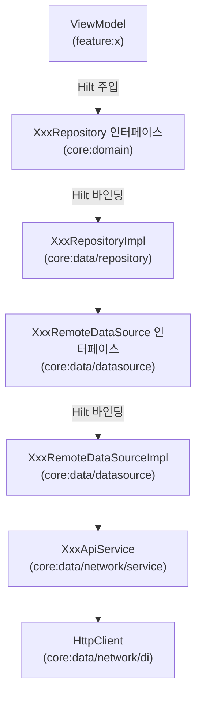

# core:data

MinoAndroid의 **데이터 계층** 모듈. `core:domain`의 Repository 인터페이스 구현체·DataSource·DTO·네트워크 인프라를 여기 두고, 도메인과 데이터 출처(원격 API·로컬 저장소 등) 사이의 경계를 담당한다.

> 모듈 책임·경계·의존 방향(레이어 그래프)은 [`docs/architecture/modularization.md`](../../docs/architecture/modularization.md)를 단일 출처로 한다. 이 문서는 이 모듈의 **패키지 구성·확장 규칙·안티패턴**만 다룬다.

---

## 1. 개요

| | |
|---|---|
| **무엇을** | Repository 구현체, DataSource, DTO, Mapper, 네트워크 설정을 제공한다. |
| **빌드 타입** | Android Library (`mino.android.library` + `mino.android.hilt` + `mino.android.flavor`) |
| **공개 범위** | 모든 구현 클래스는 `internal`. 외부에 노출되는 계약은 `core:domain`의 인터페이스다. |

> [!IMPORTANT]
> 이 모듈의 클래스는 **모두 `internal`**이다. `RepositoryImpl`·`DataSourceImpl`·`ApiService`·`DI 모듈`이 외부로 새어나오면 의존 방향이 역전된다. 외부에서 접근하는 단일 진입점은 Hilt가 바인딩한 `core:domain` 인터페이스다.

---

## 2. 레이어 흐름



- ViewModel은 `core:domain`의 Repository 인터페이스만 안다. 구현체(`RepositoryImpl`)를 직접 의존하지 않는다.
- `RepositoryImpl`은 `DataSource` 인터페이스만 알고, `DataSourceImpl`의 존재는 모른다. 위 그림은 일반 경로이며, SDK 원천을 쓰는 경로는 `DataSource` 자리에 원천 접근자 인터페이스가 온다([§5 SDK 원천](#5-datasource-작성-규칙)).
- DTO → 도메인 모델 변환(Mapper)은 `RepositoryImpl` 안에서 끝난다. 도메인 모델이 DataSource 밖으로 나올 때는 이미 변환이 완료돼 있다.

---

## 3. 디렉토리 구조

```
core/data/src/main/java/team/mino/core/data/
├── auth/
│   ├── ...            # 인증 제공자 SDK 등 외부 SDK 원천 접근자 인터페이스·구현체 (internal)
│   ├── di/            # SDK 인스턴스 제공 + 접근자 @Binds 모듈 (internal)
│   └── extension/     # SDK 타입 확장 — suspend 변환·도메인 예외 매핑 (internal)
├── database/
│   ├── di/            # (예정) 데이터베이스 인프라 DI
│   └── entity/        # (예정) DB Entity — 도메인 모델 의존 금지
├── datasource/
│   ├── ...            # 데이터 출처 추상화. 인터페이스·구현체 쌍 (internal)
│   └── di/            # DataSource @Binds 모듈 (internal)
├── invite/
│   ├── ...            # 초대 링크 조립 구현 — 호스트·경로 형식을 아는 유일한 자리 (internal)
│   └── di/            # 초대 링크 조립 @Binds 모듈 (internal)
├── network/
│   ├── di/            # HttpClient 등 네트워크 인프라 제공 (internal)
│   ├── dto/
│   │   ├── request/   # 요청 DTO (@Serializable)
│   │   └── response/  # 응답 DTO (@Serializable). 도메인 모델 의존 금지
│   ├── extension/     # 네트워크 타입 확장 (convertDomainException)
│   ├── plugin/        # HttpClient 전역에 거는 Ktor 클라이언트 플러그인 (internal)
│   └── service/       # Ktor HttpClient로 엔드포인트를 호출하는 서비스 (internal)
├── repository/
│   ├── ...            # core:domain Repository 인터페이스 구현 (internal)
│   ├── di/            # Repository @Binds 모듈 (internal)
│   └── mapper/        # DTO → 도메인 모델 Mapper (internal)
├── storage/           # DataStore<Preferences> 단일 인스턴스 제공 (internal)
└── work/
    ├── ...            # WorkManager 워커 (internal)
    └── di/            # WorkManager 인스턴스 제공 (internal)
```

원격·로컬 DataSource는 출처만 다를 뿐 같은 레이어이므로 `datasource/` 하나에 둔다. 구분은 디렉터리가 아니라 이름(`XxxRemoteDataSource` / `XxxLocalDataSource`)이 한다.

---

## 4. 네트워크 레이어 구성

### HttpClient (NetworkModule)

```kotlin
// core/data/network/di/NetworkModule.kt
HttpClient(OkHttp) {
    expectSuccess = true          // 비2xx 응답 시 ClientRequestException / ServerResponseException
    convertDomainException()
    defaultRequest {
        url(BuildConfig.API_BASE_URL)
    }
    install(ContentNegotiation) {
        json(Json { ignoreUnknownKeys = true })
    }
    install(Logging) {
        level = if (BuildConfig.FLAVOR == "qa") LogLevel.BODY else LogLevel.NONE
    }
    install(minoIdentityProofPlugin(idTokenProvider))
}
```

| 설정 | 이유 |
|---|---|
| `expectSuccess = true` | 비2xx 응답 시 `SerializationException` 대신 명확한 HTTP 예외를 던짐 |
| `convertDomainException()` | Ktor 예외 → `MinoDomainException` 전역 매핑 — 새 API 추가 시 매핑 누락이 구조적으로 불가능 |
| `BuildConfig.API_BASE_URL` | 서버 환경 전환을 코드가 아니라 flavor가 결정 — qa/prod 빌드에 URL 분기 코드가 남지 않음 |
| `ignoreUnknownKeys = true` | 서버 응답에 신규 필드가 추가돼도 파싱 실패 없음 |
| `LogLevel.BODY` (qa 한정) | prod 빌드에서 토큰·PII가 로그캣에 노출되는 것을 차단 |
| `minoIdentityProofPlugin` | 신원 증명 첨부를 클라이언트 한 곳에 모음 — Service마다 헤더를 손으로 붙이지 않는다. 설치 위치·판정 근거는 플러그인 KDoc이 지목하는 계약 문서가 단일 출처 |

> [!NOTE]
> `API_BASE_URL`은 `build-logic`의 [`ProductFlavors.kt`](../../build-logic/convention/src/main/kotlin/team/mino/buildlogic/ProductFlavors.kt)가 flavor별 `buildConfigField`로 생성한다. 서버 주소가 바뀌면 `NetworkModule`이 아니라 `Flavor` 열거형의 `apiBaseUrl`을 고친다.

### 예외 → 도메인 예외 매핑 (`convertDomainException`)

Ktor 예외를 `MinoDomainException`으로 바꾸는 유일한 지점이다. 분류 기준·화이트리스트 정책은 [`docs/conventions/error_handling.md`](../../docs/conventions/error_handling.md) §3을 단일 출처로 한다.

- `Service`·`DataSource`·`RepositoryImpl`은 예외를 잡지 않는다 — 매핑은 원천마다 정해진 지점이 전역 수행하고(HTTP 원천은 이 validator다), 실패는 throw로 전파된다.
- `MinoDomainException`에 새 리프를 추가하면 **짝이 되는 매핑 지점의 `when` 분기를 함께** 추가한다. 지점은 원천마다 다르므로 HTTP 리프만 이 파일이고, 어느 원천의 지점인지는 [`docs/conventions/error_handling.md`](../../docs/conventions/error_handling.md) §3이 정한다.
- 엔드포인트별 특수 정책(예: 특정 API의 404를 빈 결과로 취급)이 필요한 지점만 지역 catch를 병용한다. **자리는 그 정책이 무엇을 보는지가 정한다.**
  - **상태 코드만 보면 되는 정책** → 해당 `DataSource`. `MinoDomainException.Http`의 `code`만 있으면 되므로 HTTP 세부가 필요 없다.
  - **실패 응답 본문(`errorCode`)을 읽어야 하는 정책** → 그 `ApiService`. 본문을 다시 읽으려면 원본 `ResponseException`이 들고 있는 응답이 필요한데, 그것을 `DataSource`로 넘기면 Ktor 타입을 다루는 일이 §5의 "데이터 출처 호출만"을 넘어선다. 배경과 판정 근거는 [에러 본문 ADR](../../docs/adr/2026-08-28-error-body-type-and-no-error-code-leaf.md) 참조.

### ApiService 작성 규칙

**Ktor HttpClient 직접 호출** 방식을 사용한다.

```kotlin
internal class XxxApiService @Inject constructor(
    private val client: HttpClient,
) {
    suspend fun getSomething(id: String): XxxResponse =
        client.get("endpoint/$id").body<MinoResponse<XxxResponse>>().data

    suspend fun getList(page: Int): List<XxxResponse> =
        client.get("endpoint") {
            parameter("page", page)
        }.body<MinoResponse<List<XxxResponse>>>().data

    // 본문 스키마가 없는 응답(202 등) — 봉투를 쓰지 않고 반환도 없다
    suspend fun create(request: XxxRequest) {
        client.post("endpoint") {
            contentType(ContentType.Application.Json)
            setBody(request)
        }
    }
}
```

- 클래스·생성자에 `internal` 필수.
- `@Inject constructor`로 Hilt 주입 대상으로 선언. 별도 `@Provides` 불필요.
- 엔드포인트 경로는 `defaultRequest.url` 기준 상대 경로로 작성.
- 예외를 잡지 않는다 — 도메인 예외 매핑은 `HttpClient`의 validator가 전역 수행한다 (`network/extension/HttpClientConfig.kt`의 `convertDomainException`).
- **응답 봉투를 벗기는 유일한 지점이다.** 서버는 본문이 있는 성공 응답을 `{ "data": ... }`로 감싸므로 `body<MinoResponse<T>>().data`로 알맹이만 반환한다. 반환 타입에 `MinoResponse`가 드러나면 안 되며, `DataSource`·`RepositoryImpl`·`Mapper`는 봉투를 알지 못한다.
- 봉투 DTO는 `network/dto/response/MinoResponse.kt` **하나뿐**이다. 엔드포인트별 래퍼 DTO(`XxxListResponse(val data: ...)`)를 새로 만들지 않는다. 결정 배경은 [응답 봉투 ADR](../../docs/adr/2026-08-27-response-envelope-unwrapped-in-apiservice.md) 참조.
- **본문 스키마가 없는 응답(`202` 등)은 봉투 대상이 아니다.** 응답을 읽지 않으므로 `body()` 호출 없이 반환은 `Unit`이다.

---

## 5. DataSource 작성 규칙

DataSource는 **네트워크·DB 등 데이터 출처를 추상화**하는 레이어다. 인터페이스와 구현체 쌍으로 항상 작성한다.

```kotlin
// 인터페이스 — internal, DTO 반환
internal interface XxxRemoteDataSource {
    suspend fun getXxx(id: String): XxxResponse
}

// 구현체 — internal, ApiService 주입
internal class XxxRemoteDataSourceImpl @Inject constructor(
    private val service: XxxApiService,
) : XxxRemoteDataSource {
    override suspend fun getXxx(id: String): XxxResponse = service.getXxx(id)
}
```

| 항목 | 규칙 |
|---|---|
| **반환 타입** | DTO만 반환. 도메인 모델 반환 금지 |
| **가시성** | 인터페이스·구현체 모두 `internal` |
| **책임** | 데이터 출처 호출만. 변환·비즈니스 로직 없음 |
| **명명** | `Xxx{Remote\|Local}DataSource` / `XxxDataSourceImpl` |

DI 바인딩은 항상 별도 `@Module` abstract 클래스로 분리해 `datasource/di/`에 둔다. 바인딩 소유·형태 규칙은 [`docs/conventions/dependency-injection.md`](../../docs/conventions/dependency-injection.md)를 단일 출처로 한다.

```kotlin
@Module
@InstallIn(SingletonComponent::class)
internal abstract class XxxDataSourceModule {
    @Binds @Singleton
    abstract fun bindXxxRemoteDataSource(impl: XxxRemoteDataSourceImpl): XxxRemoteDataSource
}
```

### 로컬 DataSource (DataStore)

로컬 키-값 저장은 Preferences DataStore를 사용한다. 채택 배경·평문 저장 결정은 [Preferences DataStore 채택 ADR](../../docs/adr/2026-07-27-preferences-datastore-local-storage.md) 참조.

| 항목 | 규칙 |
|---|---|
| **위치** | DataStore 인스턴스 제공(DI)은 `storage/`에, 이를 사용하는 로컬 DataSource는 원격과 같은 `datasource/`에 둔다 |
| **인스턴스** | `storage/DataStoreModule`이 제공하는 단일 `DataStore<Preferences>`를 주입받아 공유한다. 새 파일·인스턴스를 만들지 않는다 (제약 배경은 `DataStoreModule` 주석 참조) |
| **키 관리** | 저장 항목은 Preferences 키로 구분하며, 키 상수는 해당 DataSource 구현체 안에 둔다 |
| **DataSource 분리** | 수명주기·변경 이유가 다른 데이터는 키만 나누지 말고 DataSource 자체를 분리한다 (예: 불변 캐시 vs 발급·만료되는 값) |
| **작성 규칙** | 원격과 동일 — 인터페이스·구현체 쌍, `internal`, 데이터 출처 접근만 담당 (명명: `XxxLocalDataSource`) |
| **SDK 원천** | DataStore 밖의 원천(외부 SDK 등)은 `auth/`처럼 원천별 패키지에 인터페이스·구현체 쌍으로 두고, 위임만 하는 DataSource 계층을 끼우지 않는다. SDK 예외 → 도메인 예외 매핑은 그 패키지의 `extension/` 한 지점에서만 하며, 분류 기준·정책은 [`docs/conventions/error_handling.md`](../../docs/conventions/error_handling.md) §3을 단일 출처로 한다. 그 밖의 작성 규칙은 위와 동일 |

---

## 6. RepositoryImpl 작성 규칙

`RepositoryImpl`은 `core:domain`의 인터페이스를 구현하고, **DataSource 호출 + Mapper 적용**을 담당한다.

```kotlin
internal class XxxRepositoryImpl @Inject constructor(
    private val dataSource: XxxRemoteDataSource,
) : XxxRepository {
    override suspend fun getXxx(id: String): Xxx =
        dataSource.getXxx(id).toDomain()   // Mapper는 DTO 확장 함수로 작성
}
```

| 항목 | 규칙 |
|---|---|
| **가시성** | `internal` 필수 |
| **의존** | DataSource 인터페이스만 주입. `DataSourceImpl` 직접 의존 금지. SDK 원천을 쓰는 경우만 예외로 원천 접근자 인터페이스를 주입한다([§5 SDK 원천](#5-datasource-작성-규칙)) |
| **Mapper** | `RepositoryImpl` 안에서 DTO → 도메인 모델 변환 완료. UseCase·ViewModel에 DTO 노출 금지 |
| **에러 처리** | 예외를 잡지 않는다 — 매핑은 그 원천의 지점이 전역 수행하며(지점은 [`docs/conventions/error_handling.md`](../../docs/conventions/error_handling.md) §3), 실패는 `MinoDomainException` throw로 전파 |

DI 바인딩은 별도 `@Module`로 분리해 `repository/di/`에 둔다.

```kotlin
@Module
@InstallIn(SingletonComponent::class)
internal abstract class XxxRepositoryModule {
    @Binds @Singleton
    abstract fun bindXxxRepository(impl: XxxRepositoryImpl): XxxRepository
}
```

---

## 7. Mapper (DTO → 도메인 모델)

Mapper는 **DTO의 확장 함수**로 작성하고, 변환 책임의 소유자인 `RepositoryImpl`이 속한 `repository/` 하위의 `mapper/` 서브패키지에 `XxxMapper.kt`로 둔다. `network/dto/`는 서버 계약(DTO)만 표현하며 도메인 모델을 알지 못한다. Repository·Mapper 쌍이 늘어날 것을 감안해 `repository/` 최상위에 바로 두지 않고 `mapper/`로 분리한다.

```kotlin
// core/data/repository/mapper/XxxMapper.kt
internal fun XxxResponse.toDomain(): Xxx =
    Xxx(
        id = id,
        name = name,
        description = description.orEmpty(),
    )
```

| 항목 | 규칙 |
|---|---|
| **위치** | `core:data/repository/mapper/` |
| **가시성** | `internal` |
| **nullable 처리** | `.orEmpty()` / `?: defaultValue` — 도메인 모델에 nullable 전파 금지 |
| **서버 전용 필드** | 도메인 모델에 포함하지 않는다 |

---

## 8. 새 API 엔드포인트 추가 절차

1. **DTO** — `network/dto/response/XxxResponse.kt` 작성 (`@Serializable`). 봉투(`{ "data": ... }`)는 DTO에 넣지 않는다
2. **ApiService** — 기존 `XxxApiService`에 함수 추가 또는 신규 파일 작성 (`internal`). 본문이 있는 응답이면 여기서 `body<MinoResponse<...>>().data`로 봉투를 벗긴다([§4](#apiservice-작성-규칙)) — 3번 이후 단계는 봉투를 고려하지 않는다
3. **DataSource 인터페이스** — `datasource/XxxRemoteDataSource.kt` (없으면 신규)
4. **DataSourceImpl** — `datasource/XxxRemoteDataSourceImpl.kt`
5. **DataSource DI** — `datasource/di/XxxDataSourceModule.kt` (`@Binds`)
6. **도메인 모델** — `core:domain/model/Xxx.kt`
7. **Repository 인터페이스** — `core:domain/repository/XxxRepository.kt`
8. **RepositoryImpl** — `repository/XxxRepositoryImpl.kt`
9. **Mapper** — `repository/mapper/XxxMapper.kt` 작성 (`internal fun XxxResponse.toDomain()`)
10. **Repository DI** — `repository/di/XxxRepositoryModule.kt` (`@Binds`)

> 도메인 모델·Repository 인터페이스(6·7번)는 **`core:domain`에 추가**한다. `core:domain` 컨벤션은 [`core/domain/README.md`](../domain/README.md) 참조.

---

## 9. 금지 규칙 (안티패턴)

| 금지 | 이유 |
|---|---|
| 구현 클래스(`Impl`·`ApiService`·`Module`)를 `public`으로 선언 | 의존 방향 역전, 계층 경계 파괴 |
| RepositoryImpl·DataSourceImpl이 도메인 모델을 반환하기 전에 DTO를 노출 | UseCase·ViewModel에 데이터 계층 구현 상세가 노출됨 |
| Mapper를 `core:domain`에 위치 | domain이 data에 역의존하게 됨 |
| `NetworkModule`·`ApiService`에 서버 URL을 하드코딩 | flavor별 환경 분리가 무너진다. 주소는 `ProductFlavors.kt`의 `apiBaseUrl`이 단일 출처 |
| `@OptIn(InternalSerializationApi::class)` 코드 추가 | IDE false-positive([KTIJ-31549](https://youtrack.jetbrains.com/issue/KTIJ-31549))에 대한 잘못된 해결. 실제 컴파일·런타임은 정상이며, 진짜 원인은 IDE 인덱싱 문제다. 해소 방법·배경은 [직렬화 opt-in 경고 ADR](../../docs/adr/2026-06-29-serialization-optin-ide-warning.md) 참조 |
| 단일 `HttpClient`에 여러 baseUrl 혼용 | `defaultRequest.url`이 덮어써짐. 다른 호스트가 필요하면 별도 `HttpClient`를 제공한다 |

---

## 10. 의존성 추가 가이드

`feature` 모듈은 `core:data`를 직접 의존하지 않는다. `core:domain`만 의존한다.

```kotlin
// core:data는 추가하지 않는다
```

`core:data` 내부에 새 외부 라이브러리가 필요하면 `core/data/build.gradle.kts`에만 추가한다.

```kotlin
// core/data/build.gradle.kts
dependencies {
    implementation(libs.ktor.client.core)
    // ...
}
```
