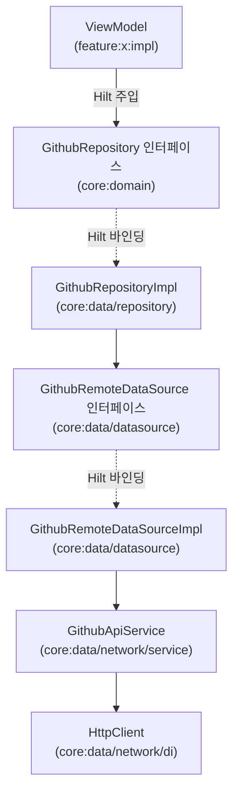

# core:data

MinoAndroid의 **데이터 계층** 모듈. `core:domain`의 Repository 인터페이스 구현체·DataSource·DTO·네트워크 인프라를 여기 두고, 도메인과 데이터 출처(원격 API·로컬 DB 등) 사이의 경계를 담당한다.

> 모듈 책임·경계·의존 방향(레이어 그래프)은 [`docs/architecture/modularization.md`](../../docs/architecture/modularization.md)를 단일 출처로 한다. 이 문서는 이 모듈의 **패키지 구성·확장 규칙·안티패턴**만 다룬다.

---

## 1. 개요

| | |
|---|---|
| **무엇을** | Repository 구현체, DataSource, DTO, Mapper, 네트워크 설정을 제공한다. |
| **빌드 타입** | Android Library (`mino.android.library` + `mino.android.hilt` + `mino.android.flavor`) |
| **공개 범위** | 모든 구현 클래스는 `internal`. 외부에 노출되는 계약은 `core:domain`의 인터페이스다. |

> [!IMPORTANT]
> 이 모듈의 클래스는 **모두 `internal`**이다. `RepositoryImpl`·`DataSourceImpl`·`ApiService`·`DI 모듈`이 외부로 새어나오면 의존 방향이 역전된다. 외부에서 접근하는 단일 진입점은 Hilt가 바인딩한 `core:domain` 인터페이스다.

---

## 2. 레이어 흐름



- ViewModel은 `core:domain`의 Repository 인터페이스만 안다. 구현체(`RepositoryImpl`)를 직접 의존하지 않는다.
- `RepositoryImpl`은 `DataSource` 인터페이스만 알고, `DataSourceImpl`의 존재는 모른다.
- DTO → 도메인 모델 변환(Mapper)은 `RepositoryImpl` 안에서 끝난다. 도메인 모델이 DataSource 밖으로 나올 때는 이미 변환이 완료돼 있다.

---

## 3. 디렉토리 구조

```
core/data/src/main/java/team/mino/core/data/
├── datasource/
│   ├── GithubRemoteDataSource.kt          # DataSource 인터페이스 (internal)
│   ├── GithubRemoteDataSourceImpl.kt      # DataSource 구현체 (internal)
│   └── di/
│       └── GithubDataSourceModule.kt      # @Binds 모듈 (internal)
├── network/
│   ├── di/
│   │   └── NetworkModule.kt               # HttpClient 제공 (internal)
│   ├── dto/
│   │   └── response/
│   │       ├── GithubRepoResponse.kt      # 서버 응답 DTO (@Serializable)
│   │       └── GithubMapper.kt            # DTO → 도메인 모델 Mapper (internal)
│   └── service/
│       └── GithubApiService.kt            # Ktor 직접 호출 서비스 (internal)
└── repository/
    ├── GithubRepositoryImpl.kt            # Repository 구현체 (internal)
    └── di/
        └── GithubRepositoryModule.kt      # @Binds 모듈 (internal)
```

| 패키지 | 역할 |
|---|---|
| `datasource/` | 데이터 출처 추상화. 원격·로컬을 구분하는 경계 |
| `network/di/` | HttpClient·네트워크 인프라 DI 제공 |
| `network/dto/` | 서버 응답 스펙을 표현하는 DTO. `@Serializable` 필수 |
| `network/service/` | Ktor HttpClient로 엔드포인트를 직접 호출하는 클래스 |
| `repository/` | `core:domain` Repository 인터페이스 구현 및 Mapper 적용 |

---

## 4. 네트워크 레이어 구성

### HttpClient (NetworkModule)

```kotlin
// core/data/network/di/NetworkModule.kt
HttpClient(OkHttp) {
    expectSuccess = true          // 비2xx 응답 시 ClientRequestException / ServerResponseException
    defaultRequest {
        url("https://api.github.com/")   // 현재는 임시 baseUrl — 실서버 연결 시 ProductFlavors로 이동
    }
    install(ContentNegotiation) {
        json(Json { ignoreUnknownKeys = true })
    }
    install(Logging) {
        level = if (BuildConfig.FLAVOR == "qa") LogLevel.BODY else LogLevel.NONE
    }
}
```

| 설정 | 이유 |
|---|---|
| `expectSuccess = true` | 비2xx 응답 시 `SerializationException` 대신 명확한 HTTP 예외를 던짐 |
| `ignoreUnknownKeys = true` | 서버 응답에 신규 필드가 추가돼도 파싱 실패 없음 |
| `LogLevel.BODY` (qa 한정) | prod 빌드에서 토큰·PII가 로그캣에 노출되는 것을 차단 |
| `baseUrl` (임시) | 현재는 GitHub 임시 API. 실서버 연결 시 `ProductFlavors.apiBaseUrl`로 교체 |

> [!NOTE]
> `baseUrl`은 `ProductFlavors.kt`의 `apiBaseUrl`로 flavor별 관리하는 것이 목표다. 실서버 배포 전에 `NetworkModule`의 하드코딩된 URL을 `BuildConfig.API_BASE_URL`로 교체한다.

### ApiService 작성 규칙

**Ktor HttpClient 직접 호출** 방식을 사용한다.

```kotlin
internal class XxxApiService @Inject constructor(
    private val client: HttpClient,
) {
    suspend fun getSomething(id: String): XxxResponse =
        client.get("endpoint/$id").body()

    suspend fun getList(page: Int): List<XxxResponse> =
        client.get("endpoint") {
            parameter("page", page)
        }.body()
}
```

- 클래스·생성자에 `internal` 필수.
- `@Inject constructor`로 Hilt 주입 대상으로 선언. 별도 `@Provides` 불필요.
- 엔드포인트 경로는 `defaultRequest.url` 기준 상대 경로로 작성.
- 에러 처리(예외 → 도메인 에러 매핑)는 DataSource 또는 RepositoryImpl에서 담당.

---

## 5. DataSource 작성 규칙

DataSource는 **네트워크·DB 등 데이터 출처를 추상화**하는 레이어다. 인터페이스와 구현체 쌍으로 항상 작성한다.

```kotlin
// 인터페이스 — internal, DTO 반환
internal interface XxxRemoteDataSource {
    suspend fun getXxx(id: String): XxxResponse
}

// 구현체 — internal, ApiService 주입
internal class XxxRemoteDataSourceImpl @Inject constructor(
    private val service: XxxApiService,
) : XxxRemoteDataSource {
    override suspend fun getXxx(id: String): XxxResponse = service.getXxx(id)
}
```

| 항목 | 규칙 |
|---|---|
| **반환 타입** | DTO만 반환. 도메인 모델 반환 금지 |
| **가시성** | 인터페이스·구현체 모두 `internal` |
| **책임** | 데이터 출처 호출만. 변환·비즈니스 로직 없음 |
| **명명** | `Xxx{Remote\|Local}DataSource` / `XxxDataSourceImpl` |

DI 바인딩은 항상 `GithubDataSourceModule`처럼 별도 `@Module` abstract 클래스로 분리한다.

```kotlin
@Module
@InstallIn(SingletonComponent::class)
internal abstract class XxxDataSourceModule {
    @Binds @Singleton
    abstract fun bindXxxRemoteDataSource(impl: XxxRemoteDataSourceImpl): XxxRemoteDataSource
}
```

---

## 6. RepositoryImpl 작성 규칙

`RepositoryImpl`은 `core:domain`의 인터페이스를 구현하고, **DataSource 호출 + Mapper 적용**을 담당한다.

```kotlin
internal class XxxRepositoryImpl @Inject constructor(
    private val dataSource: XxxRemoteDataSource,
) : XxxRepository {
    override suspend fun getXxx(id: String): Xxx =
        dataSource.getXxx(id).toDomain()   // Mapper는 DTO 확장 함수로 작성
}
```

| 항목 | 규칙 |
|---|---|
| **가시성** | `internal` 필수 |
| **의존** | DataSource 인터페이스만 주입. `DataSourceImpl` 직접 의존 금지 |
| **Mapper** | `RepositoryImpl` 안에서 DTO → 도메인 모델 변환 완료. UseCase·ViewModel에 DTO 노출 금지 |
| **에러 처리** | `HttpClient`의 `expectSuccess = true`로 HTTP 예외가 올라오므로, 필요 시 `RepositoryImpl`에서 도메인 에러로 래핑 |

DI 바인딩은 별도 `@Module`로 분리한다.

```kotlin
@Module
@InstallIn(SingletonComponent::class)
internal abstract class XxxRepositoryModule {
    @Binds @Singleton
    abstract fun bindXxxRepository(impl: XxxRepositoryImpl): XxxRepository
}
```

---

## 7. Mapper (DTO → 도메인 모델)

Mapper는 **DTO의 확장 함수**로 작성하고, DTO와 같은 패키지(`network/dto/`)에 `XxxMapper.kt`로 둔다.

```kotlin
// core/data/network/dto/response/GithubMapper.kt
internal fun GithubRepoResponse.toDomain(): GithubRepo =
    GithubRepo(
        id = id,
        name = name,
        fullName = fullName,
        description = description.orEmpty(),
        htmlUrl = htmlUrl,
        language = language.orEmpty(),
        stargazersCount = stargazersCount,
        forksCount = forksCount,
    )
```

| 항목 | 규칙 |
|---|---|
| **위치** | `core:data/network/dto/` — DTO와 같은 패키지 |
| **가시성** | `internal` |
| **nullable 처리** | `.orEmpty()` / `?: defaultValue` — 도메인 모델에 nullable 전파 금지 |
| **서버 전용 필드** | 도메인 모델에 포함하지 않는다 |

---

## 8. 새 API 엔드포인트 추가 절차

1. **DTO** — `network/dto/response/XxxResponse.kt` 작성 (`@Serializable`)
2. **Mapper** — `network/dto/response/XxxMapper.kt` 작성 (`internal fun XxxResponse.toDomain()`)
3. **ApiService** — 기존 `XxxApiService`에 함수 추가 또는 신규 파일 작성 (`internal`)
4. **DataSource 인터페이스** — `datasource/XxxRemoteDataSource.kt` (없으면 신규)
5. **DataSourceImpl** — `datasource/XxxRemoteDataSourceImpl.kt`
6. **DataSource DI** — `datasource/di/XxxDataSourceModule.kt` (`@Binds`)
7. **도메인 모델** — `core:domain/model/Xxx.kt`
8. **Repository 인터페이스** — `core:domain/repository/XxxRepository.kt`
9. **RepositoryImpl** — `repository/XxxRepositoryImpl.kt`
10. **Repository DI** — `repository/di/XxxRepositoryModule.kt` (`@Binds`)

> 도메인 모델·Repository 인터페이스(7·8번)는 **`core:domain`에 추가**한다. `core:domain` 컨벤션은 [`core/domain/README.md`](../domain/README.md) 참조.

---

## 9. 금지 규칙 (안티패턴)

| 금지 | 이유 |
|---|---|
| 구현 클래스(`Impl`·`ApiService`·`Module`)를 `public`으로 선언 | 의존 방향 역전, 계층 경계 파괴 |
| RepositoryImpl·DataSourceImpl이 도메인 모델을 반환하기 전에 DTO를 노출 | UseCase·ViewModel에 데이터 계층 구현 상세가 노출됨 |
| Mapper를 `core:domain`에 위치 | domain이 data에 역의존하게 됨 |
| `@OptIn(InternalSerializationApi::class)` 코드 추가 | IDE false-positive([KTIJ-31549](https://youtrack.jetbrains.com/issue/KTIJ-31549))에 대한 잘못된 해결. 실제 컴파일·런타임은 정상이며, 진짜 원인은 IDE 인덱싱 문제다. 해소 방법·배경은 [ADR 0001](../../docs/adr/0001-serialization-optin-ide-warning.md) 참조 |
| 단일 `HttpClient`에 여러 baseUrl 혼용 | `defaultRequest.url`이 덮어써짐. 별도 클라이언트 또는 절대 URL 사용 |

---

## 10. 의존성 추가 가이드

`feature` 모듈은 `core:data`를 직접 의존하지 않는다. `core:domain`만 의존한다.

```kotlin
// core:data는 추가하지 않는다
```

`core:data` 내부에 새 외부 라이브러리가 필요하면 `core/data/build.gradle.kts`에만 추가한다.

```kotlin
// core/data/build.gradle.kts
dependencies {
    implementation(libs.ktor.client.core)
    // ...
}
```
