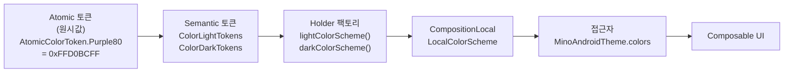
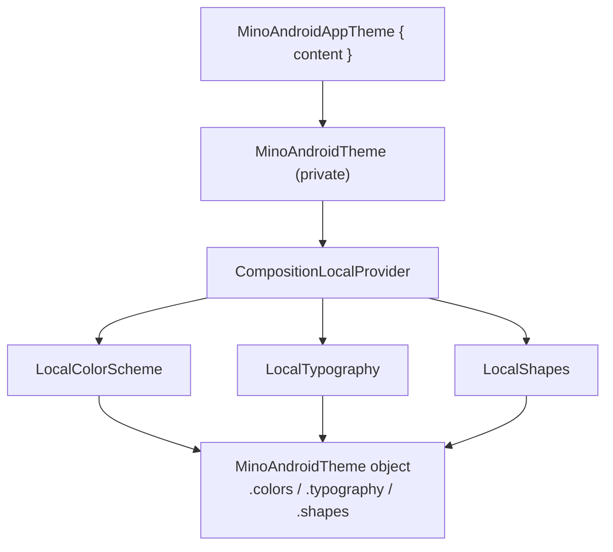

# core:design-system

MinoAndroid의 디자인 시스템 모듈. Material3를 기반으로 하되, Material의 `ColorScheme` / `Typography` / `Shapes`를 직접 노출하지 않고 **자체 토큰 시스템으로 한 번 감싸서** 제공한다.

> [!IMPORTANT]
> **현재 반영된 토큰은 전부 예시용 임시(placeholder) 토큰이다.**
> 색상(purple/pink 팔레트), 타이포(`bodyLarge`), 셰이프(8/12/16dp)는 구조를 잡기 위한 값이며, **디자이너의 디자인 시스템 작업이 완료되면 실제 토큰으로 다시 채워 넣는 추가 작업이 필요**하다.
> 아키텍처(토큰 3계층·접근 방식)는 그대로 유지되고, **채워지는 값과 슬롯만** 바뀐다.

---

## 1. 개요

| | |
|---|---|
| **무엇을** | 앱 전역에서 일관되게 쓰는 색상·타이포·셰이프 토큰과, 이를 주입하는 테마(`MinoAndroidAppTheme`)를 제공한다. |
| **왜 자체 토큰인가** | Material3 기본 타입을 그대로 쓰면 접근점이 흩어지고 디자인 토큰을 통제하기 어렵다. 자체 홀더로 감싸 **단일 접근점**(`MinoAndroidTheme.*`)을 두고, `원시값 → 시맨틱 → 사용처`로 이어지는 흐름을 명시적으로 관리한다. |

`core` 레이어 모듈로, 화면을 그리는 모든 UI(주로 feature `impl`)가 의존한다.

**제공 자산**

| 자산 | 설명 | 참조 |
|---|---|---|
| 디자인 토큰 | 색상·타이포·셰이프를 3계층(원시→시맨틱→홀더)으로 관리 | [4. 토큰 시스템](#4-토큰-시스템) |
| 테마 진입점 | `MinoAndroidAppTheme` — 토큰을 주입하고 라이트/다크를 자동 전환 | [2. 빠른 시작](#2-빠른-시작) |
| 클릭 Modifier 유틸 | 연타 차단·리플을 표준화한 `Modifier` 확장 | [5.2 클릭 Modifier 유틸](#52-클릭-modifier-유틸) |
| 프리뷰 어노테이션 | 라이트/다크 동시 프리뷰 `@UiModePreviews` | [5.3 프리뷰](#53-프리뷰) |
| 공용 컴포넌트 *(예정)* | 토큰으로 조립한 버튼·칩 등 재사용 Composable. `component/` 패키지에 추가될 예정 | [3. 디렉토리 구조](#3-디렉토리-구조) |

---

## 2. 빠른 시작

**① 의존성 추가** — 소비 모듈 `build.gradle.kts`:

```kotlin
dependencies {
    implementation(project(":core:design-system"))
}
```

**② 진입점을 테마로 감싸기** — Activity `setContent`(또는 화면 최상위)를 `MinoAndroidAppTheme`로 감싼다. 라이트/다크는 시스템 모드에 따라 자동 적용된다.

```kotlin
setContent {
    MinoAndroidAppTheme {
        AppContent() // 이 안에서만 MinoAndroidTheme.* 접근 가능
    }
}
```

**③ 토큰·클릭 유틸 꺼내 쓰기** — `MinoAndroidTheme`로 토큰을 읽고, 클릭은 클릭 유틸로 처리한다.

```kotlin
Text(
    text = "Mino-Android",
    color = MinoAndroidTheme.colors.purple80,
    style = MinoAndroidTheme.typography.bodyLarge,
)

Box(
    modifier = Modifier
        .clip(MinoAndroidTheme.shapes.medium)
        .background(MinoAndroidTheme.colors.purpleGrey40)
        .rippleSingleClickable { /* onClick */ },
)
```

접근자는 셋 다 `@Composable @ReadOnlyComposable` 이라 **컴포저블 안에서만** 호출한다.

| 접근자 | 반환 타입 |
|---|---|
| `MinoAndroidTheme.colors` | `ColorScheme` |
| `MinoAndroidTheme.typography` | `Typography` |
| `MinoAndroidTheme.shapes` | `Shapes` |

> [!IMPORTANT]
> `MinoAndroidTheme.*`는 반드시 **`MinoAndroidAppTheme { ... }` 내부**에서 읽어야 한다. 테마 바깥에서 접근하면 `CompositionLocal`의 정적 기본값(라이트)이 잡힌다.

클릭 유틸 선택 기준은 [5.2 클릭 Modifier 유틸](#52-클릭-modifier-유틸), 의존성 상세는 [6. 의존성 추가 가이드](#6-의존성-추가-가이드)를 참조.

---

## 3. 디렉토리 구조

패키지는 **역할**로 나뉜다. 새 코드는 성격에 맞는 곳에 두고, 새 종류면 같은 패턴으로 패키지를 추가한다.

```
team/mino/core/designsystem/
├── foundation/   # 디자인 토큰. foundation별로 color/ typography/ shape/ 하위 패키지를 둔다.
│   └── <kind>/   #   각 foundation = token/ 패키지(Atomic·Semantic·AccessKey) + Holder 파일.
├── component/    # 토큰으로 조립한 공용 Composable 컴포넌트 (버튼·칩 등). 현재 비어 있음(예약).
├── theme/        # 테마 진입점·접근자 (MinoAndroidAppTheme / MinoAndroidTheme).
└── util/         # 토큰과 무관한 재사용 UI 유틸.
    ├── modifier/ #   Modifier 확장 (예: clickable/ — 클릭·디바운스). 종류별로 하위 패키지.
    └── preview/  #   프리뷰 어노테이션.
```

| 새로 추가하는 것 | 위치 |
|---|---|
| 새 토큰 값/슬롯 (색·타이포·셰이프) | 해당 `foundation/<kind>/` — 절차는 [4.4 토큰 추가하기](#44-토큰-추가하기) |
| 새 foundation 종류 (예: elevation) | `foundation/` 아래 새 패키지를 기존 3계층 패턴으로 |
| 공용 Composable 컴포넌트 (버튼·칩 등) | `component/` — 토큰은 `*AccessKeyToken.value`로 소비 ([4.3 사용 패턴](#43-사용-패턴--모듈-안팎의-두-갈래)) |
| `Modifier` 확장 | `util/modifier/<종류>/` (공개 확장만 노출, 내부 구현은 `internal`) |
| 프리뷰·기타 UI 유틸 | `util/` 아래 성격에 맞는 패키지 |

---

## 4. 토큰 시스템

색상·타이포·셰이프 토큰의 구조부터 소비·확장·규칙까지 토큰에 관한 모든 것을 이 섹션에 모은다.

### 4.1 3계층 아키텍처

원시값(Atomic) → 시맨틱 토큰(Semantic) → 홀더(Holder)를 거쳐 `CompositionLocal`로 주입되고, 소비처에서 `MinoAndroidTheme.*`로 읽는다.



색상을 예로 들었지만 **타이포·셰이프도 동일한 3계층 구조**다. 세 foundation은 1:1로 대응한다.

| 계층 | color | typography | shape |
|---|---|---|---|
| **Atomic** (원시값) | `AtomicColorToken` | `AtomicTypographyToken` | `AtomicShapeToken` |
| **Semantic** (의미 토큰) | `ColorLightTokens` / `ColorDarkTokens` | `TypographyTokens` | `ShapeTokens` |
| **Key enum + `value`** | `ColorAccessKeyToken` | `TypographyAccessKeyToken` | `ShapeAccessKeyToken` |
| **Holder** (클래스) | `ColorScheme` | `Typography` | `Shapes` |
| **팩토리** | `light/darkColorScheme()` | `minoTypography()` | `minoShapes()` |
| **CompositionLocal** | `LocalColorScheme` | `LocalTypography` | `LocalShapes` |
| **접근자** | `MinoAndroidTheme.colors` | `.typography` | `.shapes` |

> [!NOTE]
> 색상만 라이트/다크 2개 팩토리를 가진다. 타이포·셰이프는 변형이 없어 단일 팩토리다.

테마 주입은 `MinoAndroidAppTheme` → 내부 `MinoAndroidTheme`(private)에서 세 `CompositionLocal`을 **한 번에** provide 하는 구조다.



### 4.2 라이트·다크 모드

모드 전환은 **자동으로 반영**된다. 진입점이 시스템 모드를 보고 스킴을 고른다.

```kotlin
// ColorScheme.kt
@Composable
internal fun provideColorScheme(): ColorScheme = when {
    isSystemInDarkTheme() -> darkColorScheme()   // 다크면 다크 스킴
    else -> lightColorScheme()                   // 아니면 라이트 스킴
}
```

1. `MinoAndroidAppTheme`이 `provideColorScheme()`로 현재 모드에 맞는 스킴을 **선택**한다.
2. 그 스킴을 `LocalColorScheme`에 주입한다.
3. `MinoAndroidTheme.colors`(= `LocalColorScheme.current`)는 **선택된 스킴**을 돌려준다.

따라서 외부(홀더 프로퍼티)든 내부(`*.value`)든 **둘 다 같은 `LocalColorScheme.current`를 거치므로 동일하게 반영**된다. `isSystemInDarkTheme()`이 `@Composable`이라 런타임에 모드가 바뀌면 재구성되어 자동 갱신된다.

> [!WARNING]
> 지금은 [`ColorDarkTokens`](src/main/java/team/mino/core/designsystem/foundation/color/token/ColorDarkTokens.kt)가 라이트와 **같은 원시값을 참조**하는 placeholder다. 그래서 모드 전환은 정상 동작하지만 색 값이 같아 **화면상 차이는 없다**. 다크 전용 값을 채우면 **코드 변경 없이** 즉시 반영된다 — 배선은 이미 완성, 값만 비어 있는 상태.

### 4.3 사용 패턴 — 모듈 안팎의 두 갈래

같은 토큰이라도 **모듈 밖에서 쓰는 길**과 **모듈 안에서 쓰는 길**이 다르다.

**(A) 모듈 외부 소비자 — 홀더 프로퍼티**

다른 모듈(`feature:*` 등)에서는 public API인 홀더 프로퍼티만 사용한다.

```kotlin
val color = MinoAndroidTheme.colors.purple80
val style = MinoAndroidTheme.typography.bodyLarge
val shape = MinoAndroidTheme.shapes.medium
```

**(B) 모듈 내부 기여자 — AccessKey 토큰의 `value`**

design-system 안에서 컴포넌트를 만들 때는 `internal`인 `*AccessKeyToken.value` 확장으로 현재 활성 테마 값을 해석한다. (외부 모듈에서는 `internal`이라 보이지 않는다.)

```kotlin
Text(
    modifier = Modifier
        .background(
            shape = ShapeAccessKeyToken.Small.value,
            color = ColorAccessKeyToken.PurpleGrey40.value,
        )
        .padding(4.dp),
    text = "Mino-Android",
    style = TypographyAccessKeyToken.BodyLarge.value.copy(
        color = ColorAccessKeyToken.Purple80.value,
    ),
)
```

`*.value`는 내부적으로 `MinoAndroidTheme.<foundation>.fromToken(this)`를 호출해 `키 → 실제 값`으로 변환한다.

> [!TIP]
> **왜 두 갈래로 나눴나**
> - **캡슐화**: 키 enum·`fromToken` 같은 내부 메커니즘을 `internal`로 숨기고, 외부엔 안정적인 홀더 프로퍼티만 노출 → 내부 리팩토링이 외부로 새지 않는다.
> - **단순한 외부 API**: 소비자는 `theme.colors.x` 한 방식만 알면 된다.
> - **내부의 유연함**: 컴포넌트를 토큰 **키로 파라미터화**(`fun MinoChip(colorKey: ColorAccessKeyToken)`)할 수 있어, 테마가 바뀌면 자동으로 따라간다.

### 4.4 토큰 추가하기

새 슬롯을 추가할 때 손대는 파일은 foundation마다 **동일한 4곳**이다. 색상에 `Teal40`을 추가하는 예시:

| 순서 | 파일 | 할 일 |
|---|---|---|
| 1 | `AtomicColorToken` | 원시값 정의 — `val Teal40 = Color(0xFF008577)` |
| 2 | `ColorLightTokens` / `ColorDarkTokens` | 시맨틱 매핑 — `val Teal40 = AtomicColorToken.Teal40` |
| 3 | `ColorAccessKeyToken` | enum 항목 추가 (`fromToken`의 `when`이 망라적이라 분기 추가를 강제함) |
| 4 | `ColorScheme` | 홀더 프로퍼티 + `copy` 인자 + 팩토리 기본값 + `fromToken` 분기 추가 |

typography·shape도 **`Atomic → Tokens → AccessKeyToken(enum + when) → Holder(프로퍼티/copy/fromToken)`** 순서로 똑같이 진행한다.

### 4.5 토큰 규칙

| 항목 | 규칙 |
|---|---|
| **가시성** | 홀더 클래스·`MinoAndroidAppTheme`·`MinoAndroidTheme`만 public. 팩토리·`*AccessKeyToken`·`value`·`fromToken`·`Local*`·`*Token` 오브젝트는 모두 `internal`. 외부는 홀더 프로퍼티로만 접근한다. |
| **불변성** | 모든 홀더는 `@Immutable` — Compose가 재구성을 안전하게 스킵하도록 보장. |
| **equals/hashCode** | 홀더는 모든 토큰 프로퍼티 기준으로 동등성 정의, `hashCode`는 `arrayOf(...).contentHashCode()`. 토큰 추가 시 함께 갱신한다. |
| **다크 모드** | `ColorDarkTokens`는 현재 라이트와 동일 값(placeholder). 다크 전용 값은 디자인 확정 후 채운다. |

> [!IMPORTANT]
> 다시 강조 — 지금의 토큰 값·슬롯 구성은 **예시**다. 디자인 시스템이 확정되면 [4.4 토큰 추가하기](#44-토큰-추가하기) 절차로 실제 토큰을 채워 넣는다.

---

## 5. 컴포넌트 & UI 유틸

토큰과 무관하게 재사용하는 Composable·`Modifier` 자산. 외부 모듈은 여기의 public API를 그대로 가져다 쓴다.

### 5.1 Modifier 확장 구현 규칙

새 `Modifier` 확장을 추가할 때 따르는 규칙이다. (참조 구현: `util/modifier/clickable`)

- **`composed { }` 대신 `Modifier.Node` API를 우선 사용한다.** 확장 안에서 상태·`CompositionLocal`·`remember` 등이 필요해 `composed`를 쓰고 싶어지는 상황이라면, `Modifier.Node`로 구현한다. `composed`는 재사용·skippable 최적화를 깨고 불필요한 할당을 유발한다.
- **공개 API는 `Modifier` 확장 함수뿐.** `ModifierNodeElement`·`Modifier.Node` 구현은 `internal`로 숨기고, 외부에는 확장 함수만 노출한다.
- **위치**: `util/modifier/<종류>/`. `Modifier.Node`/`Element` 구현은 그 아래 `node/` 하위 패키지에 둔다.

> [!NOTE]
> `Modifier.Node`는 Compose가 권장하는 저수준 Modifier 구현 방식으로, 노드 인스턴스를 재사용하고 람다 캡처를 줄여 `composed`보다 재구성 비용이 낮다.

### 5.2 클릭 Modifier 유틸

`util/modifier/clickable`은 **연타(중복 클릭) 차단**과 **리플(ripple) 표시**를 디자인 시스템 차원에서 표준화한 `Modifier` 확장이다. 외부 모듈은 아래 3개 공개 확장만 사용하고, 일반 클릭에 `Modifier.clickable`을 직접 쓰기보다 이 확장으로 연타·리플 정책을 일관되게 가져간다.

| 확장 | 리플 | 연타 차단 | 용도 |
|---|---|---|---|
| `Modifier.rippleClickable` | O | X | 일반 클릭 + 기본 리플 (Compose `clickable`의 얇은 래퍼) |
| `Modifier.singleClickable` | X | O | 리플 없이 연타만 차단 |
| `Modifier.rippleSingleClickable` | O | O | 리플 + 연타 차단 (가장 흔한 버튼 케이스) |

**선택 기준**
- **기본값은 `rippleSingleClickable`이다.** 클릭 가능한 요소는 별다른 이유가 없으면 이걸 쓴다.
- 나머지 두 확장(`rippleClickable`·`singleClickable`)은 **기획 의도가 그것을 요구할 때만** 쓴다. 예: 리플 피드백을 빼야 한다(`singleClickable`), 연타를 허용해야 한다(`rippleClickable`).
- 기획 의도가 분명하지 않으면 **추측하지 말고 사용자(기획자)에게 확인**한 뒤 확장을 고른다.

> [!WARNING]
> Compose 기본 `Modifier.clickable`은 **직접 사용하지 않는다.** 연타·리플 정책을 우회하게 되므로, 클릭은 위 3개 확장으로만 처리한다.

```kotlin
Box(
    modifier = Modifier.rippleSingleClickable(
        debounceIntervalMillis = 300L, // 기본값과 동일, 생략 가능
        onClick = { viewModel.submit() },
    ),
)
```

연타 차단 간격은 기본 **300ms**이며, 기획 의도에 따라 `debounceIntervalMillis`로 조정할 수 있다.

### 5.3 프리뷰

**프리뷰는 기본적으로 `@UiModePreviews`를 사용한다.** 단일 `@Preview` 대신 이 어노테이션을 붙여 라이트/다크를 항상 함께 확인한다.

```kotlin
@UiModePreviews
@Composable
private fun MyComponentPreview() {
    MinoAndroidAppTheme {
        /* ... */
    }
}
```

---

## 6. 의존성 추가 가이드

`build.gradle.kts`에 추가:

```kotlin
dependencies {
    implementation(project(":core:design-system"))
}
```

테마·토큰·클릭 Modifier를 쓰는 모든 UI 모듈(주로 feature `impl`)이 의존한다.
