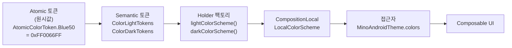
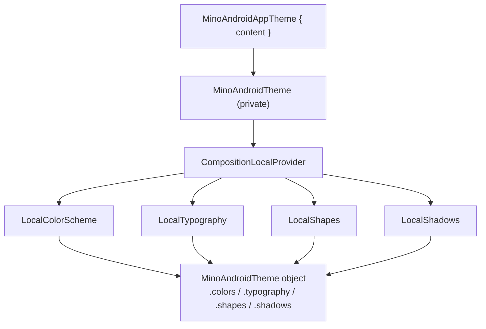

# core:design-system

MinoAndroid의 디자인 시스템 모듈. Material3를 기반으로 하되, Material의 `ColorScheme` / `Typography` / `Shapes`를 직접 노출하지 않고 **자체 토큰 시스템으로 한 번 감싸서** 제공한다.

> [!IMPORTANT]
> **색상·타이포·그림자 토큰은 디자이너의 Figma 디자인 시스템(MU_Wanted Design System)에서 추출한 실제 값이다.**
> 서체는 디자인 지정 폰트 [SUITE](https://sun.fo/suite)(OFL-1.1, [SUITE-LICENSE.txt](SUITE-LICENSE.txt))를 Regular/Medium/Bold 3종으로 번들한다(`res/font/`). 단, **셰이프(8/12/16dp)는 아직 placeholder**다.

---

## 1. 개요

| | |
|---|---|
| **무엇을** | 앱 전역에서 일관되게 쓰는 색상·타이포·셰이프·그림자 토큰과, 이를 주입하는 테마(`MinoAndroidAppTheme`)를 제공한다. |
| **왜 자체 토큰인가** | Material3 기본 타입을 그대로 쓰면 접근점이 흩어지고 디자인 토큰을 통제하기 어렵다. 자체 홀더로 감싸 **단일 접근점**(`MinoAndroidTheme.*`)을 두고, `원시값 → 시맨틱 → 사용처`로 이어지는 흐름을 명시적으로 관리한다. |

`core` 레이어 모듈로, 화면을 그리는 모든 UI(주로 feature 모듈)가 의존한다.

**제공 자산**

| 자산 | 설명 | 참조 |
|---|---|---|
| 디자인 토큰 | 색상·타이포·셰이프·그림자를 3계층(원시→시맨틱→홀더)으로 관리 | [4. 토큰 시스템](#4-토큰-시스템) |
| 아이콘 | Figma 아이콘 세트를 `ImageVector`로 제공하는 `MinoIcons` 네임스페이스 | [5. 아이콘](#5-아이콘) |
| 테마 진입점 | `MinoAndroidAppTheme` — 토큰을 주입하고 라이트/다크를 자동 전환 | [2. 빠른 시작](#2-빠른-시작) |
| Modifier 유틸 | 클릭·선택(연타 차단·리플 표준화)·그림자 토큰 적용 `Modifier` 확장 | [6.3 클릭·선택 Modifier 유틸](#63-클릭선택-modifier-유틸) |
| 프리뷰 어노테이션 | 라이트/다크 동시 프리뷰 `@UiModePreviews` | [6.4 프리뷰](#64-프리뷰) |
| 공용 컴포넌트 | 토큰으로 조립한 재사용 Composable. `component/` 패키지에서 제공 | [6.1 컴포넌트 구현 패턴](#61-컴포넌트-구현-패턴--material3-관례) |

---

## 2. 빠른 시작

**① 의존성 추가** — 소비 모듈 `build.gradle.kts`:

```kotlin
dependencies {
    implementation(project(":core:design-system"))
}
```

**② 진입점을 테마로 감싸기** — Activity `setContent`(또는 화면 최상위)를 `MinoAndroidAppTheme`로 감싼다. 라이트/다크는 시스템 모드에 따라 자동 적용되고, 폰트 배율은 시스템 설정과 무관하게 고정된다([4.5 토큰 규칙](#45-토큰-규칙) 참조).

```kotlin
setContent {
    MinoAndroidAppTheme {
        AppContent() // 이 안에서만 MinoAndroidTheme.* 접근 가능
    }
}
```

**③ 토큰·클릭 유틸 꺼내 쓰기** — `MinoAndroidTheme`로 토큰을 읽고, 클릭은 클릭 유틸로 처리한다.

```kotlin
Text(
    text = "Mino-Android",
    color = MinoAndroidTheme.colors.labelNormal,
    style = MinoAndroidTheme.typography.body1NormalRegular,
)

Box(
    modifier = Modifier
        .dropShadow(
            shape = MinoAndroidTheme.shapes.medium,
            shadow = MinoAndroidTheme.shadows.normalMedium,
        )
        .clip(MinoAndroidTheme.shapes.medium)
        .background(MinoAndroidTheme.colors.fillNormal)
        .rippleSingleClickable { /* onClick */ },
)
```

접근자는 모두 `@Composable @ReadOnlyComposable` 이라 **컴포저블 안에서만** 호출한다.

| 접근자 | 반환 타입 |
|---|---|
| `MinoAndroidTheme.colors` | `ColorScheme` |
| `MinoAndroidTheme.typography` | `Typography` |
| `MinoAndroidTheme.shapes` | `Shapes` |
| `MinoAndroidTheme.shadows` | `Shadows` |

그림자는 여러 겹의 드롭 섀도(`MinoShadow`)로 정의되므로, 위 예시처럼 디자인 시스템이 제공하는 `Modifier.dropShadow(shape, shadow)` 확장으로 적용한다.

> [!IMPORTANT]
> `MinoAndroidTheme.*`는 반드시 **`MinoAndroidAppTheme { ... }` 내부**에서 읽어야 한다. 테마 바깥에서 접근하면 `CompositionLocal`의 정적 기본값(라이트)이 잡힌다.

클릭 유틸 선택 기준은 [6.3 클릭·선택 Modifier 유틸](#63-클릭선택-modifier-유틸)을 참조.

---

## 3. 디렉토리 구조

패키지는 **역할**로 나뉜다. 새 코드는 성격에 맞는 곳에 두고, 새 종류면 같은 패턴으로 패키지를 추가한다.

```
team/mino/core/designsystem/
├── foundation/   # 디자인 기초 자산. foundation별로 color/ typography/ shape/ shadow/ icons/ 하위 패키지를 둔다.
│   ├── <kind>/   #   토큰 foundation = token/ 패키지(Atomic·Semantic·AccessKey) + Holder 파일 + 토큰 카탈로그 프리뷰(*Preview.kt).
│   └── icons/    #   예외: 아이콘은 토큰 3계층 없이 MinoIcons 네임스페이스 + 카탈로그 프리뷰. 아이콘별 ImageVector 파일은 icons/ 하위 패키지.
├── component/    # 토큰으로 조립한 공용 Composable 컴포넌트. 컴포넌트별 하위 패키지로 구성.
├── theme/        # 테마 진입점·접근자 (MinoAndroidAppTheme / MinoAndroidTheme).
└── util/         # 재사용 UI 유틸.
    ├── modifier/ #   Modifier 확장 (예: clickable/ — 클릭·디바운스, shadow/ — 그림자 토큰 적용). 종류별로 하위 패키지.
    └── preview/  #   프리뷰 어노테이션.
```

| 새로 추가하는 것 | 위치 |
|---|---|
| 새 토큰 값/슬롯 | 해당 `foundation/<kind>/` — 절차는 [4.4 토큰 추가하기](#44-토큰-추가하기) |
| 새 foundation 종류 (예: spacing) | `foundation/` 아래 새 패키지를 기존 3계층 패턴으로 |
| 새 아이콘 | `foundation/icons/` — 절차는 [5.2 아이콘 추가하기](#52-아이콘-추가하기) |
| 공용 Composable 컴포넌트 (버튼·칩 등) | `component/<name>/` — 구조는 [6.1 컴포넌트 구현 패턴](#61-컴포넌트-구현-패턴--material3-관례) |
| `Modifier` 확장 | `util/modifier/<종류>/` (공개 확장만 노출, 내부 구현은 `internal`) |
| 프리뷰·기타 UI 유틸 | `util/` 아래 성격에 맞는 패키지 |

---

## 4. 토큰 시스템

색상·타이포·셰이프·그림자 토큰의 구조부터 소비·확장·규칙까지 토큰에 관한 모든 것을 이 섹션에 모은다.

### 4.1 3계층 아키텍처

원시값(Atomic) → 시맨틱 토큰(Semantic) → 홀더(Holder)를 거쳐 `CompositionLocal`로 주입되고, 소비처에서 `MinoAndroidTheme.*`로 읽는다.



색상을 예로 들었지만 **타이포·셰이프·그림자도 동일한 3계층 구조**다. 네 foundation은 1:1로 대응한다.

| 계층 | color | typography | shape | shadow |
|---|---|---|---|---|
| **Atomic** (원시값) | `AtomicColorToken` | `AtomicTypographyToken` | `AtomicShapeToken` | `AtomicShadowToken` |
| **Semantic** (의미 토큰) | `ColorLightTokens` / `ColorDarkTokens` | `TypographyTokens` | `ShapeTokens` | `ShadowTokens` |
| **Key enum + `value`** | `ColorAccessKeyToken` | `TypographyAccessKeyToken` | `ShapeAccessKeyToken` | `ShadowAccessKeyToken` |
| **Holder** (클래스) | `ColorScheme` | `Typography` | `Shapes` | `Shadows` |
| **팩토리** | `light/darkColorScheme()` | `minoTypography()` | `minoShapes()` | `minoShadows()` |
| **CompositionLocal** | `LocalColorScheme` | `LocalTypography` | `LocalShapes` | `LocalShadows` |
| **접근자** | `MinoAndroidTheme.colors` | `.typography` | `.shapes` | `.shadows` |

> [!NOTE]
> 색상만 라이트/다크 2개 팩토리를 가진다. 타이포·셰이프·그림자는 변형이 없어 단일 팩토리다.

테마 주입은 `MinoAndroidAppTheme` → 내부 `MinoAndroidTheme`(private)에서 네 `CompositionLocal`을 **한 번에** provide 하는 구조다.



### 4.2 라이트·다크 모드

모드 전환은 **자동으로 반영**된다. 진입점이 시스템 모드를 보고 스킴을 고른다.

```kotlin
// ColorScheme.kt
@Composable
internal fun provideColorScheme(): ColorScheme = when {
    isSystemInDarkTheme() -> DarkColorScheme   // 다크면 다크 스킴
    else -> LightColorScheme                   // 아니면 라이트 스킴
}
```

선택된 스킴이 `LocalColorScheme`에 주입되므로 외부(홀더 프로퍼티)든 내부(`*.value`)든 같은 값을 읽는다. `isSystemInDarkTheme()`이 `@Composable`이라 런타임에 모드가 바뀌면 재구성되어 자동 갱신된다.

### 4.3 사용 패턴 — 모듈 안팎의 두 갈래

같은 토큰이라도 **모듈 밖에서 쓰는 길**과 **모듈 안에서 쓰는 길**이 다르다.

**(A) 모듈 외부 소비자 — 홀더 프로퍼티**

다른 모듈(`feature:*` 등)에서는 public API인 홀더 프로퍼티만 사용한다.

```kotlin
val color = MinoAndroidTheme.colors.labelNormal
val style = MinoAndroidTheme.typography.body1NormalRegular
val shape = MinoAndroidTheme.shapes.medium
```

**(B) 모듈 내부 기여자 — AccessKey 토큰의 `value`**

design-system 안에서 컴포넌트를 만들 때는 `internal`인 `*AccessKeyToken.value` 확장으로 현재 활성 테마 값을 해석한다. (외부 모듈에서는 `internal`이라 보이지 않는다.)

```kotlin
Text(
    modifier = Modifier
        .background(
            shape = ShapeAccessKeyToken.Small.value,
            color = ColorAccessKeyToken.BackgroundNormalNormal.value,
        )
        .padding(4.dp),
    text = "Mino-Android",
    style = TypographyAccessKeyToken.Body1NormalBold.value.copy(
        color = ColorAccessKeyToken.LabelNormal.value,
    ),
)
```

`*.value`는 내부적으로 `MinoAndroidTheme.<foundation>.fromToken(this)`를 호출해 `키 → 실제 값`으로 변환한다.

> [!TIP]
> **왜 두 갈래로 나눴나**
> - **캡슐화**: 키 enum·`fromToken` 같은 내부 메커니즘을 `internal`로 숨기고, 외부엔 안정적인 홀더 프로퍼티만 노출 → 내부 리팩토링이 외부로 새지 않는다.
> - **단순한 외부 API**: 소비자는 `theme.colors.x` 한 방식만 알면 된다.
> - **내부의 유연함**: 컴포넌트를 토큰 **키로 파라미터화**(`fun MinoChip(colorKey: ColorAccessKeyToken)`)할 수 있어, 테마가 바뀌면 자동으로 따라간다.

### 4.4 토큰 추가하기

새 슬롯을 추가할 때 손대는 파일은 foundation마다 **동일한 4곳**이다. 색상에 시맨틱 슬롯 `StatusInfo`를 추가하는 예시:

| 순서 | 파일 | 할 일 |
|---|---|---|
| 1 | `AtomicColorToken` | 원시값 정의 (팔레트에 없는 색일 때만) — `val Teal40 = Color(0xFF008577)` |
| 2 | `ColorLightTokens` / `ColorDarkTokens` | 시맨틱 매핑 — `val StatusInfo = AtomicColorToken.Blue50` (모드별로 다른 원시값 가능) |
| 3 | `ColorAccessKeyToken` | enum 항목 추가 (`fromToken`의 `when`이 망라적이라 분기 추가를 강제함) |
| 4 | `ColorScheme` | 홀더 프로퍼티 + `copy` 인자 + 팩토리 기본값 + `fromToken` 분기 추가 |

시맨틱 이름은 원시값이 아니라 **용도**(`LabelNormal`, `FillStrong` 등)를 따른다. 반투명 시맨틱은 `AtomicOpacityToken`의 알파를 곱해 만든다 — `AtomicColorToken.CoolNeutral50.copy(alpha = AtomicOpacityToken.Opacity22)`.

typography·shape·shadow도 **`Atomic → Tokens → AccessKeyToken(enum + when) → Holder(프로퍼티/copy/fromToken)`** 순서로 똑같이 진행한다. 단, 새 `CompositionLocal`을 추가하면 루트 `lint.xml`의 `ComposeCompositionLocalUsage` allowlist에도 등록한다.

### 4.5 토큰 규칙

| 항목 | 규칙 |
|---|---|
| **가시성** | 홀더 클래스·`MinoAndroidAppTheme`·`MinoAndroidTheme`, 그리고 홀더 프로퍼티가 노출하는 값 타입(`MinoShadow`)과 적용 확장(`Modifier.dropShadow`)만 public. 팩토리·`*AccessKeyToken`·`value`·`fromToken`·`Local*`·`*Token` 오브젝트는 모두 `internal`. 외부는 홀더 프로퍼티로만 접근한다. |
| **불변성** | 모든 홀더는 `@Immutable` — Compose가 재구성을 안전하게 스킵하도록 보장. |
| **equals/hashCode** | 홀더는 모든 토큰 프로퍼티 기준으로 동등성 정의, `hashCode`는 `arrayOf(...).contentHashCode()`. 토큰 추가 시 함께 갱신한다. |
| **다크 모드** | `ColorDarkTokens`는 Figma 다크 시맨틱 매핑을 반영한다. 새 시맨틱 슬롯은 라이트/다크 매핑을 항상 쌍으로 추가한다. |
| **폰트 배율 고정** | 테마가 `LocalDensity`의 `fontScale`을 `1f`로 고정해 **테마 하위에서는 항상 1sp = 1dp**다. 시스템 폰트 크기 설정은 앱 텍스트에 반영되지 않는다. 폰트 크기·행간은 그대로 `.sp`로 표기한다(`TextStyle.fontSize`는 `TextUnit`이라 dp를 넣을 수 없다). 배경은 ADR 참조. |

> [!IMPORTANT]
> 토큰의 SSOT는 디자이너의 Figma 디자인 시스템이다. Figma 토큰이 바뀌면 [4.4 토큰 추가하기](#44-토큰-추가하기) 절차로 코드를 따라 맞춘다.

---

## 5. 아이콘

디자이너의 Figma 아이콘 세트를 Compose `ImageVector`로 변환해 제공한다. 각 아이콘은 `MinoIcons` 오브젝트의 확장 프로퍼티(지연 생성 + 캐싱)이며, 파일 하나가 아이콘 하나다.

### 5.1 사용

```kotlin
Icon(
    imageVector = MinoIcons.CaretDown,
    contentDescription = null,
    tint = MinoAndroidTheme.colors.labelNormal,
)
```

| 규칙 | 내용 |
|---|---|
| **색상** | 벡터에 색을 굽지 않는다. 기본 fill(#171719)은 자리값일 뿐, 실제 색은 항상 `Icon`의 `tint`로 입힌다. |
| **변형** | Fill·Thick·Tight 변형은 이름 접미사가 붙은 **별도 프로퍼티**다. 상태(선택/비선택)에 따라 에셋을 갈아끼우지 말고, 단일 에셋 + 틴트가 기본이다. |
| **크기** | 24×24 기준. Figma 원본이 비정방형인 아이콘만 원본 비율을 따른다. 표시 크기는 `Modifier.size`로 제어한다. |

전체 목록은 `MinoIconsPreview`의 카탈로그 프리뷰로 확인한다.

### 5.2 아이콘 추가하기

아이콘의 SSOT도 Figma 디자인 시스템이다. 새 아이콘은 Figma 심볼을 SVG로 export한 뒤 변환한다.

1. Figma에서 심볼(24×24)을 SVG로 export
2. 모듈의 `scripts/svg2imagevector.py`로 변환 — `python3 core/design-system/scripts/svg2imagevector.py <input.svg> <iconNameCamelCase> <foundation/icons/icons 경로>`
3. `MinoIconsPreview`의 카탈로그 목록에 항목 추가

변환 가능한 SVG 조건: 단색 fill(stroke·transform·그라데이션 불가), viewBox 원점 0,0. 조건을 벗어나면 스크립트가 에러로 알려주며, 그 경우 Figma에서 패스를 병합(flatten)해 다시 export한다.

### 5.3 래스터 이미지 에셋

`ImageVector`로 변환할 수 없는 사진·일러스트 등 래스터 이미지는 **WebP**로 저장한다(PNG·JPEG 등 다른 래스터 포맷 금지). Figma에서 export한 원본이 PNG여도 `cwebp -lossless -q 100 <원본>.png -o <대상>.webp`로 무손실 변환 후 커밋한다. 리소스 참조는 `R.drawable.<name>`으로 확장자와 무관해 코드 변경이 필요 없다. 배경은 [ADR](../../docs/adr/2026-08-01-webp-for-raster-images.md) 참고.

밀도별로 `drawable-mdpi/xhdpi/xxhdpi/`에 나눠 배치한다(밀도 미구분 `drawable/`은 `IconLocation` 린트 경고 대상).

---

## 6. 컴포넌트 & UI 유틸

재사용하는 Composable·`Modifier` 자산. 외부 모듈은 여기의 public API를 그대로 가져다 쓴다.

### 6.1 컴포넌트 구현 패턴 — Material3 관례

`component/` 하위 컴포넌트는 **Material3 컴포넌트 구조(Defaults object · Colors 클래스 · 컴포넌트 토큰 층)** 를 따른다. 채택 배경·근거·레퍼런스 원문 링크는 [M3 컴포넌트 패턴 ADR](../../docs/adr/2026-07-25-design-system-component-m3-pattern.md)을 참조.

`component/<name>/` 아래에 다음 구성으로 만든다.

| 구성 요소 | 역할 | M3 대응 |
|---|---|---|
| `Mino<Name>` Composable | 공개 API. 셰이프·색·패딩 등 커스터마이징 파라미터의 디폴트는 전부 `Mino<Name>Defaults`에서 공급 | `Button` |
| `Mino<Name>Defaults` object | 기본값 프로퍼티·상수와 `...colors()` 팩토리. 파일이 커지면 별도 파일로 분리 | `ButtonDefaults` |
| `Mino<Name>Colors` 클래스 | 상태(enabled 등)별 색 슬롯. `@Immutable`, `Color.Unspecified`를 "원본 유지"로 해석하는 `copy`, `@Stable internal` 상태 해석 함수, equals/hashCode. 기본 인스턴스는 `ColorScheme`의 `internal var default<Name>ColorsCached`에 캐시 | `ButtonColors` |
| `token/<Name>Tokens` object | `internal`. 컴포넌트 슬롯 → 디자인 토큰 키(`*AccessKeyToken`) 매핑만 담고, 값 해석은 `*AccessKeyToken.value`가 담당 | `tokens/FilledButtonTokens` |

- 상태 없는 컴포넌트는 Colors 클래스 없이 Defaults의 단일 값 프로퍼티로 둔다(M3 `BadgeDefaults.containerColor` 방식).
- **클릭은 M3처럼 `Surface(onClick)`을 쓰지 않고** [6.3 클릭·선택 Modifier 유틸](#63-클릭선택-modifier-유틸)로 처리한다.
- 아직 동작하지 않는 기능의 파라미터는 미리 만들지 않는다 — 이후 기능은 디폴트 파라미터로 소스 호환 추가한다.

### 6.2 Modifier 확장 구현 규칙

새 `Modifier` 확장을 추가할 때 따르는 규칙이다. (참조 구현: `util/modifier/clickable`)

- **`composed { }` 대신 `Modifier.Node` API를 우선 사용한다.** 확장 안에서 상태·`CompositionLocal`·`remember` 등이 필요해 `composed`를 쓰고 싶어지는 상황이라면, `Modifier.Node`로 구현한다. `composed`는 재사용·skippable 최적화를 깨고 불필요한 할당을 유발한다.
- **공개 API는 `Modifier` 확장 함수뿐.** `ModifierNodeElement`·`Modifier.Node` 구현은 `internal`로 숨기고, 외부에는 확장 함수만 노출한다.
- **위치**: `util/modifier/<종류>/`. `Modifier.Node`/`Element` 구현은 그 아래 `node/` 하위 패키지에 둔다.

> 컴포저블 안의 람다는 수동 `remember`로 감싸지 않는다 → [ADR](../../docs/adr/2026-08-01-compose-lambda-memoization.md). 상태 홀더·비용 큰 객체를 붙잡는 `remember`는 그대로 쓴다.

### 6.3 클릭·선택 Modifier 유틸

`util/modifier/clickable`·`util/modifier/selectable`은 **연타(중복 클릭) 차단**과 **리플(ripple) 표시**를 디자인 시스템 차원에서 표준화한 `Modifier` 확장이다. 외부 모듈은 아래 6개 공개 확장만 사용하고, 일반 클릭에 `Modifier.clickable`을 직접 쓰기보다 이 확장으로 연타·리플 정책을 일관되게 가져간다.

| 확장 | 리플 | 연타 차단 | 용도 |
|---|---|---|---|
| `Modifier.rippleClickable` | O | X | 일반 클릭 + 기본 리플 (Compose `clickable`의 얇은 래퍼) |
| `Modifier.singleClickable` | X | O | 리플 없이 연타만 차단 |
| `Modifier.rippleSingleClickable` | O | O | 리플 + 연타 차단 (가장 흔한 버튼 케이스) |
| `Modifier.rippleSelectable` | O | X | `rippleClickable`의 선택 버전 (Compose `selectable`의 얇은 래퍼) |
| `Modifier.singleSelectable` | X | O | `singleClickable`의 선택 버전 |
| `Modifier.rippleSingleSelectable` | O | O | `rippleSingleClickable`의 선택 버전 (선택 상태를 갖는 요소의 기본) |

`selectable` 계열은 clickable 계열과 같은 리플·연타 정책에 `selected` 시맨틱 노출이 더해진 것이다.

**선택 기준**
- **기본값은 `rippleSingleClickable`이다.** 클릭 가능한 요소는 별다른 이유가 없으면 이걸 쓴다.
- **선택 상태를 갖는 요소(탭·칩·세그먼트 등)는 `rippleSingleSelectable`을 쓴다.** 접근성 시맨틱에 `selected`가 실려야 스크린 리더가 현재 선택을 읽을 수 있다.
- 나머지 확장은 **기획 의도가 그것을 요구할 때만** 쓴다. 예: 리플 피드백을 빼야 한다(`single*`), 연타를 허용해야 한다(`ripple*`).
- 기획 의도가 분명하지 않으면 **추측하지 말고 사용자(기획자)에게 확인**한 뒤 확장을 고른다.

> [!WARNING]
> Compose 기본 `Modifier.clickable`·`Modifier.selectable`은 **직접 사용하지 않는다.** 연타·리플 정책을 우회하게 되므로, 클릭·선택은 위 6개 확장으로만 처리한다.

```kotlin
Box(
    modifier = Modifier.rippleSingleClickable(
        debounceIntervalMillis = 300L, // 연타 차단 간격. 기본값과 동일, 생략 가능
        onClick = { viewModel.submit() },
    ),
)
```

### 6.4 프리뷰

**프리뷰는 기본적으로 `@UiModePreviews`를 사용한다.** 단일 `@Preview` 대신 이 어노테이션을 붙여 라이트/다크를 항상 함께 확인한다.

**`component/` 프리뷰는 Figma 문서 페이지의 구조를 그대로 옮긴다.** Figma는 컴포넌트마다 `속성 = 값 · 값` 헤딩과 그 아래 예시 묶음을 세로로 쌓아 문서 페이지를 만든다. 코드도 `PreviewPage` + `PreviewProperty`로 같은 구조를 만들어, **Figma 페이지와 프리뷰를 나란히 놓고 속성 축 단위로 대조**할 수 있게 한다.

```kotlin
@UiModePreviews
@Composable
private fun MyComponentPreview() {
    PreviewPage {
        PreviewProperty(name = "size", values = MySize.entries.previewValues()) {
            PreviewRow {
                MySize.entries.forEach { MyComponent(size = it) }
            }
        }
    }
}
```

작성 규칙:

- **블록 순서·이름은 Figma 문서 페이지를 따른다.** 헤딩에는 코드 파라미터명이 아니라 **Figma 속성명**을 적는다. 둘이 다르면 KDoc에 대응을 남긴다.
- **Figma에 있으나 만들지 않은 축은 이유를 KDoc에 적는다.** 웹 전용 축, 미구현 기능, Android에서 다른 방식으로 대체한 축(hover·press → 리플)이 여기 해당한다.
- **프리뷰는 컴포넌트 파일이 아니라 `<Name>Preview.kt`에 둔다.** 컴포넌트셋이 나뉘어 있으면(예: 형제 컴포넌트셋) 파일도 나눈다.
- 상태가 필요한 컴포넌트는 프리뷰 파일 안에 **인스턴스 하나에 대응하는 private 헬퍼**를 두고 그 헬퍼가 상태를 들게 한다.

`PreviewPage`·`PreviewProperty`·`PreviewRow`·`previewValues`는 `util/preview`가 제공하는 `internal` 유틸이다.
