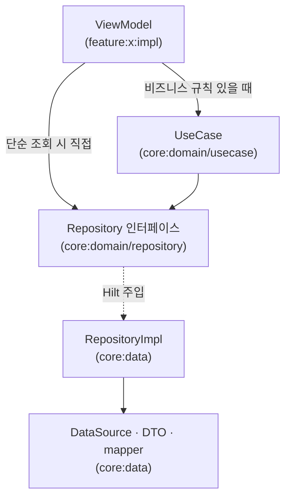

# core:domain

MinoAndroid의 **비즈니스 로직 중심** 모듈. Repository 인터페이스와 필요한 UseCase를 여기 두고, ViewModel과 데이터 계층 사이의 경계를 명확히 한다.

> 모듈 책임·경계·의존 방향(레이어 그래프)은 [`docs/architecture/modularization.md`](../../docs/architecture/modularization.md)를 단일 출처로 한다. 이 문서는 이 모듈의 **API·사용법·확장 규칙**만 다룬다.

---

## 1. 모듈 개요

| 항목 | 내용 |
|---|---|
| Gradle 모듈 | `:core:domain` |
| 모듈 종류 | Kotlin JVM (Android SDK 의존 없음) |
| 의존 | `:core:common:kotlin`만 허용 — `core:domain`이 `implementation`으로 직접 의존할 수 있는 모듈 |
| 역할 | 도메인 모델 · Repository 인터페이스 · UseCase |

Android SDK 의존이 없으므로 JVM 단위 테스트를 Android 환경 없이 실행할 수 있다. UseCase나 Repository 인터페이스는 가짜 구현(fake)으로 교체해 테스트한다.

```kotlin
// test/.../GetDashboardUseCaseTest.kt
class GetDashboardUseCaseTest {

    private val fakeProfileRepository = FakeProfileRepository()
    private val fakePostRepository = FakePostRepository()
    private val useCase = GetDashboardUseCase(fakeProfileRepository, fakePostRepository)

    @Test
    fun `프로필과 게시물 수를 합쳐 대시보드를 반환한다`() = runTest {
        val result = useCase("user-1")
        assertEquals("홍길동", result.profile.name)
        assertEquals(5, result.postCount)
    }
}
```

```kotlin
// build.gradle.kts
plugins {
    alias(libs.plugins.mino.kotlin.jvm)
}

dependencies {
    implementation(project(":core:common:kotlin"))
    implementation(libs.kotlinx.coroutines.core) // Flow, suspend
    implementation(libs.javax.inject)             // @Inject constructor

    testImplementation(libs.kotlinx.coroutines.test) // runTest
}
```

---

## 2. 패키지 구조

```
:core:domain — team/mino/core/domain/
├── model/          # 도메인 모델 (Entity, VO)
├── repository/     # Repository 인터페이스
└── usecase/        # UseCase (필요한 경우에만)
```

| 디렉터리 | 배치 기준 |
|---|---|
| `model/` | 비즈니스 개념을 표현하는 순수 Kotlin 데이터 타입. DTO·Room Entity 아님. `enum`, `sealed class`(상태 표현 등)도 비즈니스 개념이면 함께 둔다. 파일이 늘어나면 `model/enum`, `model/state` 등으로 하위 분리 가능 |
| `repository/` | 데이터 접근의 계약(인터페이스). 구현체는 `:core:data`에 위치 |
| `usecase/` | 여러 Repository 조합, 비즈니스 규칙, 재사용 행위만 위치. 기준은 4장 참조 |

---

## 3. 레이어 흐름



ViewModel은 UseCase 또는 Repository 인터페이스만 알고, 구현체(`RepositoryImpl`)는 알지 못한다. RepositoryImpl과 Hilt 바인딩은 `:core:data`에 두고, `:app`은 최종 DI 그래프를 조립한다.

---

## 4. UseCase 생성·생략 기준

### 생략해도 되는 경우 — ViewModel이 Repository를 직접 호출

아래 조건을 **모두** 만족하면 UseCase 없이 ViewModel이 Repository 인터페이스를 직접 호출한다.

- 단일 API 하나로 화면에 필요한 데이터를 모두 받는다
- 응답 데이터를 그대로(또는 단순 변환만) 화면에 보여준다
- 여러 화면에서 재사용할 행위가 아니다
- 정렬, 필터링, 권한 판단, 상태 전이 같은 비즈니스 규칙이 없다

```kotlin
@HiltViewModel
class ProfileViewModel @Inject constructor(
    private val profileRepository: ProfileRepository,  // Repository 인터페이스 직접 주입
) : ViewModel(), MviContainer<ProfileUiState, ProfileSideEffect> by mviContainer(ProfileUiState()) {

    fun loadProfile(userId: String) {
        viewModelScope.launch {
            val profile = profileRepository.getProfile(userId)
            updateState { copy(profile = profile.toUiModel()) }
        }
    }
}
```

### UseCase가 필요한 경우

다음 중 하나라도 해당되면 UseCase를 `core:domain/usecase`에 작성한다.

> UseCase가 주입받는 Repository는 `core:domain/repository`의 인터페이스이며, 실제 구현체(`RepositoryImpl`)는 `core:data`에 있고 Hilt가 런타임에 바인딩한다.

| 상황 | 예시 |
|---|---|
| 여러 Repository/API를 조합 | 프로필 + 팔로워 수 + 게시물 수를 합쳐 대시보드 구성 |
| 비즈니스 규칙 — 정렬·필터링 | 공지사항을 고정 → 최신순으로 정렬 |
| 비즈니스 규칙 — 권한 판단 | 로그인 상태·역할에 따라 메뉴 노출 여부 결정 |
| 비즈니스 규칙 — 상태 전이 | 주문 상태가 특정 단계일 때만 취소 가능 판단 |
| 여러 화면에서 재사용하는 행위 | 알림 읽음 처리를 피드·마이페이지·상세 세 곳에서 공통 사용 |

UseCase 작성 규칙:

- UseCase는 다른 UseCase보다 Repository 인터페이스에 직접 의존하는 것을 우선한다.
- public 함수는 기본적으로 `operator fun invoke(...)` 하나로 둔다.
- UI 상태, navigation, Android `Context`를 알지 않는다.

```kotlin
// core:domain/usecase/GetDashboardUseCase.kt
class GetDashboardUseCase @Inject constructor(
    private val profileRepository: ProfileRepository,
    private val postRepository: PostRepository,
) {
    suspend operator fun invoke(userId: String): Dashboard {
        val profile = profileRepository.getProfile(userId)
        val postCount = postRepository.getPostCount(userId)
        return Dashboard(profile = profile, postCount = postCount)
    }
}
```

```kotlin
@HiltViewModel
class DashboardViewModel @Inject constructor(
    private val getDashboard: GetDashboardUseCase,  // UseCase 주입
) : ViewModel(), MviContainer<DashboardUiState, DashboardSideEffect> by mviContainer(DashboardUiState()) {

    fun load(userId: String) {
        viewModelScope.launch {
            val dashboard = getDashboard(userId)
            updateState { copy(dashboard = dashboard.toUiModel()) }
        }
    }
}
```

### 판단 흐름

```
단일 API이고 비즈니스 판단/조합 없음?
    YES → ViewModel이 Repository 직접 호출
    NO  → 여러 Repository 조합 or 비즈니스 규칙 or 재사용?
              YES → UseCase 작성 (core:domain/usecase)
              NO  → ViewModel이 Repository 직접 호출
```

---

## 5. Repository 인터페이스 규칙

### 위치

| 항목 | 위치 |
|---|---|
| 인터페이스 | `core:domain/repository/` |
| 구현체(`RepositoryImpl`) | `core:data` |
| DataSource · DTO · mapper | `core:data` |

### 작성 규칙

- 반환 타입은 도메인 모델(`core:domain/model/`)만 사용한다. DTO·Room Entity 반환 금지.
- 코루틴 기반(`suspend` 함수 또는 `Flow`)으로 작성한다.
- 인터페이스 이름: `XxxRepository`

```kotlin
// core:domain/repository/ProfileRepository.kt
interface ProfileRepository {
    suspend fun getProfile(userId: String): Profile
    fun observeProfile(userId: String): Flow<Profile>
}
```

```kotlin
// core:domain/model/Profile.kt
data class Profile(
    val id: String,
    val name: String,
    val imageUrl: String,
)
```

```kotlin
// core:data — RepositoryImpl은 여기에
class ProfileRepositoryImpl @Inject constructor(
    private val remoteDataSource: ProfileRemoteDataSource,
) : ProfileRepository {

    override suspend fun getProfile(userId: String): Profile {
        return remoteDataSource.getProfile(userId).toDomain()  // DTO → 도메인 모델 변환
    }

    // Flow를 반환하는 경우도 DTO → 도메인 모델 변환은 RepositoryImpl 내부에서 끝낸다
    override fun observeProfile(userId: String): Flow<Profile> {
        return remoteDataSource.observeProfile(userId).map { it.toDomain() }
    }
}
```

---

## 6. ViewModel 책임 범위

ViewModel은 **UI 상태 연결 + Domain 호출**만 담당한다. 비즈니스 판단·규칙은 ViewModel 안에 작성하지 않는다.

### 해야 할 것

- `MviContainer`로 UI 상태(`UiState`)·사이드 이펙트(`SideEffect`) 관리
- UseCase 또는 Repository 인터페이스 호출
- `SavedStateHandle`로 라우트 인자 복원

### 하지 말아야 할 것

| 안티패턴 | 대안 |
|---|---|
| ViewModel 안에서 정렬·필터링 판단 | UseCase로 이동 |
| 여러 Repository를 ViewModel에서 직접 조합 | UseCase로 이동 |
| DTO·Room Entity를 ViewModel이 직접 다룸 | Repository 인터페이스가 도메인 모델로 변환 후 반환 |
| ViewModel이 `RepositoryImpl`을 직접 의존 | 인터페이스에만 의존, 구현 바인딩은 Hilt |

```kotlin
// ✅ 올바른 예 — 정렬 로직은 UseCase 안에
fun loadFeed() {
    viewModelScope.launch {
        val feed = getSortedFeed()       // UseCase 호출
        updateState { copy(items = feed) }
    }
}

// ❌ 잘못된 예 — 비즈니스 규칙이 ViewModel에
fun loadFeed() {
    viewModelScope.launch {
        val feed = feedRepository.getFeed()
            .sortedByDescending { it.isPinned }  // ❌ 정렬 로직
            .take(20)                            // ❌ 페이징 기준
        updateState { copy(items = feed) }
    }
}
```

---

## 7. 금지 규칙 (안티패턴)

### 의존 방향 원칙

`core:domain`은 레이어 계층의 안쪽에 위치하며 바깥 레이어를 알아서는 안 된다.

| 금지 | 이유 |
|---|---|
| `core:domain`이 Android SDK에 의존 | JVM 단위 테스트 불가 |
| `core:domain`이 `core:data`에 의존 | 역방향 의존 — `core:data`가 `core:domain`을 의존해야 함 |

### 레이어 계약 위반

레이어 경계는 구현 상세가 아닌 인터페이스·도메인 모델을 통해서만 넘어야 한다.

| 금지 | 이유 |
|---|---|
| Repository 인터페이스가 DTO·Room Entity 반환 | 데이터 계층 구현 상세가 도메인으로 노출됨 |
