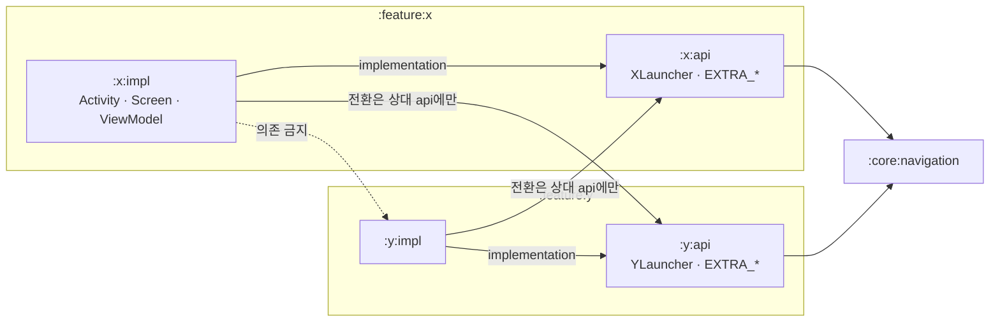
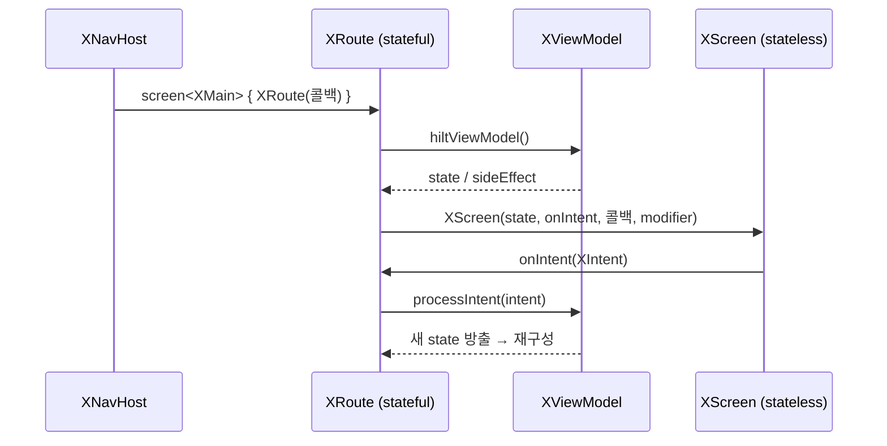

# Feature 모듈 컨벤션

새 feature 모듈을 추가하거나 화면을 작성할 때의 **구조·역할** 규약. **이 문서가 단일 출처(SSOT)** 이며, 아래 인라인 스켈레톤을 그대로 본떠 작성한다.

> **화면 전환(feature 간 Activity / feature 내부 Route)** 규약은 → `docs/architecture/feature-navigation.md`.
>
> placeholder는 `X`(feature 이름), `XMain`/`XDetail`(화면)로 표기한다. 새 feature가 `profile`이면 `ProfileActivity`, `ProfileMain` 식으로 치환한다. MVI 기반 타입(`UiState`/`Intent`/`SideEffect`/`MviContainer`)은 `:core:common:android`의 `architecture` 패키지를 단일 출처로 한다.

---

## 1. 모듈 분리: `api` / `impl`

각 feature는 **두 모듈**로 나뉜다.

| 모듈 | 노출하는 것 | 의존 규칙 |
|---|---|---|
| `:feature:x:api` | 전환 계약만 — `interface XLauncher : ActivityLauncher` + `EXTRA_*` 상수 | 다른 feature는 **이 `api`에만** 의존한다 |
| `:feature:x:impl` | Activity·화면·ViewModel·Launcher 구현 | 자신의 `api`에 의존. **다른 feature의 `impl`에는 의존 금지** |



**핵심**: feature 간 결합은 `impl`이 상대 `api`(Launcher 인터페이스 + 키 상수)에만 의존한다. Hilt가 `impl`의 `XLauncherImpl`을 상대 `api`의 `XLauncher`로 주입해주므로 `impl`끼리 직접 알 필요가 없다. (전환 메커니즘 → `feature-navigation.md`)

---

## 2. 패키지 구조

**화면 단위 우선** 배치다. 그래프 레벨 파일은 모듈 루트, DI는 `di/`, 각 화면은 자기 이름의 디렉터리(`main`, `detail`, …) 아래 `screen·vm·model·component`를 갖는다.

```
:feature:x:api  —  team/mino/feature/x/api/
├── XLauncher.kt         # interface XLauncher : ActivityLauncher
└── XExtras.kt           # const val EXTRA_* = "..."

:feature:x:impl —  team/mino/feature/x/
├── XActivity.kt         # @AndroidEntryPoint, NavHost 호스팅 + feature 간 전환
├── XDestinations.kt     # @Serializable Route 정의(XMain, XDetail) + typeMap
├── XNavHost.kt          # MinoNavHost + screen<T> 등록, navController 보유
├── di/
│   ├── XLauncherImpl.kt        # BaseActivityLauncher 구현
│   └── XNavigationModule.kt    # @Binds XLauncherImpl → XLauncher
├── main/                # 첫 화면(screen-feature)
│   ├── screen/  XRoute.kt(stateful) · XScreen.kt(stateless)
│   ├── vm/      XViewModel · XUiState · XSideEffect · (XIntent: 액션 있을 때만)
│   ├── args/    화면 진입 인자(Route 프로퍼티) 타입 (없으면 생략)
│   ├── model/   UiState를 구성하는 UiModel (없으면 생략)
│   └── component/ Screen 구성용 컴포저블 단위 (없으면 생략)
└── detail/              # 두 번째 화면 — main과 동일 구조
    ├── model/XQuery.kt        # 인자이자 UiState 구성요소 → UiModel로 model에 (아래 규칙)
    ├── screen/  XDetailRoute · XDetailScreen
    └── vm/      XDetailViewModel · XDetailUiState · XDetailSideEffect
```

`api` 모듈은 가볍다 — Launcher 인터페이스와 `EXTRA_*` 상수만 둔다(compose·hilt 미적용).

### 디렉터리 역할 (`<screen>/` 하위)

| 디렉터리 | 역할 |
|---|---|
| `screen/` | `XRoute`(stateful) + `XScreen`(stateless) 컴포저블 |
| `vm/` | `XViewModel` · `XUiState` · `XSideEffect` · (`XIntent`) |
| `args/` | **화면 진입 인자**(Route 프로퍼티)로 쓰는 타입의 **기본 위치** |
| `model/` | **UiState를 구성하는 UiModel** |
| `component/` | **Screen을 구성하는 컴포저블 단위**들의 모음 |

**인자 배치 규칙**: 진입 인자 타입은 기본적으로 `args/`에 둔다. **단 그 인자가 `UiState`에도 쓰이면**(= UiModel 겸용) `model/`에 두고 거기서 가져다 쓴다.
예) `XQuery`가 `XDetail(query)`의 인자이면서 `XDetailUiState.query`이기도 하면 → `model/XQuery.kt`.

### 객체별 역할

| 객체 | 역할 |
|---|---|
| `XActivity` | feature의 단일 진입 Activity. `setContent`로 `XNavHost` 호스팅. feature 간 전환·Intent 처리(→ `feature-navigation.md`) |
| `XDestinations`(`XMain`/`XDetail`) | feature 내부 화면의 type-safe `@Serializable` Route (→ `feature-navigation.md`) |
| `XNavHost` | `MinoNavHost` + `screen<T>`로 화면 그래프 구성, `navController` 보유 (→ `feature-navigation.md`) |
| `XLauncher`(api) / `XLauncherImpl`(impl) | 다른 feature가 이 feature로 전환하는 계약/구현 (→ `feature-navigation.md`) |
| `XRoute` | **stateful** 컴포저블 — VM·state·sideEffect를 Screen에 연결 (4장) |
| `XScreen` | **stateless** 컴포저블 — state·콜백만으로 그리는 순수 UI (4장) |
| `XViewModel` | `MviContainer<XUiState, XSideEffect>` 위임. 라우트 인자는 `savedStateHandle.toRoute<T>()`로 복원 |

---

## 3. 진입점·MVI 스켈레톤

> 전환 관련 스켈레톤(`XDestinations`·`XNavHost`·`XLauncherImpl`·DI)은 → `feature-navigation.md`.

**XActivity — 진입점 (NavHost 호스팅)**
```kotlin
@AndroidEntryPoint
class XActivity : ComponentActivity() {
    @Inject lateinit var yLauncher: YLauncher   // 다른 feature 전환용 (선택)

    override fun onCreate(savedInstanceState: Bundle?) {
        super.onCreate(savedInstanceState)
        enableEdgeToEdge()
        val arg = intent.getStringExtra(EXTRA_SOMETHING)
        setContent {
            MinoAndroidAppTheme {
                XNavHost(
                    startDestination = XMain(arg),                 // 진입 인자는 시작 라우트로 (전환 문서 2장)
                    onNavigateToY = { yLauncher.launch(this) { putExtra(EXTRA_Y, …) } },
                    modifier = Modifier.fillMaxSize(),
                )
            }
        }
    }
}
```

**XViewModel — MVI 컨테이너**
```kotlin
@HiltViewModel
class XViewModel @Inject constructor(
    savedStateHandle: SavedStateHandle,
) : ViewModel(), MviContainer<XUiState, XSideEffect> by mviContainer(XUiState()) {
    init {
        val route = savedStateHandle.toRoute<XMain>()             // 라우트 인자 복원 (전환 문서 2장)
        updateState { copy(arg = route.arg.orEmpty()) }
    }

    fun processIntent(intent: XIntent) { /* when (intent) { … } */ }
}
```
- `XUiState : UiState`, `XSideEffect : SideEffect`, (`XIntent : Intent` — 사용자 액션이 있을 때만).
- 인자가 없으면 `SavedStateHandle`·`init`을 두지 않는다(→ `feature-navigation.md`의 "인자가 없는 화면").

---

## 4. Composable 연결: Route ↔ Screen

화면 한 장은 **Route(연결부) + Screen(UI)** 두 컴포저블로 나눈다.



**`XRoute` — stateful (연결 담당)**
```kotlin
@Composable
internal fun XRoute(
    onNavigateToY: () -> Unit,
    onNavigateToDetail: () -> Unit,
    modifier: Modifier = Modifier,
    viewModel: XViewModel = hiltViewModel(),     // VM 주입
) {
    val state by viewModel.state.collectAsStateWithLifecycle()   // state 구독
    // 1회성 효과가 있으면 viewModel.sideEffect 를 수집해 Toast·이벤트 처리
    XScreen(
        state = state,
        onIntent = viewModel::processIntent,
        onNavigateToY = onNavigateToY,
        onNavigateToDetail = onNavigateToDetail,
        modifier = modifier,
    )
}
```
- VM 획득·state 구독·sideEffect 수집을 담당하고, NavHost가 넘긴 **네비게이션 콜백**을 Screen에 전달한다.
- `XNavHost`가 `screen<T> { XRoute(...) }`로 호출하는 유일한 진입점.

**`XScreen` — stateless (UI 담당)**
```kotlin
@Composable
fun XScreen(
    state: XUiState,
    onIntent: (XIntent) -> Unit,
    onNavigateToY: () -> Unit,
    onNavigateToDetail: () -> Unit,
    modifier: Modifier = Modifier,
) {
    Scaffold(modifier = modifier) { innerPadding ->      // Scaffold를 화면이 소유
        Column(Modifier.padding(innerPadding)) { /* state로 UI 구성 */ }
    }
}
```
- `state`와 콜백**만** 받는다. ViewModel·navController를 모른다 → `@Preview` 단독 렌더 가능.
- **Scaffold·insets를 화면별로 소유**해 topBar/bottomBar를 독립 제어한다.

> **왜 나누나**: 네비게이션·VM 결합(테스트 어려움)을 Route에 격리하고, Screen은 입력→출력이 명확한 순수 함수로 유지해 프리뷰·재사용·테스트가 쉬워진다.

---

## 5. 새 feature 추가 체크리스트

1. `:feature:x:api`, `:feature:x:impl` 생성 후 `settings.gradle.kts` 등록. 컨벤션 플러그인 `mino.android.feature.api` / `mino.android.feature.impl` 적용.
2. `api`: `interface XLauncher : ActivityLauncher` + 필요한 `EXTRA_*` 상수.
3. `impl` 루트: `XActivity` · `XDestinations` · `XNavHost`.
4. `impl/di`: `XLauncherImpl`(`BaseActivityLauncher`) + `@Binds` 모듈.
5. 화면마다 `<screen>/screen`(`XRoute`+`XScreen`) · `<screen>/vm`(`XViewModel`·`XUiState`·`XSideEffect`, 액션 있으면 `XIntent`). 인자·UiModel·컴포저블 조각은 `args`/`model`/`component`(2장 규칙).
6. **화면 전환**(feature 간 Launcher / 내부 Route·인자 복원)은 → `docs/architecture/feature-navigation.md`.
7. Route↔Screen 분리·Scaffold 소유(4장)를 지킨다.

> 참고: 현재 `:feature:sample`이 이 구조의 구현 예시다. 단 **데모용이라 추후 제거될 수 있으므로** 규약의 기준은 이 문서이며, sample 존재에 의존하지 않는다.
