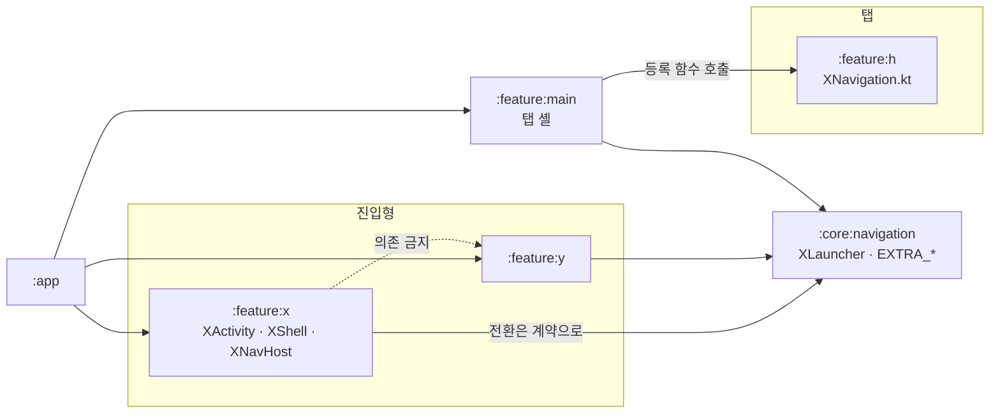
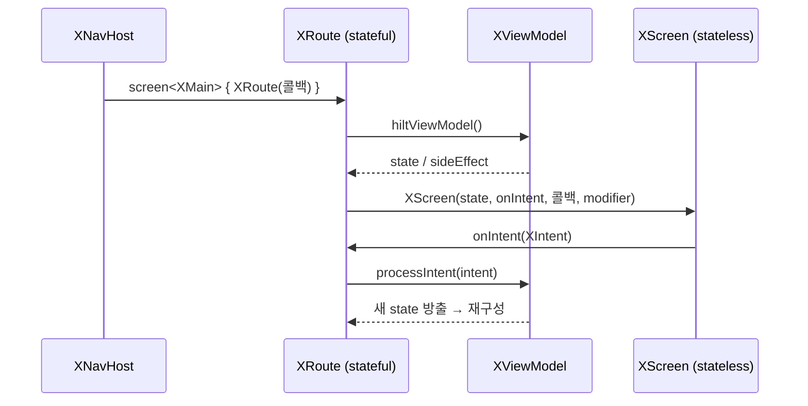

# Feature 모듈 컨벤션

새 feature 모듈을 추가하거나 화면을 작성할 때의 **구조·역할** 규약. **이 문서가 단일 출처(SSOT)** 이며, 아래 인라인 스켈레톤을 그대로 본떠 작성한다.

> **화면 전환(feature 간 Activity / feature 내부 Route)** 규약은 → `docs/architecture/feature-navigation.md`.
>
> placeholder는 `X`(feature 이름), `XMain`/`XDetail`(화면)로 표기한다. 새 feature가 `profile`이면 `ProfileActivity`, `ProfileMain` 식으로 치환한다. MVI 기반 타입(`UiState`/`Intent`/`SideEffect`/`MviContainer`)은 `:core:common:android`의 `architecture` 패키지를 단일 출처로 한다.

---

## 1. feature의 두 종류: 진입형 / 탭

feature는 **단일 모듈**이다. 대신 화면에 어떻게 진입하는지에 따라 두 종류로 나뉘고, 골격과 의존 규칙이 여기서 갈린다.

| | 진입형 feature | 탭 feature |
|---|---|---|
| 무엇인가 | Activity를 진입점으로 갖는 독립 플로우 | 바텀 네비게이션 탭에 해당하며, 셸의 그래프에 중첩 편입되는 화면 묶음 |
| 진입 방법 | 다른 feature가 `XLauncher`로 Activity를 연다 | 셸이 등록 함수를 호출해 자기 그래프에 넣는다 |
| 공개 표면 | `XActivity` (+ `:core:navigation`의 `XLauncher` 계약) | `XNavigation.kt` |
| 셸 소유 | 자기 `XShell`을 갖는다 | 셸이 없다 — `:feature:main`의 셸 안에서 그려진다 |
| 누가 의존하나 | `:app` | `:feature:main` |

구분 기준은 재사용 여부가 아니라 **Activity로 독립 진입하는지, 탭 셸의 그래프에 편입되는지**다. 온보딩·로그인은 호출자가 하나여도 탭 셸과 생애주기가 분리되고 자체 그래프를 가지므로 진입형이다.



**핵심**: feature 간 결합은 `:core:navigation`의 전환 계약 한 겹이다. Hilt가 대상 feature의 `XLauncherImpl`을 그 계약으로 주입해주므로 feature 모듈끼리 컴파일 타임에 서로를 모른다. 계약을 각 feature에 두지 않는 이유(순환 참조)와 탭 등록 형태의 배경은 → [ADR](../adr/2026-08-01-single-module-navigation-contract.md). 전환 메커니즘 자체는 → `feature-navigation.md`.

### 공개 범위

모듈 밖에서 닿을 수 있는 표면은 **가시성으로 정한다.**

- `public`으로 두는 것은 **진입형의 `XActivity`**, **탭의 `XNavigation.kt`(진입 Route + 등록 함수)** 뿐이다.
- 화면·ViewModel·Route·`XShell`·`XNavHost`·`XLauncherImpl`은 `internal`로 둔다.
- 전환 계약(`XLauncher`·`EXTRA_*`)은 이 모듈이 아니라 `:core:navigation`에 있다.

feature 간 순환 참조는 금지한다. 탭끼리 서로를 의존하지 않고, 탭 간 전환은 `:feature:main`이 콜백으로 배선한다.

---

## 2. 패키지 구조

**화면 단위 우선** 배치다. 그래프 레벨 파일은 모듈 루트, DI는 `di/`, 각 화면은 자기 이름의 디렉터리(`main`, `detail`, …) 아래 `screen·vm·model·component`를 갖는다.

**진입형 feature**

```
:feature:x  —  team/mino/feature/x/
├── XActivity.kt         # @AndroidEntryPoint, 셸 호스팅 + feature 간 전환 (public)
├── XDestinations.kt     # @Serializable Route 정의(XMain, XDetail) + typeMap
├── XShell.kt            # MinoScaffold + chrome, navController 보유·화면 로깅
├── XNavHost.kt          # MinoNavHost + screen<T> 등록 (그래프만)
├── di/
│   ├── XLauncherImpl.kt        # BaseActivityLauncher 구현
│   └── XNavigationModule.kt    # @Binds XLauncherImpl → XLauncher
├── main/                # 첫 화면(screen-feature)
│   ├── screen/  XRoute.kt(stateful) · XScreen.kt(stateless)
│   ├── vm/      XViewModel · XUiState · XSideEffect · (XIntent: 액션 있을 때만)
│   ├── args/    화면 진입 인자(Route 프로퍼티) 타입 (없으면 생략)
│   ├── model/   UiState를 구성하는 UiModel (없으면 생략)
│   └── component/ Screen 구성용 컴포저블 단위 (없으면 생략)
└── detail/              # 두 번째 화면 — main과 동일 구조
    ├── model/XQuery.kt        # 인자이자 UiState 구성요소 → UiModel로 model에 (아래 규칙)
    ├── screen/  XDetailRoute · XDetailScreen
    └── vm/      XDetailViewModel · XDetailUiState · XDetailSideEffect
```

> **런처 진입점은 `di/`를 갖지 않는다.** `MAIN`·`LAUNCHER` intent-filter를 든 feature(`:feature:splash`)는 OS 런처만이 열므로 다른 feature가 부를 `XLauncher` 계약 자체가 없다. 계약이 없으면 구현할 것도 바인딩할 것도 없다. 나머지 골격(`XActivity`·`XDestinations`·`XShell`·`XNavHost`)은 진입형 그대로다.

**탭 feature** — `XActivity`·`XShell`·`XNavHost`·`di/`가 없다. 셸을 `:feature:main`이 소유하고, 진입은 등록 함수로 이뤄지기 때문이다.

```
:feature:x  —  team/mino/feature/x/
├── XNavigation.kt       # 진입 Route(XGraph, public) + 내부 Route + NavGraphBuilder.xGraph() (public)
├── main/                # 화면 단위 배치는 진입형과 동일
│   ├── screen/  XRoute · XScreen
│   └── vm/      XViewModel · XUiState · XSideEffect · (XIntent)
└── detail/
```


### 모듈 루트 `component/` — 여러 화면이 함께 쓰는 컴포저블

**두 화면 이상이 같은 컴포저블을 쓰는데 그것이 어느 한 화면의 것이 아닐 때** 모듈 루트에 `component/`를 두고 거기 담는다. 한 화면만 쓰는 것은 그대로 `<screen>/component/`다 — 기본값은 언제나 화면 쪽이고, 이 자리는 **두 번째 화면이 실제로 생긴 뒤에** 만든다([`component-asset-placement.md` §2.1](../conventions/component-asset-placement.md#21-시점)과 같은 시점 규칙이다).

**`:core:common:ui`로 올리는 것과 헷갈리지 않는다.** 그쪽은 **둘 이상의 feature**가 쓸 때이고([같은 문서 §1.2](../conventions/component-asset-placement.md#12-컴포넌트)), 이 자리는 **한 feature 안의 두 화면**이 쓸 때다. 사용처가 같은 모듈에 머무는 한 공용 모듈로 올리지 않는다 — 검증되지 않은 API가 모듈 밖 표면으로 굳는 것을 미루는 것이 그 규칙의 취지다.

컴포저블이 받는 UiModel도 같은 자리에 둔다. 어느 화면의 `model/`에 두면 다른 화면이 남의 화면 패키지를 참조하게 된다.

### 디렉터리 역할 (`<screen>/` 하위)

| 디렉터리 | 역할 |
|---|---|
| `screen/` | `XRoute`(stateful) + `XScreen`(stateless) 컴포저블 |
| `vm/` | `XViewModel` · `XUiState` · `XSideEffect` · (`XIntent`) |
| `args/` | **화면 진입 인자**(Route 프로퍼티)로 쓰는 타입의 **기본 위치** |
| `model/` | **UiState를 구성하는 UiModel** |
| `component/` | **Screen을 구성하는 컴포저블 단위**들의 모음. 어느 모듈에 둘지(feature / `:core:common:ui` / `:core:design-system`)는 → [`component-asset-placement.md`](../conventions/component-asset-placement.md) |

**인자 배치 규칙**: 진입 인자 타입은 기본적으로 `args/`에 둔다. **단 그 인자가 `UiState`에도 쓰이면**(= UiModel 겸용) `model/`에 두고 거기서 가져다 쓴다.
예) `XQuery`가 `XDetail(query)`의 인자이면서 `XDetailUiState.query`이기도 하면 → `model/XQuery.kt`.

### 객체별 역할

| 객체 | 역할 |
|---|---|
| `XActivity` | **진입형**의 단일 진입 Activity. `setContent`로 `XShell` 호스팅. feature 간 전환·Intent 처리(→ `feature-navigation.md`) |
| `XDestinations`(`XMain`/`XDetail`) | feature 내부 화면의 type-safe `@Serializable` Route (→ `feature-navigation.md`) |
| `XShell` | **진입형**의 셸. `MinoScaffold`로 chrome·insets를 열고, `navController`를 만들어 화면 조회 로깅(`TrackScreenViews`)까지 담당한다(4장) |
| `XNavHost` | `MinoNavHost` + `screen<T>`로 **화면 그래프만** 구성. `navController`는 셸에서 받는다 (→ `feature-navigation.md`) |
| `XNavigation.kt`(`XGraph` · `xGraph()`) | **탭**의 유일한 공개 표면. 진입 Route와 그래프 등록 함수를 노출하고 셸이 호출한다 (→ `feature-navigation.md`) |
| `XLauncher`(`:core:navigation`) / `XLauncherImpl`(feature) | 다른 feature가 이 feature로 전환하는 계약/구현 (→ `feature-navigation.md`) |
| `XRoute` | **stateful** 컴포저블 — VM·state·sideEffect를 Screen에 연결 (4장) |
| `XScreen` | **stateless** 컴포저블 — state·콜백만으로 그리는 순수 UI (4장) |
| `XViewModel` | `MviContainer<XUiState, XSideEffect>` 위임. 라우트 인자는 `savedStateHandle.toRoute<T>()`로 복원 |

---

## 3. 진입점·MVI 스켈레톤

> 전환 관련 스켈레톤(`XDestinations`·`XShell`·`XNavHost`·`XNavigation`·`XLauncherImpl`·DI)은 → `feature-navigation.md`.

**XActivity — 진입형의 진입점 (셸 호스팅)**. 탭 feature는 Activity 없이 `XNavigation.kt`의 등록 함수가 진입점 역할을 한다.
```kotlin
@AndroidEntryPoint
class XActivity : ComponentActivity() {
    @Inject lateinit var yLauncher: YLauncher   // 다른 feature 전환용 (선택)

    override fun onCreate(savedInstanceState: Bundle?) {
        super.onCreate(savedInstanceState)
        enableEdgeToEdge()
        val arg = intent.getStringExtra(EXTRA_SOMETHING)
        setContent {
            MinoAndroidAppTheme {
                XShell(
                    startDestination = XMain(arg),                 // 진입 인자는 시작 라우트로 (전환 문서 2장)
                    onNavigateToY = { yLauncher.launch(this) { putExtra(EXTRA_Y, …) } },
                    modifier = Modifier.fillMaxSize(),
                )
            }
        }
    }
}
```

**XViewModel — MVI 컨테이너**
```kotlin
@HiltViewModel
class XViewModel @Inject constructor(
    savedStateHandle: SavedStateHandle,
) : ViewModel(), MviContainer<XUiState, XSideEffect> by mviContainer(XUiState()) {
    init {
        val route = savedStateHandle.toRoute<XMain>()             // 라우트 인자 복원 (전환 문서 2장)
        updateState { copy(arg = route.arg.orEmpty()) }
    }

    fun processIntent(intent: XIntent) { /* when (intent) { … } */ }
}
```
- `XUiState : UiState`, `XSideEffect : SideEffect`, (`XIntent : Intent` — 사용자 액션이 있을 때만).
- 인자가 없으면 `SavedStateHandle`·`init`을 두지 않는다(→ `feature-navigation.md`의 "인자가 없는 화면").

---

## 4. Composable 연결: Route ↔ Screen

화면 한 장은 **Route(연결부) + Screen(UI)** 두 컴포저블로 나눈다.



**`XRoute` — stateful (연결 담당)**
```kotlin
@Composable
internal fun XRoute(
    onNavigateToY: () -> Unit,
    onNavigateToDetail: () -> Unit,
    modifier: Modifier = Modifier,
    viewModel: XViewModel = hiltViewModel(),     // VM 주입
) {
    val state by viewModel.state.collectAsStateWithLifecycle()   // state 구독
    // 1회성 효과가 있으면 viewModel.sideEffect 를 수집해 Toast·이벤트 처리

    // 액션 실패(도메인 에러)를 스낵바로 알릴 때. 호스트는 셸이 소유한다 → error_handling.md §5·§6
    val snackbarHostState = LocalSnackbarHostState.current
    val scope = rememberCoroutineScope()
    val context = LocalContext.current
    CollectDomainError(viewModel) { error ->
        // 리프 → 문구 매핑은 이 화면이 한다. 공통 매퍼는 두지 않는다(error_handling.md §8)
        scope.launch { snackbarHostState.showSnackbar(context.getString(messageResOf(error))) }
    }

    XScreen(
        state = state,
        onIntent = viewModel::processIntent,
        onNavigateToY = onNavigateToY,
        onNavigateToDetail = onNavigateToDetail,
        modifier = modifier,
    )
}
```
- VM 획득·state 구독·sideEffect 수집을 담당하고, NavHost가 넘긴 **네비게이션 콜백**을 Screen에 전달한다.
- `XNavHost`가 `screen<T> { XRoute(...) }`로 호출하는 유일한 진입점.
- `DomainErrorEmitter`는 ViewModel 인스턴스별 채널이라 셸이 대신 수집할 수 없다 — 수집은 Route가 하고 표시할 호스트만 셸에서 받는다. `LocalSnackbarHostState`는 Route에서만 읽고 `XScreen`으로 내려보내지 않는다.
- `messageResOf`는 그 화면이 자기 파일에 두는 `when(error)` 매핑이다. 리프별 문구 정책이 미정이라 **공통 매퍼를 만들지 않는다**(→ `error_handling.md` §8).

**`XScreen` — stateless (UI 담당)**
```kotlin
@Composable
fun XScreen(
    state: XUiState,
    onIntent: (XIntent) -> Unit,
    onNavigateToY: () -> Unit,
    onNavigateToDetail: () -> Unit,
    modifier: Modifier = Modifier,
) {
    Column(modifier) { /* state로 UI 구성 */ }           // Scaffold를 열지 않는다
}
```
- `state`와 콜백**만** 받는다. ViewModel·navController를 모른다 → `@Preview` 단독 렌더 가능.
- `Scaffold`·insets는 화면이 아니라 **셸이 소유**한다(아래).

> **왜 나누나**: 네비게이션·VM 결합(테스트 어려움)을 Route에 격리하고, Screen은 입력→출력이 명확한 순수 함수로 유지해 프리뷰·재사용·테스트가 쉬워진다.

### 셸(`XShell`)과 그래프(`XNavHost`) 분리

**chrome을 여는 셸과 화면 그래프는 컴포저블을 나눈다.** 셸은 `Scaffold`·insets·`navController`·화면 로깅을, 그래프는 `screen<T>` 등록만 맡는다. `Scaffold`는 **그래프당 하나**이고 셸이 소유한다 — 셸은 M3 `Scaffold`를 직접 열지 않고 [`MinoScaffold`](../../core/common/ui/README.md)를 쓰며, 화면은 셸이 계산한 영역 안을 그린다.

```kotlin
// XShell — chrome·insets·navController·로깅
@Composable
internal fun XShell(startDestination: Route, modifier: Modifier = Modifier) {
    val navController = rememberNavController()
    TrackScreenViews(navController)

    MinoScaffold(modifier = modifier, bottomBar = { /* 그래프 전체에 걸리는 chrome */ }) { innerPadding ->
        XNavHost(navController, startDestination, Modifier.padding(innerPadding))
    }
}

// XNavHost — 그래프만
@Composable
internal fun XNavHost(navController: NavHostController, startDestination: Route, modifier: Modifier = Modifier) {
    MinoNavHost(navController, startDestination, modifier) { /* screen<T> 등록 */ }
}
```

- **`Activity`가 호출하는 것은 `XShell`이다.** `XNavHost`는 셸만 호출한다. 탭 feature는 셸을 갖지 않으므로 이 절은 진입형과 `:feature:main`에만 적용된다 — 탭의 화면은 셸이 연 `MinoScaffold` 안에서 그려진다.
- `navController`는 **셸이 만들어** 그래프에 넘긴다. chrome(탭 바 등)이 현재 목적지를 읽어야 하고 화면 로깅도 `navController`에 붙으므로, 소유자를 셸로 못박아 두 관심사가 그래프 안에 섞이지 않게 한다.
- `MinoScaffold`의 슬롯은 `content` **하나**다. 화면 전환이 있으면 그 안에서 `XNavHost`를, 단일 화면이면 화면 컴포저블을 직접 그린다. 화면이 하나여도 인자 복원(`toRoute`)·화면 조회 로깅이 NavHost에 딸려 오므로 **NavHost 유지가 기본**이고, VM·인자·로깅이 모두 없는 정적 화면만 `XNavHost` 없이 셸이 화면을 직접 그린다.
- 여러 화면에 걸치는 chrome(bottomBar)은 **셸의 slot**에 둔다. 탭 전환 화면도 이 형태의 `XShell`일 뿐 별도 구조가 아니다.
- 스낵바 호스트와 미처리 예외 안내는 `MinoScaffold`가 이미 갖고 있다 — feature가 배선하지 않는다(→ `error_handling.md` §6). **Activity당 `MinoScaffold`는 하나**다.
- 화면 고유 chrome(topBar 등)은 그 화면이 자기 컨테이너 최상단에 **직접 배치**한다.
- **예외** — `TopAppBar` 스크롤 연동처럼 slot API가 꼭 필요하거나, 인셋을 무시하고 full-bleed로 그려야 하는 화면은 그 화면이 **M3 `Scaffold`를 직접** 열 수 있다(`MinoScaffold`가 아니다 — 미처리 예외 수집이 중복된다). 이때 인셋 이중 적용을 막기 위해 안쪽은 `contentWindowInsets = WindowInsets(0)`으로 둔다.

> 화면마다 `Scaffold`를 열면 인셋이 중복 적용되고, 여러 화면에 공통으로 걸리는 chrome을 둘 자리가 없다. 배경은 → [Scaffold·insets는 화면이 아니라 네비게이션 셸이 소유한다](../adr/2026-07-29-scaffold-ownership-navhost.md)(당시 셸 이름은 `XNavHost`였다), 셸을 공통 컴포저블로 승격하고 `XShell`/`XNavHost`로 나눈 배경은 → [공통 셸 `MinoScaffold`](../adr/2026-07-31-common-shell-mino-scaffold.md).

---

## 5. 새 feature 추가 체크리스트

모듈 생성·등록 절차(디렉터리·`settings.gradle.kts`·`:app` 의존)는 → `modularization.md`. 여기서는 코드 골격만 적는다.

**공통**

1. 화면마다 `<screen>/screen`(`XRoute`+`XScreen`) · `<screen>/vm`(`XViewModel`·`XUiState`·`XSideEffect`, 액션 있으면 `XIntent`). 인자·UiModel·컴포저블 조각은 `args`/`model`/`component`(2장 규칙).
2. Route↔Screen 분리(4장)를 지키고, 공개 범위는 1장 규칙을 따른다.
3. **화면 전환**(feature 간 Launcher / 내부 Route·인자 복원)은 → `feature-navigation.md`.

**진입형이면**

4. 모듈 루트에 `XActivity` · `XDestinations` · `XShell` · `XNavHost`. 셸/그래프 분리(4장)를 지킨다.
5. `di/`에 `XLauncherImpl`(`BaseActivityLauncher`) + `@Binds` 모듈. 그 짝인 `XLauncher` 계약은 `:core:navigation`에 둔다(→ `feature-navigation.md` 1장). **런처 진입점은 이 항목을 건너뛴다**(2장 주석).

**탭이면**

4. 모듈 루트에 `XNavigation.kt` — 진입 Route(`XGraph`)와 `NavGraphBuilder.xGraph(...)`만 `public`.
5. 셸(`:feature:main`)의 `MainTab`에 항목을 더하고 `MainNavHost`에서 등록 함수를 호출한다.

> 이미 셸에 placeholder로 등록된 탭을 모듈로 떼어내는 경우라면, Route를 셸의 `MainDestinations`에서 새 모듈로 옮겨 `XGraph`로 만들고, `MainTab`이 그것을 참조하도록 바꾼 뒤 placeholder `screen<T>` 등록을 지운다.

> 참고: 진입형은 `:feature:roomform`, 탭은 `:feature:home`이 구현 예시다. 단 규약의 기준은 어디까지나 이 문서이며, 특정 모듈의 존재에 의존하지 않는다.
