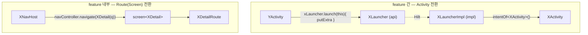

# Feature 화면 전환(네비게이션) 컨벤션

feature의 **화면 전환** 규약. 전환은 범위에 따라 둘로 갈린다 — feature **간**은 Activity, feature **내부**는 Route(Compose Navigation). 모듈 구조·패키지·Composable 구성(Route↔Screen)은 → `feature-module.md`.

> placeholder: `X`/`Y`(feature 이름), `XMain`/`XDetail`(화면). 인프라(`ActivityLauncher`/`BaseActivityLauncher`/`intentOf`/`MinoNavHost`/`screen`/`serializableNavType`/`popBackStackIfResumed`)의 **API는 [`core:navigation` README](../../core/navigation/README.md)를 단일 출처**로 한다 — 여기서 재정의하지 않고, 그 API를 feature가 **어떻게 쓰는지(규약)** 만 다룬다.

---

## 한눈에



| | feature 간 (Activity) | feature 내부 (Route) |
|---|---|---|
| 호출 | `xLauncher.launch(ctx) { putExtra(EXTRA_*, …) }` | `navController.navigate(XDetail(args))` |
| 결과 | `launch(ctx, resultLauncher = …)` + `setResult` | 콜백(`onBack` 등) / 뒤로 `popBackStackIfResumed(entry)` |
| 인자 | **Intent extra** (키는 상대 `api`의 `EXTRA_*` 상수) | **Route 프로퍼티** (primitive 그대로 / custom은 `typeMap`) |
| 복원 | `intent.getXExtra(EXTRA_*)` | ViewModel의 `savedStateHandle.toRoute<T>()` → `UiState` |

> 내부 화면 인자는 컴포저블로 드릴링하지 않는다 — 진입 값은 시작 라우트(`XMain(arg)`)에 싣고, **ViewModel이 `toRoute`로 복원**해 `UiState`에 반영한다.

---

## 1. feature 간 — Activity 전환

다른 feature의 Activity로 갈 때. 전환을 시작하는 쪽은 상대 `api`의 `XLauncher`만 주입받아 호출한다(상대 `impl`은 모른다).

**계약 (api)**
```kotlin
// :feature:x:api
interface XLauncher : ActivityLauncher

const val EXTRA_SOMETHING = "x_something"
```

**구현 (impl/di)**
```kotlin
internal class XLauncherImpl @Inject constructor() : BaseActivityLauncher(), XLauncher {
    override fun createIntent(context: Context): Intent = context.intentOf<XActivity>()
}

@Module
@InstallIn(ActivityRetainedComponent::class)
internal abstract class XNavigationModule {
    @Binds @ActivityRetainedScoped
    abstract fun bindXLauncher(impl: XLauncherImpl): XLauncher
}
```

**호출 (전환 시작 측)**
```kotlin
@Inject lateinit var xLauncher: XLauncher
// ...
xLauncher.launch(this) { putExtra(EXTRA_SOMETHING, value) }                  // fire-and-forget
xLauncher.launch(this, resultLauncher = resultLauncher) { putExtra(...) }    // 결과가 필요할 때
```
- **인자**: Intent extra. 키는 상대 `api`의 `EXTRA_*` 상수로 공유한다(타입 계약 대신 키 상수).
- **받는 쪽**: 대상 Activity가 `intent.getStringExtra(EXTRA_SOMETHING)`로 읽는다(보통 시작 라우트로 넘김 — 2장).
- **결과**: `registerForActivityResult(StartActivityForResult())`로 받고, 대상은 `setResult(RESULT_OK, Intent().putExtra(...))`로 돌려준다.

---

## 2. feature 내부 — Route 전환

같은 feature 안에서의 화면 전환. `MinoNavHost` + type-safe `@Serializable` Route를 쓴다.

**Route 정의 (`XDestinations`)**
```kotlin
@Serializable
internal data class XMain(val arg: String? = null) : Route        // primitive 인자 → typeMap 불필요

@Serializable
internal data class XDetail(val query: XQuery) : Route {          // custom 인자 → typeMap 필요
    companion object {
        val typeMap: Map<KType, NavType<*>> =
            mapOf(typeOf<XQuery>() to serializableNavType<XQuery>())
    }
}
```

**그래프 (`XNavHost`)**
```kotlin
@Composable
internal fun XNavHost(
    startDestination: Route,
    onNavigateToY: () -> Unit,
    modifier: Modifier = Modifier,
) {
    val navController = rememberNavController()
    Scaffold(modifier = modifier) { innerPadding ->            // Scaffold는 셸이 소유 → feature-module.md 4장
        MinoNavHost(navController, startDestination, Modifier.padding(innerPadding)) {
            screen<XMain> {
                XRoute(
                    onNavigateToY = onNavigateToY,
                    onNavigateToDetail = { navController.navigate(XDetail(XQuery(...))) },
                )
            }
            screen<XDetail>(typeMap = XDetail.typeMap) { entry ->
                XDetailRoute(onBack = { navController.popBackStackIfResumed(entry) })
            }
        }
    }
}
```
- **전환**: `navController.navigate(XDetail(args))`. **뒤로**: `popBackStackIfResumed(entry)` — 전환 중 빠른 중복 탭에 의한 이중 pop을 막는다(현재 화면이 RESUMED일 때만 pop).
- **custom 인자 타입**은 `screen<T>(typeMap = XDetail.typeMap)`처럼 등록 시 typeMap을 넘긴다. primitive만 쓰면 생략(`emptyMap`).

**인자 전달·복원**

진입 인자는 컴포저블로 드릴링하지 않는다. Activity는 진입 값을 **시작 라우트**에 싣고:
```kotlin
XNavHost(startDestination = XMain(intent.getStringExtra(EXTRA_SOMETHING)), …)
```
ViewModel이 `savedStateHandle.toRoute<T>()`로 복원해 `UiState`에 반영한다:
```kotlin
init {
    val route = savedStateHandle.toRoute<XMain>()          // custom 타입이면 toRoute<T>(XMain.typeMap)
    updateState { copy(arg = route.arg.orEmpty()) }
}
```
- 같은 `typeMap`을 **등록(`screen<T>`)과 복원(`toRoute<T>`) 양쪽**이 참조해야 한다 → Route `companion`에 한 번 정의해 공유한다.
- `navController.navigate(route)` 호출부는 typeMap을 다시 넘기지 않아도 된다(등록 시점 NavType 재사용). NavType이 필요한 건 `SavedStateHandle` 복원뿐이다.

### 인자가 없는 화면

진입 인자가 없으면 Route를 `data object`로 두고, ViewModel은 `SavedStateHandle`/`toRoute` 없이 초기 `UiState`만 둔다.
```kotlin
@Serializable
internal data object XMain : Route                       // data class → data object, typeMap·args 불필요

@HiltViewModel
class XViewModel @Inject constructor() :                 // SavedStateHandle 주입 안 함
    ViewModel(), MviContainer<XUiState, XSideEffect> by mviContainer(XUiState())
```
- 상태 로직조차 없는 정적 화면이면 ViewModel·Route를 만들지 않고 `screen<XMain> { XScreen(...) }`로 `XScreen`을 직접 등록해도 된다.

### 탭(top-level) 전환

하단 탭처럼 **서로 대등한 최상위 목적지** 사이를 오갈 때는 일반 `navigate`와 navOptions가 다르다. 탭은 이동 이력을 남기지 않아야 하고, 되돌아왔을 때 이전 상태가 남아 있어야 한다.

```kotlin
internal fun NavHostController.navigateToTab(tab: XTab) {
    navigate(tab.route) {
        popUpTo(graph.findStartDestination().id) { saveState = true }
        launchSingleTop = true
        restoreState = true
    }
}
```

| 옵션 | 역할 |
|---|---|
| `popUpTo(startDestination) { saveState = true }` | 탭 전환이 백스택에 쌓이지 않게 되감으면서, 떠나는 탭의 상태를 저장한다 |
| `launchSingleTop` | 선택된 탭을 다시 눌러도 같은 목적지가 중복 생성되지 않는다 |
| `restoreState` | 저장해 둔 탭 상태를 복원한다 — `saveState`와 **짝으로** 켜고 끈다 |

선택 상태는 `currentBackStackEntryAsState()`로 관찰하고, 문자열 비교 대신 Route 타입으로 판별한다. 탭 하위에 중첩 그래프가 생겨도 상위 탭이 선택으로 남도록 `hierarchy`를 훑는다.

```kotlin
destination.hierarchy.any { it.hasRoute(tab.route::class) }
```

탭 목록(Route·아이콘·라벨)은 enum 하나에 모아 그래프와 하단 바가 같은 출처를 보게 한다. 탭 바를 어디에 두는지는 → `feature-module.md` 4장(셸이 `Scaffold` 소유).
