# Feature 화면 전환(네비게이션) 컨벤션

feature의 **화면 전환** 규약. 전환은 범위에 따라 셋으로 갈린다 — feature **간**은 Activity, feature **내부**는 Route(Compose Navigation), 탭 feature는 셸 **그래프에 편입**된다. 모듈 구조·패키지·Composable 구성(Route↔Screen)은 → `feature-module.md`.

> placeholder: `X`/`Y`(feature 이름), `XMain`/`XDetail`(화면). 진입형 feature의 진입 컴포저블은 셸 `XShell`이고, 화면 그래프는 `XNavHost`다(역할 구분 → `feature-module.md` 4장). 인프라(`ActivityLauncher`/`BaseActivityLauncher`/`intentOf`/`MinoNavHost`/`screen`/`graph`/`serializableNavType`/`popBackStackIfResumed`)의 **API는 [`core:navigation` README](../../core/navigation/README.md)를 단일 출처**로 한다 — 여기서 재정의하지 않고, 그 API를 feature가 **어떻게 쓰는지(규약)** 만 다룬다.

---

## 한눈에

```mermaid
flowchart TD
    subgraph A["feature 간 — Activity 전환"]
        direction LR
        caller["YActivity"] -- "xLauncher.launch(this){ putExtra }" --> xl["XLauncher (core:navigation)"]
        xl -. Hilt .-> xli["XLauncherImpl (feature)"]
        xli -- "intentOf&lt;XActivity&gt;()" --> target["XActivity"]
    end
    subgraph B["feature 내부 — Route(Screen) 전환"]
        direction LR
        host["XNavHost"] -- "navController.navigate(XDetail(q))" --> dest["screen&lt;XDetail&gt;"]
        dest --> droute["XDetailRoute"]
    end
    subgraph C["탭 feature — 셸 그래프 편입"]
        direction LR
        shell["MainNavHost"] -- "xGraph(콜백)" --> g["graph&lt;XGraph&gt;"]
        g --> xroute["XRoute"]
    end
```



| | feature 간 (Activity) | feature 내부 (Route) |
|---|---|---|
| 호출 | `xLauncher.launch(activity) { putExtra(EXTRA_*, …) }` | `navController.navigate(XDetail(args))` |
| 결과 | `launch(activity, resultLauncher = …)` + `setResult` | 콜백(`onBack` 등) / 뒤로 `popBackStackIfResumed(entry)` |
| 인자 | **Intent extra** (키는 `:core:navigation`의 `EXTRA_*` 상수) | **Route 프로퍼티** (primitive 그대로 / custom은 `typeMap`) |
| 복원 | `intent.getXExtra(EXTRA_*)` | ViewModel의 `savedStateHandle.toRoute<T>()` → `UiState` |

> 내부 화면 인자는 컴포저블로 드릴링하지 않는다 — 진입 값은 시작 라우트(`XMain(arg)`)에 싣고, **ViewModel이 `toRoute`로 복원**해 `UiState`에 반영한다.

---

## 1. feature 간 — Activity 전환

다른 feature의 Activity로 갈 때. 전환을 시작하는 쪽은 `XLauncher`만 주입받아 호출하고, 대상 feature 모듈은 모른다.

**계약은 `:core:navigation`에 둔다.** feature 모듈에 두면 서로를 여는 두 feature가 생기는 순간 Gradle 모듈 순환이 되어 빌드가 막힌다. 배경 → [ADR](../adr/2026-08-01-single-module-navigation-contract.md).

```kotlin
// :core:navigation — activity/launcher/XLauncher.kt
interface XLauncher : ActivityLauncher

// :core:navigation — activity/launcher/ExtraTag.kt
const val EXTRA_X_SOMETHING = "x_something"
```
- 키 이름은 **`EXTRA_<대상 feature>_<이름>`**. 한 파일의 최상위 상수라 스코프가 없으므로 접두어로 어느 feature에 전달되는 값인지 드러낸다.

**구현 (대상 feature의 `di/`)**
```kotlin
internal class XLauncherImpl @Inject constructor() : BaseActivityLauncher(), XLauncher {
    override fun createIntent(context: Context): Intent = context.intentOf<XActivity>()
}

@Module
@InstallIn(ActivityRetainedComponent::class)
internal abstract class XNavigationModule {
    @Binds @ActivityRetainedScoped
    abstract fun bindXLauncher(impl: XLauncherImpl): XLauncher
}
```

**호출 (전환 시작 측)**
```kotlin
@Inject lateinit var xLauncher: XLauncher
// ...
xLauncher.launch(this) { putExtra(EXTRA_X_SOMETHING, value) }                 // fire-and-forget
xLauncher.launch(this, resultLauncher = resultLauncher) { putExtra(...) }     // 결과가 필요할 때
xLauncher.launch(this, withFinish = true) { putExtra(...) }                   // 호출 화면을 남기지 않을 때
```
- **인자**: Intent extra. 키는 `:core:navigation`의 `EXTRA_*` 상수로 공유한다(타입 계약 대신 키 상수).
- **받는 쪽**: 대상 Activity가 `intent.getStringExtra(EXTRA_X_SOMETHING)`로 읽는다(보통 시작 라우트로 넘김 — 2장).
- **결과**: `registerForActivityResult(StartActivityForResult())`로 받고, 대상은 `setResult(RESULT_OK, Intent().putExtra(...))`로 돌려준다.
- 첫 인자가 `Activity`인 이유와 `withFinish`의 제약은 → [`core:navigation` README](../../core/navigation/README.md).

**컴포저블에서 호출하지 않는다.** 전환은 Activity가 시작하고, 화면은 콜백만 올려보낸다(`onNavigateToX`). 콜백이 Activity·`resultLauncher`를 캡처하면 컴파일러가 memoize하지 못해 그래프 빌더 람다의 identity가 리컴포지션마다 바뀌므로, Activity에서 `remember`로 감싸 내려보낸다.

---

## 2. feature 내부 — Route 전환

같은 feature 안에서의 화면 전환. `MinoNavHost` + type-safe `@Serializable` Route를 쓴다.

**Route 정의 (`XDestinations`)**
```kotlin
@Serializable
internal data class XMain(val arg: String? = null) : Route        // primitive 인자 → typeMap 불필요

@Serializable
internal data class XDetail(val query: XQuery) : Route {          // custom 인자 → typeMap 필요
    companion object {
        val typeMap: Map<KType, NavType<*>> =
            mapOf(typeOf<XQuery>() to serializableNavType<XQuery>())
    }
}
```

**셸 (`XShell`)** — chrome·insets·`navController`·화면 로깅. 진입형 feature에서 Activity가 호출하는 진입점이다(→ `feature-module.md` 4장). 탭 feature는 셸을 갖지 않는다(3장).
```kotlin
@Composable
internal fun XShell(
    startDestination: Route,
    onNavigateToY: () -> Unit,
    modifier: Modifier = Modifier,
) {
    val navController = rememberNavController()
    TrackScreenViews(navController)

    MinoScaffold(modifier = modifier) { innerPadding ->
        XNavHost(
            navController = navController,
            startDestination = startDestination,
            onNavigateToY = onNavigateToY,
            modifier = Modifier.padding(innerPadding),
        )
    }
}
```

**그래프 (`XNavHost`)** — `screen<T>` 등록만. `navController`는 셸에서 받는다.
```kotlin
@Composable
internal fun XNavHost(
    navController: NavHostController,
    startDestination: Route,
    onNavigateToY: () -> Unit,
    modifier: Modifier = Modifier,
) {
    MinoNavHost(navController, startDestination, modifier) {
        screen<XMain> {
            XRoute(
                onNavigateToY = onNavigateToY,
                onNavigateToDetail = { navController.navigate(XDetail(XQuery(...))) },
            )
        }
        screen<XDetail>(typeMap = XDetail.typeMap) { entry ->
            XDetailRoute(onBack = { navController.popBackStackIfResumed(entry) })
        }
    }
}
```
- **전환**: `navController.navigate(XDetail(args))`. **뒤로**: `popBackStackIfResumed(entry)` — 전환 중 빠른 중복 탭에 의한 이중 pop을 막는다(현재 화면이 RESUMED일 때만 pop).
- **custom 인자 타입**은 `screen<T>(typeMap = XDetail.typeMap)`처럼 등록 시 typeMap을 넘긴다. primitive만 쓰면 생략(`emptyMap`).

**인자 전달·복원**

진입 인자는 컴포저블로 드릴링하지 않는다. Activity는 진입 값을 **시작 라우트**에 싣고:
```kotlin
XShell(startDestination = XMain(intent.getStringExtra(EXTRA_SOMETHING)), …)
```
ViewModel이 `savedStateHandle.toRoute<T>()`로 복원해 `UiState`에 반영한다:
```kotlin
init {
    val route = savedStateHandle.toRoute<XMain>()          // custom 타입이면 toRoute<T>(XMain.typeMap)
    updateState { copy(arg = route.arg.orEmpty()) }
}
```
- 같은 `typeMap`을 **등록(`screen<T>`)과 복원(`toRoute<T>`) 양쪽**이 참조해야 한다 → Route `companion`에 한 번 정의해 공유한다.
- `navController.navigate(route)` 호출부는 typeMap을 다시 넘기지 않아도 된다(등록 시점 NavType 재사용). NavType이 필요한 건 `SavedStateHandle` 복원뿐이다.

### 인자가 없는 화면

진입 인자가 없으면 Route를 `data object`로 두고, ViewModel은 `SavedStateHandle`/`toRoute` 없이 초기 `UiState`만 둔다.
```kotlin
@Serializable
internal data object XMain : Route                       // data class → data object, typeMap·args 불필요

@HiltViewModel
class XViewModel @Inject constructor() :                 // SavedStateHandle 주입 안 함
    ViewModel(), MviContainer<XUiState, XSideEffect> by mviContainer(XUiState())
```
- 상태 로직조차 없는 정적 화면이면 ViewModel·Route를 만들지 않고 `screen<XMain> { XScreen(...) }`로 `XScreen`을 직접 등록해도 된다.

### 탭(top-level) 전환

하단 탭처럼 **서로 대등한 최상위 목적지** 사이를 오갈 때는 일반 `navigate`와 navOptions가 다르다. 탭은 이동 이력을 남기지 않아야 하고, 되돌아왔을 때 이전 상태가 남아 있어야 한다.

```kotlin
internal fun NavHostController.navigateToTab(tab: XTab) {
    navigate(tab.route) {
        popUpTo(graph.findStartDestination().id) { saveState = true }
        launchSingleTop = true
        restoreState = true
    }
}
```

| 옵션 | 역할 |
|---|---|
| `popUpTo(startDestination) { saveState = true }` | 탭 전환이 백스택에 쌓이지 않게 되감으면서, 떠나는 탭의 상태를 저장한다 |
| `launchSingleTop` | 선택된 탭을 다시 눌러도 같은 목적지가 중복 생성되지 않는다 |
| `restoreState` | 저장해 둔 탭 상태를 복원한다 — `saveState`와 **짝으로** 켜고 끈다 |

탭 바는 `XShell`이 여는 `MinoScaffold`의 `bottomBar` 슬롯에 둔다. **현재 탭은 슬롯 람다 안에서 읽는다** — 바깥에서 읽으면 탭 전환마다 셸과 그래프까지 리컴포지션 범위에 들어온다.

선택 상태는 `currentBackStackEntryAsState()`로 관찰하고, 문자열 비교 대신 Route 타입으로 판별한다. 탭 하위에 중첩 그래프가 생겨도 상위 탭이 선택으로 남도록 `hierarchy`를 훑는다.

```kotlin
destination.hierarchy.any { it.hasRoute(tab.route::class) }
```

탭 목록(Route·아이콘·라벨)은 셸의 enum 하나에 모아 그래프와 하단 바가 같은 출처를 보게 한다. **Route 자체는 탭 feature 모듈이 소유하고 enum이 그것을 참조한다**(3장). 탭 바를 어디에 두는지는 → `feature-module.md` 4장(셸/그래프 분리).

---

## 3. 탭 feature — 셸 그래프 편입

탭 feature는 Activity도 셸도 갖지 않는다. 자기 화면 묶음을 **등록 함수**로 노출하고, 셸(`:feature:main`)이 그것을 호출해 자기 그래프에 편입시킨다.

**모듈이 여는 표면 (`XNavigation.kt`)** — 탭 모듈은 이 파일만 `public`으로 연다(공개 범위 → `feature-module.md` 1장).
```kotlin
/** 탭 그래프의 진입 Route. 셸의 탭 목록이 참조하므로 이 모듈이 밖으로 여는 유일한 Route다. */
@Serializable
data object XGraph : Route

@Serializable
internal data object XMain : Route

@Serializable
internal data class XDetail(val id: String) : Route

fun NavGraphBuilder.xGraph(
    navController: NavHostController,
    onNavigateToY: () -> Unit,
) {
    graph<XGraph>(startDestination = XMain) {
        screen<XMain> {
            XRoute(
                onNavigateToY = onNavigateToY,
                onNavigateToDetail = { id -> navController.navigate(XDetail(id)) },
            )
        }
        screen<XDetail> { entry ->
            XDetailRoute(onBack = { navController.popBackStackIfResumed(entry) })
        }
    }
}
```

**셸이 호출하는 쪽**
```kotlin
// :feature:main — MainTab.kt
internal enum class MainTab(val route: Route, /* icon, labelRes */) {
    X(XGraph, …),                                        // Route는 탭 모듈 소유
    …
}

// :feature:main — MainNavHost.kt
MinoNavHost(navController, startDestination = MainTab.X.route, modifier) {
    xGraph(navController = navController, onNavigateToY = onNavigateToY)
    …
}
```

- **화면이 하나뿐이어도 `graph<XGraph>`로 감싼다.** 탭 진입 Route가 그래프 Route로 고정되므로, 탭 안에 화면이 늘어도 셸의 탭 목록과 선택 판별(`hierarchy` 탐색)이 바뀌지 않는다. 평면으로 `screen<T>`만 나열하면 하위 화면으로 들어가는 순간 상위 탭이 선택 상태를 잃는다.
- **모듈 안에서 끝나는 전환은 모듈이 처리한다.** 등록 함수가 `navController`를 받아 내부 전환을 직접 하고, feature 밖으로 나가는 전환만 콜백으로 받는다. 내부 전환을 콜백으로 올리면 셸이 탭의 화면 구성을 알게 된다. 내부 전환이 없으면 `navController` 파라미터를 두지 않는다.
- **탭 간 전환은 셸이 배선한다.** 탭 모듈끼리 서로를 의존하지 않는다.
- 셸은 그 탭 모듈을 `build.gradle.kts`에서 직접 의존한다 — 모듈 경계 규칙상 유일한 feature 간 의존 예외다(→ `modularization.md`).
