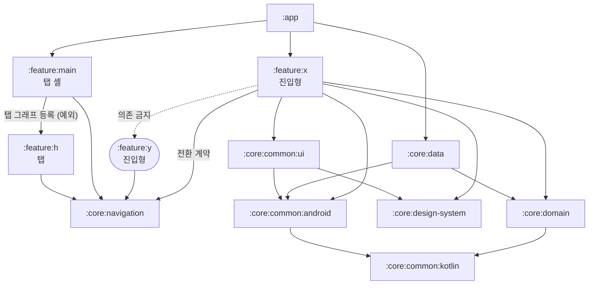

# 모듈화 가이드

## 개요
Mino Android는 다중 Gradle 모듈 구조를 채택한다.

**목적**
- 변경 범위에 따른 **빌드 시간 단축**
- **레이어별 책임 분리** (Clean Architecture 원칙)
- **테스트 용이성** — 순수 Kotlin 모듈은 JVM 단위 테스트 가능
- **feature 단위 독립 개발**

---

## 모듈 구성

### `:app`
애플리케이션 진입점. DI 그래프 조립, 루트 Navigation, APK/AAB 산출.
→ Android Application

### `:core:common:kotlin`
순수 Kotlin 공용 유틸리티. Android SDK 의존 없음.
→ Kotlin JVM

### `:core:common:android`
Android SDK 기반 공용 유틸리티 (Context 확장, Intent 헬퍼 등).
→ Android Library

### `:core:common:ui`
**feature 간 재사용되는 공통 UI 컴포넌트** 관리. 공용 Composable 유틸리티(Modifier 확장, Effect 헬퍼 등)도 포함.
→ Android Library (Compose)

### `:core:design-system`
디자인 시스템 — 컬러·타이포그래피·셰이프·기본 컴포넌트.
→ Android Library (Compose)

### `:core:domain`
비즈니스 로직 — UseCase, 도메인 모델, Repository 인터페이스.
→ Kotlin JVM

### `:core:error-handling`
에러 처리 인프라 — 도메인 에러 모델(`MinoDomainException`)과 에러 소비 규약 헬퍼. 규약은 `docs/conventions/error_handling.md`.
→ Kotlin JVM

### `:core:data`
데이터 계층 — Repository 구현, DataSource, DTO 매핑.
→ Android Library

### `:core:navigation`
네비게이션 인프라 — feature 간 Activity 전환(`ActivityLauncher`)과 feature 내부 type-safe Route(`MinoNavHost`·`screen`·`graph`·`serializableNavType`). feature별 전환 계약(`XLauncher` 인터페이스와 Intent extra 키)도 이 모듈이 보유한다. 구현은 각 feature에 있다.
→ Android Library

### `:core:map`
지도 — `MinoMap` 컴포저블, 좌표 모델(`GeoPoint`)과 SDK 타입 변환.
→ Android Library (Compose)

### `:core:analytics`
분석 — 이벤트 로깅(`AnalyticsTracker`)과 화면 조회 자동 로깅(`TrackScreenViews`).
→ Android Library (Compose)

### `:feature:main`
앱의 진입 feature. BottomNavigation 탭 셸을 소유하고 탭 feature의 그래프를 조립한다.
→ Android Library (Compose)

### `:feature:sample` (진입형)·`:feature:home` (탭)
데모 feature(추후 제거 가능).
→ Android Library (Compose)

> feature는 단일 모듈이며 진입형·탭 두 종류로 나뉜다. 종류별 골격과 공개 범위는 `docs/architecture/feature-module.md`, 전환 규약은 `feature-navigation.md`.

---

## 의존성 흐름

### 원칙
1. 의존 방향은 바깥 → 안쪽 (feature/data → domain)
2. 같은 레이어 간 직접 의존 금지 (feature ↔ feature)
3. Android 모듈은 Kotlin 모듈을 의존 가능, 반대는 불가
4. `implementation` 기본, 전이 노출이 필요한 경우에만 `api`

### 그래프

feature 모듈끼리는 서로를 의존하지 않는다. 전환 계약이 `:core:navigation`에 모여 있어 호출자는 그 계약만 알면 되고, Hilt가 대상 feature의 구현을 주입한다. 예외는 탭 셸(`:feature:main`)이 탭 feature를 직접 의존하는 경우뿐이다.

`:app`은 **진입형 feature와 탭 셸만** 등록한다. 탭 feature는 셸을 통해 런타임 클래스패스에 들어오므로 직접 의존을 두지 않는다.

### DI 바인딩 소유

인터페이스 구현을 가진 모듈이 자신의 `di/` 패키지에서 그 바인딩을 소유한다. 구현체는 `internal`로 닫고 `@Module @InstallIn(...) internal abstract class` + `@Binds`로만 노출한다.

`:app`은 `@HiltAndroidApp`으로 그래프를 조립할 뿐 바인딩을 두지 않는다. `:app`이 바인딩하려면 모든 구현체를 `public`으로 열어야 하고, 그 순간 모듈 경계가 무너진다.

스코프는 컴포넌트를 따른다. 앱 전역 싱글턴은 `SingletonComponent`, Activity 수명에 묶인 전환 계약(`Launcher`)은 `ActivityRetainedComponent` + `@ActivityRetainedScoped`.

### 금지 규칙 (안티패턴)
- `:core:domain`이 Android에 의존 → 단위 테스트가 Android로 오염됨
- `:core:data`가 `:core:common:ui`를 의존 → UI 레이어 침범
- feature 모듈이 다른 feature 모듈을 의존 → 전환은 `:core:navigation`의 계약을 통한다. 탭 셸 → 탭 feature만 예외이며, 탭끼리는 서로를 모르고 탭 간 전환은 셸이 콜백으로 배선한다. 그 외 공유가 필요하면 `:core:common:*`로 해결
- `:feature:*`가 `:core:data`를 직접 의존 → domain 인터페이스만 알고, 구현 바인딩은 구현을 소유한 모듈의 DI에서 (위 `DI 바인딩 소유`)
- 구현 바인딩을 `:app`에 모으기 → 구현체를 `public`으로 열게 되어 모듈 경계가 무너진다

> 위 규칙을 검사하는 장치는 아직 없다. `lint.xml`에 모듈 의존 방향 룰이 없고 Gradle 의존 검증도 도입하지 않아, 순환 참조를 제외하면 경계는 문서와 리뷰에만 의존한다. 순환 참조는 계약을 `:core:navigation`에 모은 덕에 Gradle이 컴파일 타임에 거부한다. 검증 장치 도입은 모듈 구조와 독립적인 별도 과제다.

---

## 새 feature 모듈 추가 절차

feature는 **단일 모듈**이다. 여기서는 절차만 적고, 구조·역할·네비게이션 상세는 컨벤션 문서를 단일 출처로 따른다.

> 진입형/탭 구분·패키지 구조·공개 범위·Route↔Screen → `docs/architecture/feature-module.md`
> 화면 전환(feature 간 Launcher / 내부 Route·인자 전달 / 탭 그래프 편입) → `docs/architecture/feature-navigation.md`

1. `feature/<name>/` 디렉터리와 `build.gradle.kts` 생성. `alias(libs.plugins.mino.android.feature)` + `namespace`만 적용한다(진입형·탭 공통).
2. `settings.gradle.kts`에 `include(":feature:<name>")` 등록.
3. 의존 등록은 종류에 따라 갈린다.
   - **진입형**: `:app`의 `build.gradle.kts`에 `implementation(project(":feature:<name>"))` 추가
   - **탭**: `:feature:main`의 `build.gradle.kts`에 추가한다. `:app`에는 넣지 않는다
4. 코드 작성은 `feature-module.md` 골격을 본뜬다.
   - **진입형**: `XActivity`·`XDestinations`·`XShell`·`XNavHost`·`di/`, 화면별 `screen·vm`(+필요 시 `args·model·component`). 전환 계약(`XLauncher`·extra 키)은 `:core:navigation`의 `activity/launcher/`에 추가
   - **탭**: `XNavigation.kt`(진입 Route + 등록 함수)와 화면별 `screen·vm`. `:feature:main`의 `MainTab`·`MainNavHost`에 배선
5. `./gradlew :app:assembleQaDebug`로 빌드 확인
