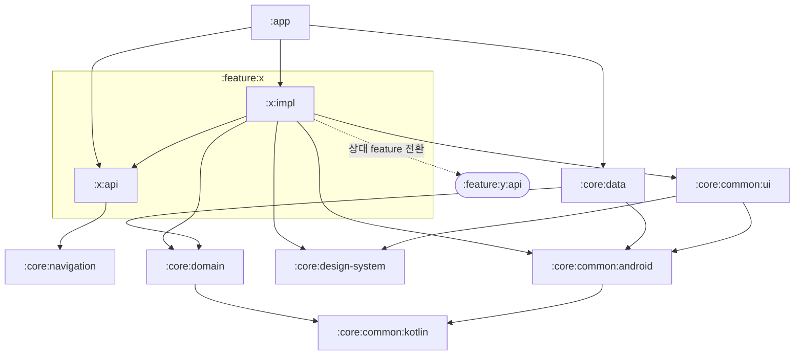

# 모듈화 가이드

## 개요
Mino Android는 다중 Gradle 모듈 구조를 채택한다.

**목적**
- 변경 범위에 따른 **빌드 시간 단축**
- **레이어별 책임 분리** (Clean Architecture 원칙)
- **테스트 용이성** — 순수 Kotlin 모듈은 JVM 단위 테스트 가능
- **feature 단위 독립 개발**

---

## 모듈 구성

### `:app`
애플리케이션 진입점. DI 그래프 조립, 루트 Navigation, APK/AAB 산출.
→ Android Application

### `:core:common:kotlin`
순수 Kotlin 공용 유틸리티. Android SDK 의존 없음.
→ Kotlin JVM

### `:core:common:android`
Android SDK 기반 공용 유틸리티 (Context 확장, Intent 헬퍼 등).
→ Android Library

### `:core:common:ui`
**feature 간 재사용되는 공통 UI 컴포넌트** 관리. 공용 Composable 유틸리티(Modifier 확장, Effect 헬퍼 등)도 포함.
→ Android Library (Compose)

### `:core:design-system`
디자인 시스템 — 컬러·타이포그래피·셰이프·기본 컴포넌트.
→ Android Library (Compose)

### `:core:domain`
비즈니스 로직 — UseCase, 도메인 모델, Repository 인터페이스.
→ Kotlin JVM

### `:core:error-handling`
에러 처리 인프라 — 도메인 에러 모델(`MinoDomainException`)과 에러 소비 규약 헬퍼. 규약은 `docs/conventions/error_handling.md`.
→ Kotlin JVM

### `:core:data`
데이터 계층 — Repository 구현, DataSource, DTO 매핑.
→ Android Library

### `:core:navigation`
네비게이션 인프라 — feature 간 Activity 전환(`ActivityLauncher`)과 feature 내부 type-safe Route(`MinoNavHost`·`screen`·`serializableNavType`).
→ Android Library

### `:feature:sample` — `:api` / `:impl`
데모 feature(추후 제거 가능). `:api`는 전환 계약(`SampleLauncher` + `EXTRA_*`)만, `:impl`은 Activity·화면·ViewModel·Launcher 구현. 다른 feature는 `:api`에만 의존한다. 구조·전환 규약은 `docs/architecture/feature-module.md`·`feature-navigation.md`.
→ Android Library (Compose)

---

## 의존성 흐름

### 원칙
1. 의존 방향은 바깥 → 안쪽 (feature/data → domain)
2. 같은 레이어 간 직접 의존 금지 (feature ↔ feature)
3. Android 모듈은 Kotlin 모듈을 의존 가능, 반대는 불가
4. `implementation` 기본, 전이 노출이 필요한 경우에만 `api`

### 그래프

feature는 `api`/`impl`로 나뉜다 — `impl`은 자신과 **상대 feature의 `api`**(전환 계약)에만 의존하고, `api`는 `:core:navigation`에 의존한다.

### 금지 규칙 (안티패턴)
- `:core:domain`이 Android에 의존 → 단위 테스트가 Android로 오염됨
- `:core:data`가 `:core:common:ui`를 의존 → UI 레이어 침범
- `:feature:x:impl`이 다른 `:feature:y:impl`을 의존 → 전환은 상대 `:feature:y:api`(Launcher)에만 의존한다. 그 외 공유가 필요하면 `:core:common:*`로 해결
- `:feature:*`가 `:core:data`를 직접 의존 → domain 인터페이스만 알고, 구현 바인딩은 `:app`의 DI에서

---

## 새 feature 모듈 추가 절차

feature는 **`api` / `impl` 두 모듈**로 만든다. 여기서는 절차만 적고, 구조·역할·네비게이션 상세는 컨벤션 문서를 단일 출처로 따른다.

> 패키지 구조·객체 역할·Route↔Screen → `docs/architecture/feature-module.md`
> 화면 전환(feature 간 Launcher / 내부 Route·인자 전달) → `docs/architecture/feature-navigation.md`

1. `feature/<name>/api`, `feature/<name>/impl` 디렉터리와 각 `build.gradle.kts` 생성. 컨벤션 플러그인만 적용한다:
   - `api`: `alias(libs.plugins.mino.android.feature.api)` + `namespace`
   - `impl`: `alias(libs.plugins.mino.android.feature.impl)` + `namespace` + 자신·상대 feature의 `api` 의존(`implementation(project(":feature:<name>:api"))`)
2. `settings.gradle.kts`에 **둘 다** 등록: `include(":feature:<name>:api")`, `include(":feature:<name>:impl")`
3. `:app`의 `build.gradle.kts`에 **둘 다** `implementation(project(...))` 추가 (`:api`, `:impl`)
4. 코드 작성은 `feature-module.md` 골격을 본뜬다 — `api`에 `XLauncher`+`EXTRA_*`, `impl`에 `XActivity`·`XDestinations`·`XNavHost`·`di/`, 화면별 `screen·vm`(+필요 시 `args·model·component`)
5. `./gradlew :app:assembleQaDebug`로 빌드 확인
