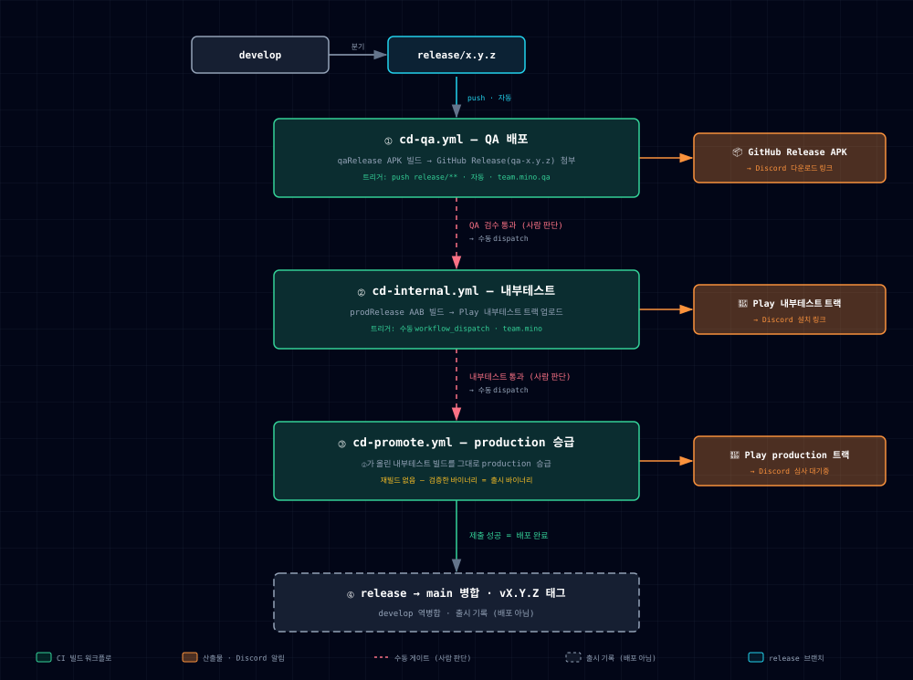

# CD 파이프라인

GitHub Actions + Fastlane 기반 Play Store 배포 자동화. 배포는 `release/*` 브랜치에서 단계적으로 일어나고, `main` 병합은 출시 기록(마무리)이다.

## 아키텍처



> 인터랙티브 버전(PNG·PDF 내보내기 지원): [diagrams/cd-pipeline.html](diagrams/cd-pipeline.html). [`architecture-diagram` 스킬](../.claude/skills/architecture-diagram/SKILL.md)로 생성하며, 흐름이 바뀌면 같은 스킬로 다시 생성한다.

## 배포 모델

- **Play 앱은 `team.mino` 단일 앱.** `prodRelease` 빌드를 내부테스트 트랙에 올려 검증하고, **같은 빌드를 production으로 승급(promote)** 한다. 재빌드하지 않으므로 *검증한 바이너리 = 출시 바이너리*.
- **`qaRelease`(`team.mino.qa`, qa-api)는 Play에 올리지 않는다.** APK를 GitHub Release(prerelease)에 첨부해 QA가 직접 받는다.
- 브랜치 전략은 [conventions/branch-naming.md](conventions/branch-naming.md) 참조.

## 단계 요약

| 단계 | 워크플로 | 트리거 | 산출물 | 게이트 |
|---|---|---|---|---|
| ① QA 배포 | `cd-qa.yml` | `push: release/**` (자동) | GitHub Release APK | — |
| ② 내부테스트 | `cd-internal.yml` | 수동 `workflow_dispatch` | Play 내부테스트 트랙 | QA 통과 판정 |
| ③ production 승급 | `cd-promote.yml` | 수동 `workflow_dispatch` | Play production 트랙 | 내부테스트 통과 판정 |
| ④ 마무리 | (배포 아님) | git PR·태그 | main 태그 | ③ 제출 성공 후 |

- `versionCode`는 `github.run_number`로 자동 주입(`-PversionCode`). `versionName`은 ①에서 release 브랜치명으로 파생, ②③은 dispatch 입력값.
- ③은 ②가 올린 빌드를 그대로 승급한다. `version_code` 입력을 비우면 internal 최신 빌드를 승급.

## 구성 요소

```
.github/
├── workflows/        cd-qa.yml · cd-internal.yml · cd-promote.yml
└── actions/          (공통 스텝 composite)
    ├── setup-android-build      JDK 17 + Gradle
    ├── restore-signing         keystore.properties + jks 복원
    ├── restore-play-credentials Play 서비스계정 키 복원
    └── discord-notify          embed 알림 전송
fastlane/             Appfile · Fastfile (internal·promote 레인)
```

## 필요한 설정

### GitHub Secrets

| 이름 | 내용 | 쓰는 단계 |
|---|---|---|
| `KEYSTORE_PROPERTIES_B64` | `keystore.properties`의 base64 | ①② |
| `KEYSTORE_QA_B64` | `keystore/qa.jks`의 base64 | ① |
| `KEYSTORE_PROD_B64` | `keystore/prod.jks`의 base64 | ② |
| `PLAY_SERVICE_ACCOUNT_JSON` | Play 업로드용 서비스계정 JSON (원문) | ②③ |
| `DISCORD_WEBHOOK_URL` | 배포 알림 webhook | ①②③ |

> base64 인코딩 예: `base64 -i keystore/prod.jks | pbcopy`

### GitHub Variables

| 이름 | 내용 |
|---|---|
| `PLAY_INTERNAL_OPT_IN_URL` | 내부테스트 설치 링크 (②알림에 첨부, 없으면 링크 생략) |

## Play Console 사전 준비 (②③ 전제, 1회)

1. `team.mino` 앱 생성 + 최초 설정(데이터 보안·콘텐츠 등급 등) 완료
2. Google Cloud 서비스계정 생성 → Play Console 권한 부여(release) → JSON 키 발급 → `PLAY_SERVICE_ACCOUNT_JSON`
3. **첫 AAB는 콘솔에서 수동 업로드 1회** (fastlane supply는 앱을 생성하지 못함)
4. 내부테스트 테스터 목록(이메일/구글그룹) 등록

## 실행 방법

- **①** `release/x.y.z` push → 자동 빌드·게시. QA는 Release 페이지 또는 Discord 링크에서 APK 다운로드
- **②** Actions → *CD - Internal Testing* → Run workflow → `release/x.y.z` 선택, `version_name` 입력
- **③** Actions → *CD - Promote to Production* → Run workflow → (선택) `version_code`·`version_name` 입력

## 후속 과제

- Play Console 앱 생성 + `PLAY_SERVICE_ACCOUNT_JSON` 등록 (②③ 실제 동작 전제)
- 디스코드 버튼으로 ② 트리거 — 별도 서버리스 중계 ([#21](https://github.com/mash-up-kr/Team-MINO-Android/issues/21))
- 배포 단계 스킬화 (`/release-*`)
