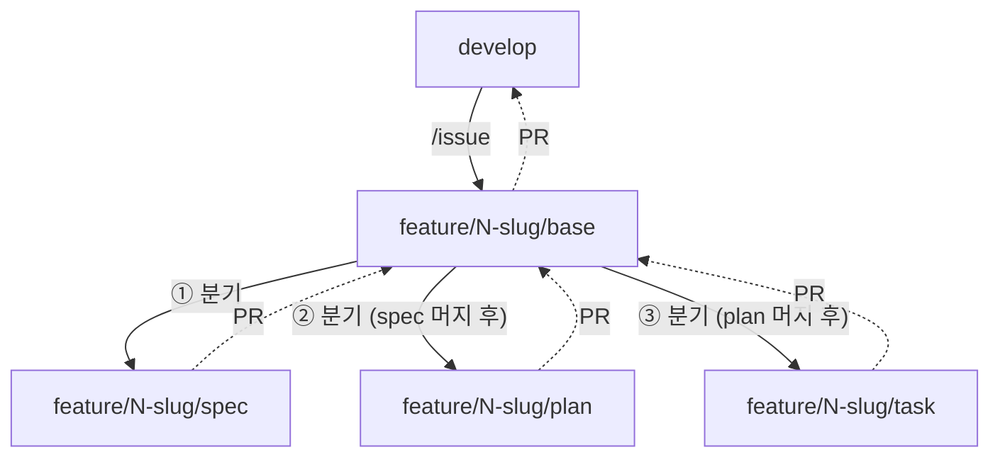

# base 브랜치 (워크플로우 통합)

워크플로우(SDD: spec → plan → task 등) 도입으로 하나의 이슈 아래 여러 PR이 생기는 경우를 위한 동작 규칙. 새 prefix를 추가하지 않고, `/issue`가 만드는 브랜치 이름 끝에 `/base` 세그먼트만 붙인다.

브랜치 이름·prefix·slug 자체의 규칙은 [`branch-naming.md`](branch-naming.md)를 단일 출처로 따른다. 이 문서는 워크플로우 하위 작업이 **어느 브랜치를 base로 삼는지**만 다룬다.

## 개념

- `/issue`가 만드는 브랜치는 **항상** `<prefix>/<issue-number>-<slug>/base` 형태다 — 그 자체로 하위 작업의 base 역할을 겸한다는 뜻을 이름에서부터 드러낸다. 별도 플래그 불필요, 이슈 생성 시 자동.
  - **왜 접미사가 필요한가**: git은 ref를 파일시스템처럼 계층 구조로 저장해서, `feature/<N>-<slug>`가 이미 브랜치(leaf)로 존재하면 그 아래 `feature/<N>-<slug>/spec` 같은 자식 ref를 만들 수 없다(동시에 파일이자 디렉터리일 수 없음). base 브랜치 이름에 `/base`를 붙여 별도 세그먼트로 만들어야, 하위 작업 브랜치들이 `feature/<N>-<slug>/<phase>` 형태로 형제(sibling)가 되어 base와 충돌 없이 공존한다.
- 하위 작업(spec/plan/task 등) 브랜치를 만들 때는 `develop`이 아니라 이 base 브랜치에서 분기한다.
- 하위 작업 브랜치의 PR은 `develop`이 아니라 base 브랜치를 타겟한다. `/pr`이 이를 **git 조상 관계로 자동 판단**한다 — 판단 방식은 아래 "base 자동판단 절차" 참고. 이 판단은 이름이 아니라 실제 분기 이력만 보므로, 하위 브랜치명이 달라도 동작 자체는 깨지지 않는다.
- **권장 네이밍(강제 아님)**: 하위 브랜치는 base 브랜치의 `/base` 자리를 `/<phase>`로 바꾼 이름을 쓴다 — `<prefix>/<issue-number>-<slug>/<phase>` (예: base가 `feature/130-base-branch-workflow/base`면 spec 작업은 `feature/130-base-branch-workflow/spec`). `<phase>`는 `spec`/`plan`/`task` 등 자유롭게 정한다. 이 형식을 따르면 `git branch`만 봐도 어느 base에 속한 하위 작업인지 한눈에 보인다.
- base 브랜치가 모든 하위 작업을 흡수한 뒤에는, base 브랜치에서 `/pr`을 실행해 `develop`으로 머지한다. 이때는 더 가까운 조상 브랜치가 없으므로 아래 절차대로 자동으로 `develop`이 default가 된다.

## 브랜치 구조



실선은 분기 출처, 점선은 PR 타겟이다. spec/plan/task는 서로가 아니라 **모두 base에서** 분기하며(순서는 순차 진행), 셋 다 base로 머지되고 나면 base 자체가 develop으로 머지된다.

## base 자동판단 절차 (`/pr` 0-4 단일 출처)

`/pr`의 base 브랜치 결정 단계(0-4)는 이 절차를 실행한다.

아래 스크립트로 **git 조상 관계**를 확인한다:
```sh
current=$(git symbolic-ref --short HEAD)
git fetch origin --quiet

base="develop"
best_count=$(git rev-list --count "origin/develop..HEAD" 2>/dev/null || echo 999999)

# HEAD의 조상인 origin 브랜치만 --merged로 걸러낸 뒤, 그중 가장 가까운(커밋 수 최소) 것을 채택
# main·develop·자기 자신·pull-request.md의 예외 브랜치는 후보에서 제외
for ref in $(git for-each-ref --format='%(refname:short)' --merged=HEAD refs/remotes/origin \
             | grep -v -E '/(HEAD|main|develop)$' \
             | grep -v -E '^origin/(hotfix|release)/' \
             | grep -vx "origin/$current"); do
  count=$(git rev-list --count "$ref..HEAD")
  if [ "$count" -lt "$best_count" ]; then
    base="${ref#origin/}"
    best_count="$count"
  fi
done
```
후보가 없으면 `develop`으로 폴백 — 별도 질문 없이 조용히 진행. 채택 기준(가장 가까운 조상 브랜치)은 위 코드가 유일한 출처다.

## 범위

spec 브랜치 생성은 MASC 대시보드가, plan/task 등 하위 브랜치 생성 자동화는 향후 별도 hook이 담당한다. 이 문서는 "base를 기준으로 분기·타겟한다"는 규칙만 규정하며, 생성 자동화 자체는 다루지 않는다.
