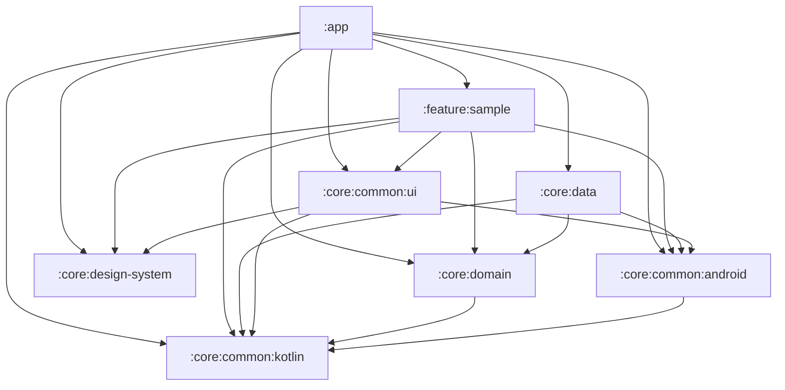

# 모듈화 가이드

## 개요
Mino Android는 다중 Gradle 모듈 구조를 채택한다.

**목적**
- 변경 범위에 따른 **빌드 시간 단축**
- **레이어별 책임 분리** (Clean Architecture 원칙)
- **테스트 용이성** — 순수 Kotlin 모듈은 JVM 단위 테스트 가능
- **feature 단위 독립 개발**

---

## 모듈 구성

### `:app`
애플리케이션 진입점. DI 그래프 조립, 루트 Navigation, APK/AAB 산출.
→ Android Application

### `:core:common:kotlin`
순수 Kotlin 공용 유틸리티. Android SDK 의존 없음.
→ Kotlin JVM

### `:core:common:android`
Android SDK 기반 공용 유틸리티 (Context 확장, Intent 헬퍼 등).
→ Android Library

### `:core:common:ui`
**feature 간 재사용되는 공통 UI 컴포넌트** 관리. 공용 Composable 유틸리티(Modifier 확장, Effect 헬퍼 등)도 포함.
→ Android Library (Compose)

### `:core:design-system`
디자인 시스템 — 컬러·타이포그래피·셰이프·기본 컴포넌트.
→ Android Library (Compose)

### `:core:domain`
비즈니스 로직 — UseCase, 도메인 모델, Repository 인터페이스.
→ Kotlin JVM

### `:core:data`
데이터 계층 — Repository 구현, DataSource, DTO 매핑.
→ Android Library

### `:feature:sample`
단일 feature — 화면, ViewModel, 내부 Navigation.
→ Android Library (Compose)

---

## 의존성 흐름

### 원칙
1. 의존 방향은 바깥 → 안쪽 (feature/data → domain)
2. 같은 레이어 간 직접 의존 금지 (feature ↔ feature)
3. Android 모듈은 Kotlin 모듈을 의존 가능, 반대는 불가
4. `implementation` 기본, 전이 노출이 필요한 경우에만 `api`

### 그래프

### 금지 규칙 (안티패턴)
- `:core:domain`이 Android에 의존 → 단위 테스트가 Android로 오염됨
- `:core:data`가 `:core:common:ui`를 의존 → UI 레이어 침범
- `:feature:*`가 다른 `:feature:*`를 직접 의존 → 공유가 필요하면 `:core:common:*` 또는 Navigation 추상화로 해결
- `:feature:*`가 `:core:data`를 직접 의존 → domain 인터페이스만 알고, 구현 바인딩은 `:app`의 DI에서

---

## 새 feature 모듈 추가 절차

1. `:feature:sample`을 참고해 `feature/<feature-name>/` 디렉토리와 `build.gradle.kts` 생성 (namespace만 교체)
2. `settings.gradle.kts`에 `include(":feature:<feature-name>")` 추가
3. `:app`의 `build.gradle.kts`에 `implementation(project(":feature:<feature-name>"))` 추가
4. `./gradlew assembleDebug`로 빌드 확인
