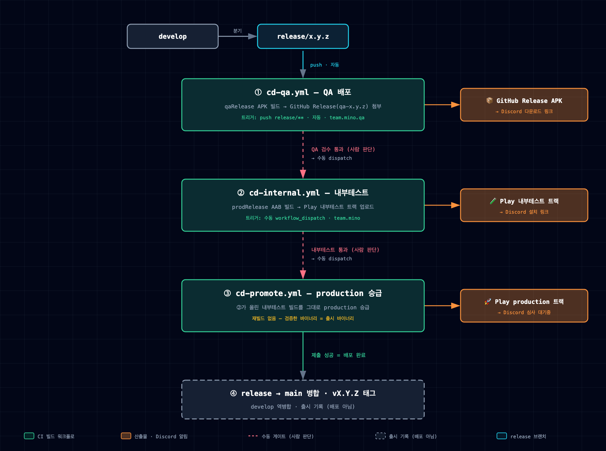

# CD 파이프라인

GitHub Actions + Fastlane 기반 Play Store 배포 자동화. 배포는 `release/*` 브랜치에서 단계적으로 일어나고, `main` 병합은 출시 기록(마무리)이다.

## 아키텍처



> 인터랙티브 버전(PNG·PDF 내보내기 지원): [diagrams/cd-pipeline.html](../diagrams/cd-pipeline.html). [`architecture-diagram` 스킬](../../.claude/skills/architecture-diagram/SKILL.md)로 생성하며, 흐름이 바뀌면 같은 스킬로 다시 생성한다.

## 배포 모델

- **Play 앱은 `com.mino.gguk` 단일 앱.** `prodRelease` 빌드를 내부테스트 트랙에 올려 검증하고, **같은 빌드를 production으로 승급(promote)** 한다. 재빌드하지 않으므로 *검증한 바이너리 = 출시 바이너리*.
- **`qaRelease`(`com.mino.gguk.qa`, qa-api)는 Play에 올리지 않는다.** APK를 GitHub Release(prerelease)에 첨부해 QA가 직접 받는다.
- 브랜치 전략은 [conventions/branch-naming.md](../conventions/branch-naming.md) 참조.

## 단계 요약

| 단계 | 워크플로 | 트리거 | 산출물 | 게이트 |
|---|---|---|---|---|
| ① QA 배포 | `cd-qa.yml` | `push: release/**` (자동) | GitHub Release APK | — |
| ② 내부테스트 | `cd-internal.yml` | 수동 `workflow_dispatch` | Play 내부테스트 트랙 | QA 통과 판정 |
| ③ production 승급 | `cd-promote.yml` | 수동 `workflow_dispatch` | Play production 트랙 | 내부테스트 통과 판정 |
| ④ 마무리 | (배포 아님) | git PR·태그 | main 태그 | ③ 제출 성공 후 |

- `versionCode`는 `github.run_number`로 자동 주입(`-PversionCode`). `versionName`은 ①에서 release 브랜치명으로 파생, ②③은 dispatch 입력값.
  - `run_number`는 워크플로별로 1부터 센다. Play는 이미 쓴 versionCode를 거부하므로, 콘솔에서 수동 업로드한 코드보다 낮은 번호의 ② 실행은 실패한다. 이때는 **새로 dispatch**한다 — Re-run은 번호가 오르지 않는다.
- ③은 ②가 올린 빌드를 그대로 승급한다. `version_code` 입력을 비우면 internal 최신 빌드를 승급.

## 구성 요소

```
.github/
├── workflows/        cd-qa.yml · cd-internal.yml · cd-promote.yml
└── actions/          (공통 스텝 composite)
    ├── setup-android-build      JDK 17 + Gradle
    ├── restore-signing         keystore.properties + jks 복원
    ├── restore-google-services  google-services.json 복원
    ├── restore-play-credentials Play 서비스계정 키 복원
    └── discord-notify          embed 알림 전송
fastlane/             Appfile · Fastfile (internal·promote 레인)
```

## 필요한 설정

### GitHub Secrets

| 이름 | 내용 | 쓰는 단계 |
|---|---|---|
| `KEYSTORE_PROPERTIES_B64` | `keystore.properties`의 base64 | ①② |
| `KEYSTORE_QA_B64` | `keystore/qa.jks`의 base64 | ① |
| `KEYSTORE_PROD_B64` | `keystore/prod.jks`의 base64 | ② |
| `GOOGLE_SERVICES_JSON_B64` | `app/google-services.json`의 base64 | ①② |
| `MAPS_API_KEY` | Maps SDK API 키 (원문, `local.properties`의 값과 동일) | ①② |
| `PLAY_SERVICE_ACCOUNT_JSON` | Play 업로드용 서비스계정 JSON (원문) | ②③ |
| `DISCORD_WEBHOOK_URL` | 배포 알림 webhook | ①②③ |

> base64 시크릿 등록 예: `base64 -i <파일> | pbcopy` 후 웹에 붙여넣거나, `base64 -i <파일> | gh secret set <시크릿명>`

`google-services.json`은 `.gitignore` 대상이라 레포에 없고, `:app`이 google-services 플러그인을 적용하므로 파일이 없으면 Gradle 빌드가 중단된다. Gradle 빌드를 돌리지 않는 ③이 제외인 이유다. 파일 하나에 `com.mino.gguk`·`com.mino.gguk.qa` 두 패키지가 모두 들어 있어 flavor별 분리는 하지 않는다.

### GitHub Variables

| 이름 | 내용 |
|---|---|
| `PLAY_INTERNAL_OPT_IN_URL` | 내부테스트 설치 링크 (②알림에 첨부, 없으면 링크 생략) |

## 서명 키와 SHA-1 등록

서명 키는 3종이다. Google Cloud Console의 Maps API 키 제한과 Firebase는 **(패키지명, SHA-1) 쌍**으로 앱을 식별하므로, 등록이 빠진 조합에서는 지도가 렌더링되지 않는다.

| 키 | 파일 | 서명하는 빌드 |
|---|---|---|
| 팀 공용 debug | `keystore/debug.jks` (레포에 추적) | 모든 debug 빌드 (`qaDebug`·`prodDebug`) |
| QA release | `keystore/qa.jks` | `qaRelease` |
| production 업로드 | `keystore/prod.jks` | `prodRelease` (업로드 키 — Play가 앱 서명 키로 재서명) |

release 키 두 개를 CI에 주입하는 경로는 위 [GitHub Secrets](#github-secrets)에 있다.

debug 키는 관례값(alias `androiddebugkey`, 비밀번호 `android`)을 쓰는 비밀이 아닌 키라 레포에 커밋한다. 팀원마다 다른 `~/.android/debug.keystore`로 서명되던 것을 하나로 고정해, 팀원이 늘거나 로컬 키스토어가 재생성돼도 지문을 다시 등록할 필요가 없다.

debug 서명이 flavor가 아니라 buildType에 붙는 이유는 [`Signing.kt`](../../build-logic/convention/src/main/kotlin/team/mino/buildlogic/Signing.kt)의 주석을 참고한다.

### 등록해야 하는 4쌍

| 패키지명 | 서명 키 | SHA-1 |
|---|---|---|
| `com.mino.gguk` | 공용 debug | `3F:9A:EB:9E:76:B6:A7:B6:64:BB:B9:7D:B4:77:92:E5:EE:52:78:37` |
| `com.mino.gguk.qa` | 공용 debug | 위와 동일 |
| `com.mino.gguk.qa` | qa.jks | `F3:A9:D1:B7:8D:B3:A7:94:7D:AE:B2:48:AA:58:2F:0C:88:36:BB:BF` |
| `com.mino.gguk` | Play 앱 서명 키 | `DA:33:D6:32:46:3F:5F:AD:F2:27:88:D4:C8:45:05:E5:E1:9B:D5:B1` |

`com.mino.gguk`의 release 빌드는 Play가 앱 서명 키로 재서명하므로, 업로드 키(`prod.jks`)가 아니라 **Play 앱 서명 키**의 SHA-1을 등록한다. Play Console → 테스트 및 출시 → 앱 무결성 → 앱 서명의 **"기존 키"** 값이다. 옆의 "양자 내성 암호화 키" 지문은 Android가 앱 식별에 쓰지 않으므로 등록해도 소용없다.

콘솔 값을 믿지 말고 **실제 설치된 스토어 빌드의 서명을 실측**한다. 앱 서명 키를 교체(업그레이드)한 뒤에는 기존 설치 기기엔 이전 키로 서명된 업데이트가 계속 내려가므로, 이전 키와 새 키 둘 다 등록해야 한다.

```sh
adb pull "$(adb shell pm path com.mino.gguk | sed 's/package://')" store.apk
apksigner verify --print-certs store.apk | grep SHA-1
# 또는 지도 화면 진입 후: adb logcat -d | grep -A3 "Authorization failure"  ← SDK가 요구하는 (SHA-1;패키지) 쌍을 그대로 찍는다
```

업로드 키(`prod.jks`, SHA-1 `29:14:1C:D8:20:1D:FE:30:87:CE:F1:77:5A:2A:E1:4A:B4:B0:AE:87`)는 4쌍에 넣지 않는다. 로컬에서 빌드한 `prodRelease` APK를 기기에 직접 설치해 확인할 때만 임시로 추가한다.

키를 교체했다면 아래로 다시 뽑는다. Firebase가 요구하는 SHA-256도 같은 출력에 있다.

```sh
keytool -list -v -keystore keystore/debug.jks -storepass android | grep -E 'SHA1:|SHA256:'
keytool -list -v -keystore keystore/qa.jks | grep -E 'SHA1:|SHA256:'   # 비밀번호는 keystore.properties 참고
```

### Firebase

Firebase는 앱이 이미 패키지명으로 나뉘어 있어 쌍을 입력하지 않는다. 프로젝트 설정 → 내 앱에서 **각 앱 아래에 위 표의 그 패키지명 행에 있는 지문만** 넣는다 (SHA-1·SHA-256 모두).

현재 쓰는 기능(익명 인증·Analytics·Crashlytics)은 지문 없이도 동작한다. Google 로그인·전화 인증·Dynamic Links·App Check를 붙일 때 필수가 되므로 미리 등록해 둔다 — App Check(Play Integrity)가 SHA-256을 쓴다.

SHA-1을 등록하면 Firebase가 Android OAuth 클라이언트를 자동 생성해 `google-services.json`에 `oauth_client` 항목이 생긴다. 등록 후 파일을 다시 받아 `app/google-services.json`과 `GOOGLE_SERVICES_JSON_B64`를 갱신한다.

> Maps API 키는 Firebase가 발급한 키가 아니라 `local.properties`의 `MAPS_API_KEY`(별개 키)다. Firebase에 지문을 넣어도 지도 제한은 바뀌지 않으므로, 위 4쌍 등록은 Google Cloud Console에서 따로 해야 한다. CI에는 `local.properties`가 없어 같은 이름의 Secret을 환경변수로 주입한다 — 빠지면 빈 키로 빌드돼 지문을 아무리 등록해도 지도가 뜨지 않는다.

## Play Console 사전 준비 (②③ 전제, 1회)

1. `com.mino.gguk` 앱 생성 + 최초 설정(데이터 보안·콘텐츠 등급 등) 완료
2. Google Cloud 서비스계정 → Play Console 권한 부여 → JSON 키 발급 → `PLAY_SERVICE_ACCOUNT_JSON`
   - 서비스계정은 `team-mino-prod` 프로젝트의 `gguk-android-publisher@team-mino-prod.iam.gserviceaccount.com`. GCP 역할은 필요 없다.
   - Play Console과 GCP 프로젝트를 연결하는 절차는 없다. Play Console → 사용자 및 권한 → 새 사용자 초대에 서비스계정 이메일을 넣고 앱 권한 4개를 준다: 앱 정보 보기(읽기 전용) · 테스트 트랙에 앱 출시 · 테스트 트랙 관리 및 테스터 목록 수정 · 프로덕션에 출시.
   - 조직 정책 `iam.disableServiceAccountKeyCreation`이 키 생성을 막는다. 조직 정책 관리자가 이 프로젝트에 한해 "시행 안 함"으로 재정의한 뒤 키를 만든다 (키 생성 후 정책을 되돌려도 기존 키는 유효).
   - 시크릿은 base64가 아닌 JSON 원문: `gh secret set PLAY_SERVICE_ACCOUNT_JSON < <키파일>.json`
3. **첫 AAB는 콘솔에서 수동 업로드 1회** (fastlane supply는 앱을 생성하지 못함)
4. **첫 production 출시도 콘솔에서** — production에 게시된 적 없는 "draft 앱"에는 API가 `completed` 릴리스를 만들지 못한다 (`Only releases with status draft may be created on draft app`). 프로덕션 → 새 버전 만들기 → 라이브러리에서 internal 빌드 추가 → 검토 → 출시. ③은 두 번째 출시부터 동작한다.
5. 내부테스트 테스터 목록(이메일/구글그룹) 등록 → 참여 링크를 `PLAY_INTERNAL_OPT_IN_URL` 변수로

## 실행 방법

- **①** `release/x.y.z` push → 자동 빌드·게시. QA는 Release 페이지 또는 Discord 링크에서 APK 다운로드
- **②** Actions → *CD - Internal Testing* → Run workflow → `release/x.y.z` 선택, `version_name` 입력
- **③** Actions → *CD - Promote to Production* → Run workflow → (선택) `version_code`·`version_name` 입력

## 후속 과제

- 서비스계정 JSON 키 대신 Workload Identity Federation(GitHub OIDC)으로 전환 — 조직 정책 취지에 맞지만 fastlane `supply`의 ADC 인증 검증 필요
- 디스코드 버튼으로 ② 트리거 — 별도 서버리스 중계 ([#21](https://github.com/mash-up-kr/Team-MINO-Android/issues/21))
- 배포 단계 스킬화 (`/release-*`)
