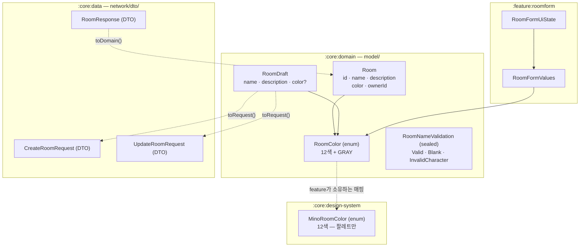
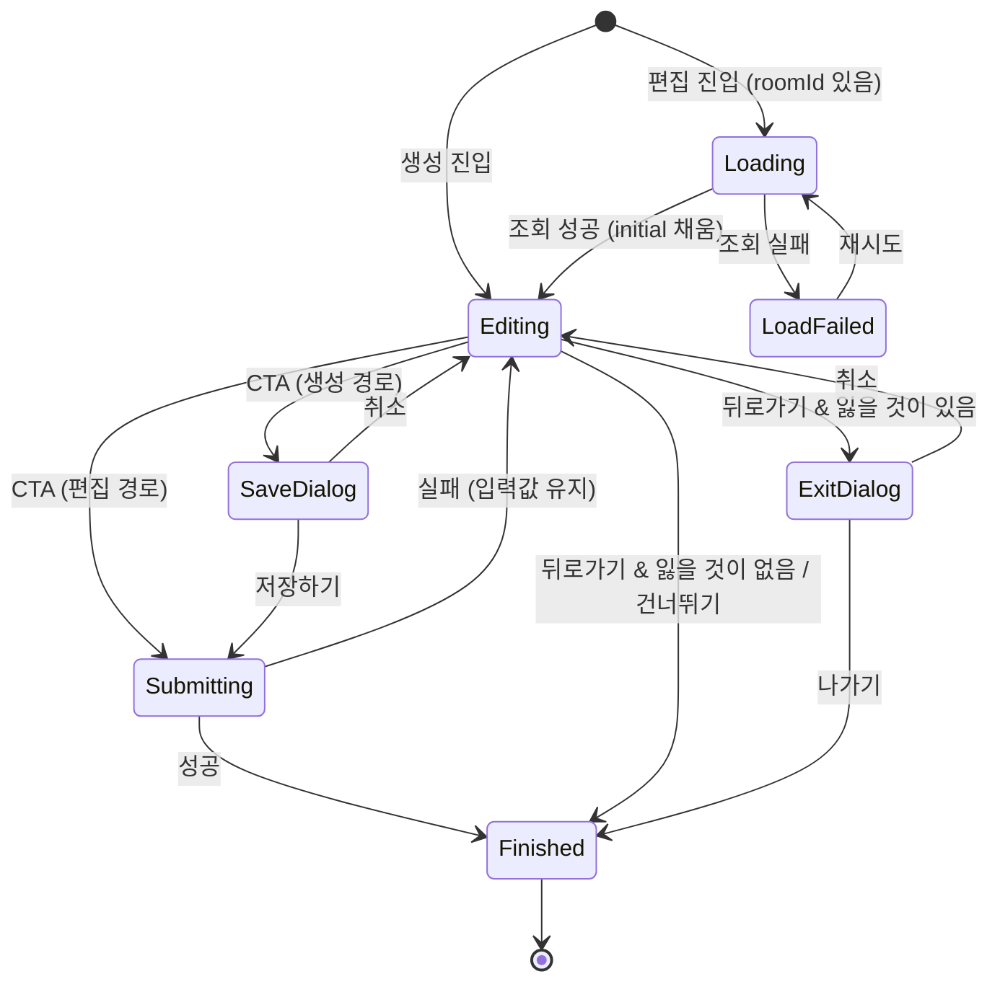

# 데이터 모델: 공동방 생성 및 편집 폼

**대상 스펙 경로**: `docs/specs/group-room-form`

**부속 문서**: [plan.md](./plan.md)에 종속된다. 현재 상태만 담으며 과거 형태를 남기지 않는다.

> 타입 이름·필드·관계·검증 규칙까지 정하고 함수 본문은 구현 단계에 남긴다. 각 항목은 spec의 FR/UX/EC 번호로 근거를 지목한다.

---

## 1. 엔티티 지도



**세 enum이 따로 있는 이유**: `MinoRoomColor`는 팔레트(색 12개)만 알고 도메인을 모른다. `RoomColor`는 방이 **가질 수 있는** 색(12 + 회색)을 안다. 둘 사이의 변환은 feature가 소유한다 — [방 색상 팔레트 ADR](../../adr/2026-08-14-room-color-palette-in-design-system.md)의 결과 조항이 그렇게 정했다.

---

## 2. 도메인 모델 (`:core:domain/model/`)

### `Room`

방을 표현하는 도메인 모델. 이 feature가 쓰는 필드만 갖는다.

| 필드 | 타입 | 제약 | 근거 |
|---|---|---|---|
| `id` | `String` | 비어 있지 않다 | swagger `Room.id` (uuid) |
| `name` | `String` | 1–15자, 한글(완성형·자모)·영문·숫자·공백 | FR-002·FR-003·FR-004·EC-025 |
| `description` | `String` | 0–30자, 문자 종류 제한 없음. 없으면 빈 문자열 | FR-005·EC-006 |
| `color` | `RoomColor` | nullable 아님 — 미선택은 `GRAY`로 확정된 상태 | FR-006 · [research.md](./research.md) R-010 |
| `ownerId` | `String` | — | FR-010·FR-014 |

- **`type`·`inviteCode`·`createdAt`·`pinCount`·`memberCount`를 넣지 않는다.** swagger `Room`·`RoomDetail`에 있으나 이 feature가 쓰지 않는다 — [`core/domain/README.md`](../../../core/domain/README.md) §5 "서버 전용 필드는 도메인 모델에 포함하지 않는다". 초대 링크는 spec §3.2가 PRD [SYS-006] 몫으로 뒀다. 다른 feature가 필요로 할 때 필드를 더한다.
- **`description`을 nullable로 두지 않는다.** DTO의 `null`은 Mapper가 `.orEmpty()`로 흡수한다(같은 README §7).

### `RoomColor`

```
enum class RoomColor { RED, RED_ORANGE, ORANGE, LIME, GREEN, CYAN, VIOLET, PINK, BLUE, BROWN, LIGHT_BLUE, PURPLE, GRAY }
```

| 규칙 | 내용 | 근거 |
|---|---|---|
| 선택 가능한 값 | 앞의 12개. `GRAY`는 사용자가 고를 수 없다 | FR-006 |
| `GRAY`의 의미 | 색을 고르지 않은 방이 **갖게 되는** 색. "값 없음"이 아니다 | spec §2.3 · [research.md](./research.md) R-010 |
| 선언 순서 | Figma 칩 그리드의 배치 순서 — red / red orange / orange / lime · green / cyan / violet / pink · blue / brown / light blue / purple. 노드는 [contracts/design-system-additions.md](./contracts/design-system-additions.md) §2가 소유한다 | FR-006 |
| 갖지 않는 것 | hex 값·표시 이름·캐릭터 에셋 참조 | 헌법 원칙 II — 도메인은 UI 자산을 모른다 |
| 썸네일 대응 | 12색은 같은 이름의 variant, `GRAY`는 `my room` variant. 매핑은 feature가 소유한다 | [research.md](./research.md) R-017 |

`companion object`에 `selectable: List<RoomColor>`(= `entries - GRAY`)를 둔다. 칩 그리드가 순회할 목록의 단일 출처다.

### `RoomDraft`

폼이 만들어 Repository에 넘기는 입력값. 아직 방이 아니므로 `id`·`ownerId`가 없다.

| 필드 | 타입 | 제약 | 근거 |
|---|---|---|---|
| `name` | `String` | 앞뒤 공백을 제거한 값. `ValidateRoomNameUseCase`를 통과한 것만 넘어온다 | FR-002·EC-001 |
| `description` | `String` | 30자 이하. 빈 문자열 허용 | FR-005 |
| `color` | `RoomColor?` | `null` = 미선택. `GRAY`를 여기에 넣지 않는다 | FR-006 · R-010 |

### `RoomNameValidation`

```
sealed interface RoomNameValidation {
    data object Valid : RoomNameValidation
    data object Blank : RoomNameValidation
    data object InvalidCharacter : RoomNameValidation
}
```

| 값 | 언제 | 화면 동작 | 근거 |
|---|---|---|---|
| `Valid` | 앞뒤 공백 제거 후 1자 이상이고 허용 문자만 | CTA 활성, 필드 기본 상태 | FR-007 |
| `Blank` | 비었거나 공백만 | CTA 비활성, 필드는 **오류 상태가 아니다** | FR-002·EC-001 |
| `InvalidCharacter` | 허용 문자 외 1자 이상 포함(이모지 포함) | CTA 비활성 + 필드 오류 상태 + 안내 문구 오류 색 | FR-004·UX-002·EC-005 |

**`Blank`와 `InvalidCharacter`를 나누는 이유**: 둘 다 CTA를 막지만 빈 필드는 오류로 그리지 않는다. TS-001(빈 폼)에 오류 표시가 없고, TS-008(허용되지 않는 문자)에만 오류 상태가 나온다.

**길이 초과는 이 타입에 없다.** 상한은 판정이 아니라 입력 차단이다 — [research.md](./research.md) R-009.

---

## 3. 검증 규칙

### 방 이름 (FR-002 · FR-003 · FR-004)

| 규칙 | 값 | 적용 지점 | 근거 |
|---|---|---|---|
| 필수 | 앞뒤 공백 제거 후 1자 이상 | `ValidateRoomNameUseCase` | FR-002·EC-001 |
| 최대 길이 | 공백 포함 15자 | ViewModel의 `NameChanged`가 자른다(`MinoTextField`에는 `maxLength`가 없다). **글자 수 카운터는 표시하지 않는다** | FR-003·TS-003·TS-045·EC-002 |
| 허용 문자 | 한글(**완성형·자모**)·영문·숫자·공백 | `ValidateRoomNameUseCase` | FR-004·EC-005·EC-025 |
| 판정 시점 | 글자 단위 입력마다 | ViewModel의 `NameChanged` 처리 | spec §4 가정 · SC-002 |
| 중복 검사 | **하지 않는다** | — | EC-003 |
| 글자 수 세기 | 사용자가 보는 문자 단위 | ViewModel의 `NameChanged` | spec §4 가정 |

**길이 계산 단위**: 코드 유닛이 아니라 **사용자가 보는 문자 단위**로 센다(spec §4 가정). 조합형 한글이 두세 자로 세어지면 15자를 채우기 전에 입력이 막혀 TS-003·EC-002가 어긋난다. 세는 수단은 구현이 정한다.

### 방 설명 (FR-005)

| 규칙 | 값 | 근거 |
|---|---|---|
| 필수 여부 | 선택 | FR-005·TS-002 |
| 최대 길이 | 공백 포함 30자. 자르는 주체와 세는 단위는 [contracts/room-form-ui.md](./contracts/room-form-ui.md) §1이 소유한다 | FR-005·TS-004 |
| 문자 종류 | 제한 없음 | EC-006 |

**swagger는 20자로 적었으나 30자를 따른다** — [research.md](./research.md) R-003.

**방 이름과 달리 설명에는 카운터가 있다** — 디자인이 방 설명을 `Textinput/Textarea`로 그렸고 그 컴포넌트가 카운터를 갖는다. 방 이름은 `Textinput/Textfield`이고 카운터가 없다(FR-003·TS-045). UX-007·SC-002도 "미리보기 카드와 **방 설명의** 글자 수 표시"로 범위가 좁혀져 있다.

### 대표 색상 (FR-006 · FR-023)

| 규칙 | 값 | 근거 |
|---|---|---|
| 선택 개수 | 0 또는 1 | FR-006·TS-006 |
| 재선택 시 해제 | **없다** — 다른 칩을 눌러야 교체된다 | spec §4 가정 |
| 미선택의 결과 | 생성 시 `GRAY`로 확정 | FR-006·TS-007 |
| 캐릭터 | 색상에서 파생. 따로 고르는 입력이 없다 | FR-023·TS-029·EC-019 |

### CTA 활성 조건 (FR-007)

```
canSubmit = (nameValidation == Valid) && !isSubmitting
```

방 설명·대표 색상은 조건에 들어가지 않는다(TS-002). `isSubmitting`은 UX-001·SC-005의 중복 차단이다([research.md](./research.md) R-012).

---

## 4. 화면 상태 (`:feature:roomform/form/vm/`)

### `RoomFormValues`

폼의 세 입력값 묶음. 현재 값과 진입 시점 스냅샷이 같은 타입이라 값 비교로 변경 판정이 성립한다(FR-024·TS-043).

| 필드 | 타입 |
|---|---|
| `name` | `String` |
| `description` | `String` |
| `color` | `RoomColor?` |

### `RoomFormUiState`

| 필드 | 타입 | 기본값 | 역할 | 근거 |
|---|---|---|---|---|
| `mode` | `RoomFormMode` | `Create` | 생성/편집. `Edit`은 `roomId`를 든다 | FR-009·FR-013·FR-025 |
| `isOnboarding` | `Boolean` | `false` | 건너뛰기 노출·뒤로가기 비노출 | FR-017·FR-022 |
| `values` | `RoomFormValues` | 빈 값 | 현재 입력값 | FR-008 |
| `initial` | `RoomFormValues?` | `null` | 편집 진입 시점 스냅샷. 생성은 `null` | FR-024·R-013 |
| `nameValidation` | `RoomNameValidation` | `Blank` | 필드 상태·CTA 판정 | FR-004·FR-007 |
| `isLoading` | `Boolean` | `false` | 편집 진입 조회 중 | FR-013·R-005 |
| `isSubmitting` | `Boolean` | `false` | 생성·편집 요청 중 | UX-001·SC-005 |
| `loadError` | `MinoDomainException?` | `null` | 편집 진입 조회 실패 — 에러 화면 + 재시도 | error_handling §5 |
| `dialog` | `RoomFormDialog?` | `null` | 확인 모달 단일 슬롯 | UX-008·R-011 |

**파생 프로퍼티**(필드가 아니라 `get()`):

| 이름 | 식 | 근거 |
|---|---|---|
| `canSubmit` | `nameValidation is Valid && !isSubmitting` | FR-007 |
| `isBlankForm` | 이름·설명이 비고 색상이 `null` | FR-021·EC-020·EC-021 |
| `isChanged` | `initial != null && initial != values` | FR-024·TS-043·EC-023·EC-024 |
| `needsExitConfirm` | 생성이면 `!isBlankForm`, 편집이면 `isChanged` | FR-021·FR-024 |

파생값을 필드로 두지 않는 이유는 두 출처가 갈릴 여지를 없애기 위해서다 — `values`가 바뀌면 파생값이 자동으로 따라온다.

### `RoomFormMode`

```
sealed interface RoomFormMode {
    data object Create : RoomFormMode
    data class Edit(val roomId: String) : RoomFormMode
}
```

`roomId`의 유무가 곧 모드다. 상단 타이틀(FR-025)·CTA 라벨(FR-009)·저장 확인 모달 표출 여부(FR-020)·이탈 모달 종류(FR-021 vs FR-024)가 모두 이 값으로 갈린다.

### `RoomFormDialog`

```
sealed interface RoomFormDialog {
    data object Save : RoomFormDialog        // 공동방을 저장하시겠어요?        — FR-020
    data object ExitCreate : RoomFormDialog  // 공동방 만들기 화면에서 나가시겠어요? — FR-021
    data object ExitEdit : RoomFormDialog    // 공동방 편집 화면에서 나가시겠어요? — FR-024
}
```

세 값의 제목·확인 버튼 라벨은 문자열 리소스로 두고, 컴포저블은 어느 모달인지 모른 채 제목과 라벨만 받는다([research.md](./research.md) R-006).

---

## 5. DTO (`:core:data/network/dto/`)

swagger 필드명을 그대로 따른다. 세부 계약과 어긋난 지점의 처리는 [contracts/room-api-mock.md](./contracts/room-api-mock.md).

### `RoomResponse` (응답)

| 필드 | 타입 | swagger 대응 | 도메인 매핑 |
|---|---|---|---|
| `id` | `String` | `Room.id` | `Room.id` |
| `name` | `String` | `Room.name` | `Room.name` |
| `description` | `String?` | `Room.description` | `.orEmpty()` |
| `color` | `String` | `Room.color` | `RoomColor` (식별자 문자열, R-003) |
| `ownerId` | `String` | `Room.ownerId` | `Room.ownerId` |

`inviteCode`·`createdAt`은 DTO에도 두지 않는다 — mock이 내려줄 필요가 없고, `ignoreUnknownKeys = true`가 이미 걸려 있어 서버가 보내도 파싱이 깨지지 않는다.

### `CreateRoomRequest` / `UpdateRoomRequest`

| 필드 | 타입 | 비고 |
|---|---|---|
| `name` | `String` | Create는 필수, Update는 nullable 아님(폼이 항상 세 값을 함께 보낸다) |
| `description` | `String?` | 빈 문자열은 `null`로 보낸다 |
| `color` | `String` | `RoomDraft.color ?: GRAY`가 확정한 값의 식별자 |

**Update를 PATCH이면서 세 필드를 모두 보내는 이유**: 폼이 세 항목을 한 화면에서 함께 편집하므로 부분 갱신 의미가 없고, 부분 전송은 "지운 설명"과 "안 건드린 설명"을 구분하지 못한다.

---

## 6. 상태 전이

### 폼 생애주기



| 전이 | 조건 | 근거 |
|---|---|---|
| `Editing → SaveDialog` | 생성 경로 & `canSubmit` | FR-020·TS-030 |
| `Editing → Submitting` (편집) | 편집 경로 & `canSubmit` — **모달을 거치지 않는다** | FR-020·TS-019 |
| `Submitting → Editing` | 실패. `values`를 그대로 둔다 | UX-003·EC-014 |
| `Editing → ExitDialog` | `needsExitConfirm` | FR-021·FR-024 |
| `Editing → Finished` (뒤로가기) | `!needsExitConfirm` | TS-028·TS-042·EC-021 |
| `* → Editing` (모달에서) | 바깥 탭·뒤로가기 포함 | UX-009·EC-022 |
| 온보딩에서 `Editing → Finished` | [건너뛰기]만. 뒤로가기 경로 자체가 없다 | FR-022·TS-026·EC-015 |

### 결과 전파

`Finished`에 도달하면 ViewModel이 `RoomFormSideEffect.Finish(outcome)`를 방출하고, Activity가 그 값을 `setResult`로 옮긴 뒤 `finish()`한다. `outcome`의 값과 Intent 표현은 [contracts/room-form-launcher.md](./contracts/room-form-launcher.md) §3.
