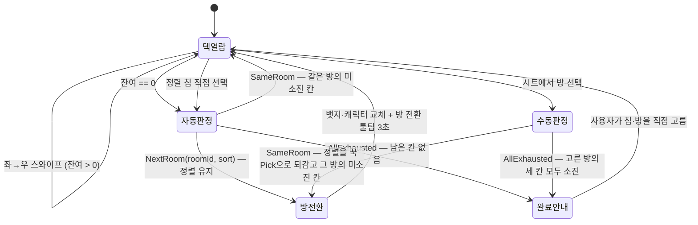
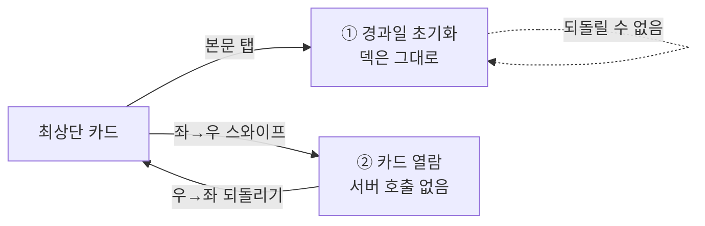

# 데이터 모델: [SCR-003] 홈 탭

**대상 스펙 경로**: `docs/specs/home-deck-exploration`

**계획서**: [plan.md](./plan.md)

> 이 문서는 **현재 상태만** 담는다. 과거 형태를 남기지 않는다.

---

## 1. 도메인 모델 (`:core:domain`)

spec §2.3 「주요 도메인」을 타입으로 옮긴 것이다. 서버 계약에만 존재하거나 다른 화면이 쓰는 필드는 두지 않는다 — [`core/domain/README.md`](../../../core/domain/README.md) §5.

### 1.1 신규

| 타입 | 종류 | 필드 | 근거 |
|---|---|---|---|
| `DeckSort` | enum | `GGUK_PICK` · `LATEST` · `NEAREST` | FR-009·011. **선언 순서가 곧 우선순위**이며 어떤 경우에도 바뀌지 않는다 |
| `PlaceLabel` | enum | `WORTH_VISITING` · `MANY_SAVES` · `MANY_COMMENTS` · `MANY_VIEWS` | FR-008. 서버 `labelGroup`(`worthVisiting`·`manySaves`·`manyComments`·`manyViews`)과 1:1. 표시 문구는 feature가 소유한다 |
| `PlaceCard` | data class | `pinId` · `placeName` · `address` · `imageUrls: List<String>` · `label: PlaceLabel` · `registrant: Registrant` | FR-008, 유저 플로우 1-1. 저장 경과일은 담지 않는다(spec §2.3) |
| `Registrant` | data class | `userId` · `nickname` · `avatarId: Int?` | 카드 헤더의 등록자 아바타 |
| `Deck` | data class | `roomId` · `sort: DeckSort` · `cards: List<PlaceCard>` | FR-004. 서버가 최대 10장으로 잘라 준 것을 그대로 담는다 |
| `DeckContext` | data class | `rooms: List<RoomSummary>` · `currentRoomId` · `currentSort` · `exhausted: Set<DeckKey>` | R-003·R-014의 UseCase 입력. **`rooms`는 순회 순서로 이미 정렬된 목록이다**(FR-012) |
| `DeckKey` | data class | `roomId` · `sort` | 격자의 칸 하나를 가리키는 식별자. 소진 집합·예고 이력의 키 |
| `RoomSummary` | data class | `id` · `name` · `color: RoomColor` · `pinCount: Int` | FR-013·017·018·021. **`pinCount == 0`이면 자동 순회에서 제외**되지만 시트에서는 고를 수 있다(EC-022) |
| `NextDeck` | sealed interface | `SameRoom(sort)` · `NextRoom(roomId, sort)` · `AllExhausted` | R-014의 UseCase 출력. FR-011·012·024·025·014에 대응 |

> **`NextRoom`이 `sort`를 함께 싣는다**(spec 4.0.0 FR-012). 자동 방 전환이 정렬을 유지하게 되면서 「다음 방」과 「그 방의 어느 정렬」이 한 답이 됐다. 종전 `NextRoom(roomId)`는 방이 바뀌면 정렬이 `꾹 Pick`으로 초기화된다는 폐기된 규칙에 기대 정렬을 생략한 형태였다.

### 1.2 기존 재사용

| 타입 | 이 spec에서의 쓰임 |
|---|---|
| `Room` · `RoomColor` | 방 뱃지·캐릭터(FR-021), 홈 방 시트(FR-018) |

> `Room`에는 `pinCount`가 없다. 홈은 FR-013 판정에 이 값이 필요하므로 **기존 `Room`을 넓히지 않고** `RoomSummary`를 따로 둔다 — `Room`은 방 생성·편집 폼이 쓰는 필드만 담는다는 그 타입의 KDoc 규칙을 지킨다.

### 1.3 검증 규칙

| 규칙 | 출처 |
|---|---|
| `Deck.cards.size <= 10` | FR-004 — **서버가 잘라 준다.** 클라이언트가 다시 자르지 않는다 |
| 후보가 10개 미만이면 있는 만큼만 — 채우지 않는다 | FR-004, TS-005 |
| `cards`가 비면 그 덱은 **소진**과 같게 다룬다 | FR-011, spec §2.3 「소진」 |
| 덱 간 중복 장소를 제거하지 않는다 | spec §4 가정 |

---

## 2. 상태 전이

### 2.1 덱 전환 (FR-010·011·012·013)

**판정이 둘로 갈린다**(spec 4.0.0). `자동판정`은 격자 전체를 훑고 정렬을 유지하며, `수동판정`은 고른 방 안만 훑고 정렬을 `꾹 Pick`으로 되감는다. `수동판정`에서 `완료안내`로 가는 화살표가 **고른 방의 얼굴을 단 채** 도착하는 것이 EC-020이다 — 방을 넘기지 않으므로 `방전환`을 거치지 않는다.

위 다이어그램은 상태의 이동만 보인다. **두 판정이 무엇을 고르는지의 규칙은 [`contracts/home-ui.md`](./contracts/home-ui.md) §4.1이 소유한다** — `ResolveNextDeckUseCase`·`ResolveRoomEntryDeckUseCase`의 계약이다. 여기서 다시 쓰지 않는다.

`전환판정`이 자기 자신으로 되돌아오는 화살표가 다이어그램에 없는 이유는, 그것이 상태 이동이 아니라 같은 판정의 재적용이기 때문이다(EC-013).

### 2.2 되돌리기 이력 (FR-002)

| 상태 | 우→좌 스와이프 결과 | 근거 |
|---|---|---|
| 직전에 넘긴 카드가 있음 | 그 카드 1장을 최상단으로 복구하고 이력에서 뺌 | FR-002 |
| 덱 최상단 = 첫 카드 | 아무 변화 없음 | EC-001 |
| 덱이 방금 바뀜 | 이전 덱 카드로 되돌아가지 않음 — 이력이 초기화됨 | EC-003 |
| 그 카드의 상세를 이미 열어봤음 | 카드는 복구되지만 **경과일 초기화는 취소되지 않음** | EC-017 |

**현재 덱 안에서 연속** 지원한다. 넘긴 순서대로 쌓고 **뒤에서부터** 꺼내므로, 되돌아오는 카드는 항상 방금
넘긴 그 카드다. 이력이 비면 아무 변화가 없다(EC-001). 덱이 바뀌면 통째로 비운다(EC-003).

### 2.3 두 「확인 이벤트」 (FR-023)

한 카드에 일어날 수 있는 일이 둘이고 **서로 독립**이다.

| | 무엇이 일으키나 | 무엇을 바꾸나 | 어디에 남나 |
|---|---|---|---|
| **① 경과일 초기화 확인** | 카드 본문 탭 → 상세 이동 | 서버의 `꾹 Pick` 순위 판정값 | 서버 |
| **② 카드 열람 확인** | 좌→우 스와이프 | `Deck.cards`에서 1장 제거 | 화면 상태 |

**둘 다 일어날 수도, 하나만 일어날 수도 있다** — 눌러서 보고 나와 넘기면 둘 다, 그냥 넘기면 ②만, 눌러서 보고 그대로 두면 ①만이다.

### 2.4 진행 상태의 수명 (R-004)

| 값 | 수명 | 근거 |
|---|---|---|
| 현재 정렬 · 덱별 소진 여부 · 되돌리기 이력 | 화면 상태 (재진입 시 초기화) | spec §4 가정 |
| 마지막으로 보던 방 | **영속** (DataStore) — 서버에 올리지도, 묻지도 않음 | FR-022, TS-033 |
| 홈 사용 가이드를 닫은 이력 | **영속** (DataStore) | FR-019, TS-031 |

---

## 3. 화면 상태 (`:feature:home`)

`HomeUiState`는 아래를 담는다. 필드 목록은 계약이고 구현 형태는 구현 단계의 몫이다.

| 필드 | 타입 | 대응 요구사항 |
|---|---|---|
| `phase` | `HomePhase` (`Loading` · `Deck` · `AllExhausted` · `Empty`) | FR-014, FR-020, EC-011 |
| `room` | `RoomSummary?` | FR-021 |
| `sort` | `DeckSort` | FR-009, UX-004 |
| `cards` | `List<PlaceCard>` | FR-004 |
| `isTransitioning` | `Boolean` | UX-001, TS-007 (R-007) |
| `tooltip` | `HomeTooltip?` (`RoomChanged(name)` · `DeckAhead(target)`) | FR-015·016 (R-008) |
| `actionMenuTarget` | `String?` (pinId) | FR-005, UX-002 |
| `rooms` | `List<RoomSummary>` (순회 순서) | FR-018, FR-012 |
| `isRoomSheetOpen` | `Boolean` — 「홈 방 시트」(방 변경) | FR-017·018 |
| `savePicker` | `SavePickerState?` (`pinId` · `selectedRoomIds: Set<String>`) — 「방 선택 시트」(`다른 방 저장`) | FR-005, TS-011a·b, EC-018 |
| `isGuideVisible` | `Boolean` | FR-019 |
| `undoStack` | `List<PlaceCard>` (넘긴 순서, 뒤에서 꺼냄) | FR-002, EC-001·003 |

**시트 상태를 둘로 나눈다**(spec 4.0.0 FR-005·FR-017). 종전에는 「홈 방 시트」 하나를 열어 두고 `pendingSavePinId`가 있으면 저장, 없으면 방 전환으로 갈랐다. 시트가 서로 다른 컴포넌트가 된 지금 그 플래그는 **두 시트 중 어느 것이 열렸는지**를 나타내는 값이 되어버리므로, 상태를 각 시트가 하나씩 갖는다. `savePicker != null`이 곧 「방 선택 시트」가 열렸다는 뜻이고, 선택 집합이 비어 있으면 `저장하기`가 비활성이다(EC-018).

**`phase`가 `Empty`와 `AllExhausted`를 나누는 이유**: 둘은 화면이 다르다(EC-011). `Empty`는 `[공동방 만들기]` CTA를 갖고, `AllExhausted`는 **CTA를 두지 않는다**(FR-014).

**`AllExhausted`는 두 경로로 도달한다**(spec 4.0.0). 격자에 남은 칸이 없을 때(FR-014)와 수동으로 고른 방의 세 칸이 모두 소진일 때(FR-024·EC-020)다. **화면은 같고 `room`만 다르다** — 후자는 고른 방의 뱃지·캐릭터를 단다. 그래서 `phase`에 갈래를 더하지 않는다.

**`isGuideVisible`이 참인 동안 다른 조작 Intent를 전부 버린다**(FR-019, TS-030). 가이드는 `phase`와 직교한다 — 볼 카드가 하나도 없어도 가이드를 먼저 띄우고 닫은 뒤에 빈 상태를 보여준다(EC-016).

---

## 4. 서버 응답 → 도메인 매핑

대조 결과와 미구현 항목은 [`contracts/deck-api.md`](./contracts/deck-api.md)가 소유한다.

| 도메인 | 원천 | 상태 |
|---|---|---|
| `RoomSummary` | `GET /api/v1/rooms` → `data[].id·name·color·pinCount` | **대응 있음** |
| `PlaceCard.placeName·address·imageUrls` | `GET /api/v1/pins` → `data[].place.name·address`, `data[].images` | **대응 있음** |
| `PlaceCard.registrant` | `GET /api/v1/pins` → `data[].createdBy` | **대응 있음** (nullable — 매퍼가 흡수) |
| `Deck` (정렬별 후보) | — | **서버 미구현** → mock (R-001) |
| `PlaceLabel` | — | **서버 미구현** → mock (R-002) |

`RoomColor`는 서버가 `color: string`(예 `"black"`)으로 내려준다. 문자열 → enum 매핑은 기존 `RoomMapper`의 방식을 따르며, 모르는 값은 `RoomColor.GRAY`로 흡수한다.
