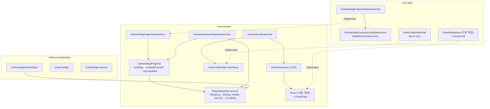
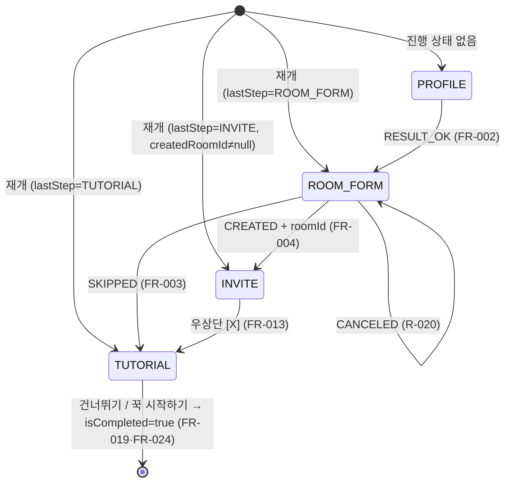

# 데이터 모델: 앱 온보딩 플로우

**대상 스펙 경로**: `docs/specs/onboarding-flow` · **부속 문서**: [plan.md](./plan.md)에 종속된다

> 현재 상태만 담는다. 과거 형태는 남기지 않는다. 타입 이름·필드·관계·검증 규칙까지 정하고 함수 본문은 구현 단계에 남긴다.

---

## 1. 엔티티 지도



**`OnboardingProgress`와 `OnboardingStep`이 도메인에 있는 이유**: 완료 표시를 읽는 주체가 온보딩 밖(스플래시)이다([research.md R-008](./research.md)). feature 안에 두면 그 소비가 불가능하다.

---

## 2. 도메인 모델 (`:core:domain/model/`)

### `OnboardingStep`

```
enum class OnboardingStep { PROFILE, ROOM_FORM, INVITE, TUTORIAL }
```

| 값 | 무엇 | 누가 그리는가 | 근거 |
|---|---|---|---|
| `PROFILE` | 프로필 설정 스텝 | `:feature:profile` (위임) | FR-001·FR-002 |
| `ROOM_FORM` | 공동방 생성 스텝 | `:feature:roomform` (위임) | FR-001·FR-003 |
| `INVITE` | 친구 초대 스텝 | `:feature:onboarding` | FR-004·FR-008~FR-013 |
| `TUTORIAL` | 공유 방법 튜토리얼 스텝 | `:feature:onboarding` | FR-014~FR-020 |

- **선언 순서가 곧 진행 순서다**(FR-001). 다만 `ROOM_FORM`에서 `TUTORIAL`로 건너뛰는 경로가 있어 "다음 값"이 아니라 전이 표([contracts/onboarding-flow-ui.md](./contracts/onboarding-flow-ui.md) §2)가 순서의 소유자다.
- **완료를 값으로 두지 않는다.** 완료는 스텝이 아니라 `isCompleted` 플래그다 — 완료된 설치에는 "머무르는 스텝"이 없다(FR-021·FR-022).
- 튜토리얼 **내부** 스텝(1~5)은 이 enum에 없다. 복원 대상이 아니다(EC-022).

### `OnboardingProgress`

이 앱 설치가 온보딩의 어디까지 왔는지. 설치에 하나만 존재한다(spec §2.3).

| 필드 | 타입 | 기본값 | 제약 | 근거 |
|---|---|---|---|---|
| `lastStep` | `OnboardingStep` | `PROFILE` | 마지막으로 머무른 스텝 | FR-023·FR-024 |
| `createdRoomId` | `String?` | `null` | 온보딩에서 만든 공동방의 id. 건너뛴 설치에서는 계속 `null` | FR-008·EC-021·UX-001 |
| `isCompleted` | `Boolean` | `false` | 한 번 `true`가 되면 되돌아가지 않는다 | FR-021·FR-022 |

- **`createdRoomId`가 진행 상태에 있는 이유**: EC-021이 "친구 초대 스텝에서 중단한 뒤 다시 켜면 직전에 만든 공동방의 초대 링크를 다시 확보한다"를 요구한다. 재개 경로에는 폼의 결과 인텐트가 없으므로 id가 저장돼 있어야 한다.
- **최대 1개 규칙**(UX-001)은 이 필드가 이미 차 있으면 공동방 스텝을 다시 열지 않는 것으로 지켜진다.
- 프로필·개인방의 존재 여부는 여기 담지 않는다. 그것은 프로필·방 스펙의 원천이 갖는다(spec §2.3 "온보딩 결과물").

### `Room` — 기존 모델의 확장

`:core:domain/model/Room.kt`는 [공동방 폼 계획](https://github.com/mash-up-kr/Team-MINO-Android/issues/146)이 소유한다. 이번 범위가 더하는 것은 한 필드다.

| 필드 | 타입 | 제약 | 근거 |
|---|---|---|---|
| `inviteCode` | `String` | swagger `Room.inviteCode` — 최대 16자. 개인방 코드는 초대에 쓸 수 없다 | FR-008 · [research.md R-010](./research.md) |

그 모델의 `data-model.md` §2가 `inviteCode`를 "다른 feature가 필요로 할 때 더한다"로 열어 둔 자리다. 나머지 필드(`type`·`createdAt`·`pinCount`·`memberCount`)는 여전히 넣지 않는다.

---

## 3. 도메인 계약

인터페이스 시그니처와 동작 계약의 소유자는 `contracts/`다.

| 계약 | 소유 문서 |
|---|---|
| `OnboardingProgressRepository` · `ResolveOnboardingStepUseCase` | [contracts/onboarding-progress.md](./contracts/onboarding-progress.md) |
| `InviteLinkBuilder` · `GetInviteLinkUseCase` | [contracts/invite-link.md](./contracts/invite-link.md) |
| `OnboardingLauncher`와 진입 인자 | [contracts/onboarding-launcher.md](./contracts/onboarding-launcher.md) |

---

## 4. 데이터 계층 (`:core:data`)

### 4.1 로컬 저장 — 온보딩 진행 상태

공유 `DataStore<Preferences>`(`core/data/storage/DataStoreModule`, 파일 `mino_preferences`)에 3개 키를 둔다. 새 DataStore 파일을 만들지 않는다([research.md R-007](./research.md)).

| 키 | 타입 | 대응 필드 | 없을 때 |
|---|---|---|---|
| `onboarding_last_step` | `String` (`OnboardingStep.name`) | `lastStep` | `PROFILE` |
| `onboarding_created_room_id` | `String` | `createdRoomId` | `null` |
| `onboarding_completed` | `Boolean` | `isCompleted` | `false` |

- **저장 값이 enum 이름이므로 파싱 실패가 가능하다.** 알 수 없는 값은 `PROFILE`로 떨어뜨린다 — 온보딩을 처음부터 다시 태우는 것이 홈으로 튕기는 것보다 안전하다(SC-002).
- 읽기는 `getProgress()` 한 번의 조회다. `Flow`로 관찰하지 않는다 — 진행 상태를 구독해야 할 화면이 없다.
- 쓰기는 스텝 전환마다 한 번, 완료 시 한 번이다(FR-024).

### 4.2 원격 — 이번 범위가 새로 만드는 API 호출은 없다

| 필요한 것 | 어디서 오는가 | swagger |
|---|---|---|
| 방 조회(초대 코드) | `RoomRepository.getRoom(roomId)` — 공동방 폼 계획 소유 | `GET /api/v1/rooms/{roomId}` |
| 방 생성 | 공동방 폼이 한다 | `POST /api/v1/rooms` |
| 유저 등록(+개인방 생성) | 프로필이 한다 | `POST /api/v1/users` |
| 프로필 존재 판정 | 스플래시가 한다 | `GET /api/v1/users/me` |

`RoomResponse`(DTO)와 `RoomMapper`에 `inviteCode`를 더하는 변경만 이번 범위가 낸다. 그 뒤의 `DataSource`가 아직 인메모리 mock이라는 사실은 [열린 항목 H](./research.md#열린-항목)가 든다.

---

## 5. 화면 상태 (`:feature:onboarding`)

`UiState`·`Intent`·`SideEffect`의 전체 표는 [contracts/onboarding-flow-ui.md](./contracts/onboarding-flow-ui.md)가 소유한다. 여기서는 타입과 소유 관계만 든다.

| 타입 | 자리 | 무엇을 든다 |
|---|---|---|
| `OnboardingFlowUiState` | `flow/vm/` | `isLoading` · `step: OnboardingStep` · `createdRoomId: String?` |
| `OnboardingFlowIntent` · `OnboardingFlowSideEffect` | `flow/vm/` | 스텝 전이 이벤트와 그 결과 실행 지시 |
| `InviteUiState` · `InviteIntent` · `InviteSideEffect` | `invite/vm/` | `isLoading` · `inviteLink: String?` |
| `TutorialStep` | `tutorial/model/` | 스텝 번호 · 안내 문구 · 예시 이미지 리소스 |

- `isLoading`은 상태에 별도 필드로 둔다 — [UiState isLoading 분리형 ADR](../../adr/2026-07-25-uistate-isloading-over-sealed-status.md).
- **릴레이 화면은 상태를 갖지 않는다.** 배경만 그린다([research.md R-005](./research.md)).

### `TutorialStep`

```
enum class TutorialStep { STEP_1, STEP_2, STEP_3, STEP_4, STEP_5 }
```

| 값 | 안내 문구 (Figma 원문) | 노드 |
|---|---|---|
| `STEP_1` | `인스타그램 공유 버튼 찾아서 눌러주기` | `3798-167079` |
| `STEP_2` | `공유 대상 버튼 찾아서 눌러주기` | `3798-167094` |
| `STEP_3` | `앱 목록을 쓸어넘겨 더보기 버튼 눌러주기` | `3798-167109` |
| `STEP_4` | `앱 목록을 쓸어내려 꾹 앱 눌러주기` | `3798-167124` |
| `STEP_5` | `꾹에 공유하기만 하면 지도에 추가 완료` | `3798-167139` |

- 문구는 **Figma 원문을 따른다**(spec §4 가정 — PRD의 `옆으로 넘겨` 표기는 같은 동작의 다른 표현). 문자열 리소스로 `:feature:onboarding`이 소유한다.
- 각 값이 스텝 번호(`1`~`5`)와 예시 이미지 리소스를 함께 든다 — 셋이 한 값에서 나오면 UX-004("서로 다른 스텝을 가리키는 상태가 남지 않는다")가 구조로 보장된다.
- `STEP_5`의 이미지 리소스는 아직 없다 — [열린 항목 C](./research.md#열린-항목).
- **예시 이미지는 조작에 반응하지 않는다**(FR-020·EC-013). 클릭 처리를 붙이지 않는 것으로 지킨다.

---

## 6. 상태 전이 — 온보딩 스텝



**되돌아가는 전이가 없다**(FR-006·FR-007). 다이어그램에 역방향 화살표가 하나도 없는 것이 그 요구사항의 표현이다. 튜토리얼 내부의 스텝 1↔5 이동은 이 다이어그램의 대상이 아니다 — 같은 `TUTORIAL` 안에서 일어난다.

**각 전이는 저장을 동반한다**(FR-024). 어느 전이에서 무엇을 기록하는지와 그것이 전환보다 앞서야 하는 이유는 [contracts/onboarding-flow-ui.md §2.4](./contracts/onboarding-flow-ui.md)가 소유한다.

---

## 7. 검증 규칙

이 feature는 **사용자 입력을 받지 않는다.** 닉네임·방 이름 검증은 두 위임 화면의 몫이다(spec §3.2). 이 문서가 지키는 규칙은 상태 정합성 셋뿐이다.

| 규칙 | 어디서 지키는가 | 근거 |
|---|---|---|
| `lastStep == INVITE`이면 `createdRoomId != null`이다 | `ResolveOnboardingStepUseCase`가 어긋난 조합을 `TUTORIAL`로 떨어뜨린다 | FR-004·SC-004 |
| 한 온보딩에서 `createdRoomId`는 한 번만 채워진다 | 이미 차 있으면 공동방 스텝을 열지 않는다 | UX-001·SC-008 |
| `isCompleted == true`인 설치에는 온보딩을 열지 않는다 | 스플래시의 분기 — 온보딩 밖 | FR-021·SC-003 |
