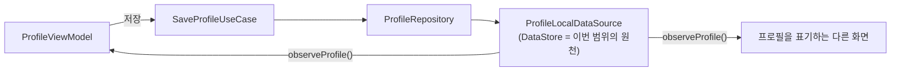

# 데이터 모델: 프로필 설정 및 수정

Phase 1 산출물. 현재 설계 상태만 담는다(개정 시 이 파일은 통째로 대체된다). 결정의 근거는 [`research.md`](research.md), 도메인 표면은 [`contracts/profile-repository-contract.md`](contracts/profile-repository-contract.md)에 있다.

> **범위**: 이번 설계는 원격 API를 연결하지 않는다([research.md D22](research.md#d22-이번-범위의-저장소--로컬-datastore-단독-원격-연동은-후속-작업)). 아래의 모든 저장·조회는 로컬 DataStore 하나로 끝난다.

## 1. 도메인 모델 (`core:domain/model/`)

### `Profile`

```kotlin
data class Profile(
    val nickname: String,
    val avatarId: Int,
)
```

| 필드 | 의미 | 규칙 |
|---|---|---|
| `nickname` | 다른 사람에게 보이는 이름 | 앞뒤 공백이 제거된 값만 담는다. 한글 음절·영문 알파벳만, 길이 2 이상, 클라이언트 상한 없음 (FR-002, EC-008) |
| `avatarId` | 아바타 12종 중 하나를 가리키는 식별자 | 서버 계약(`Avatar { id: integer }`)의 타입을 그대로 따른다. 미선택 저장(EC-002)은 기본 아바타의 id로 채워져 들어온다 |

- 하나의 익명 세션(앱 설치)에 **하나만** 존재한다. 없는 상태는 `Profile?`의 `null`이며 "빈 프로필" 값을 따로 두지 않는다(spec §2.3).
- 닉네임 유효성은 생성자에서 강제하지 않는다. 판정은 `ValidateNicknameUseCase`, 정규화(trim)는 `SaveProfileUseCase`가 한다([research.md D7](research.md#d7-닉네임-검증의-위치--coredomain의-usecase)).
- `avatarId`가 `Int`인 것은 원격이 이연돼도 유지한다. 로컬 사정에 맞춰 타입을 바꿨다가 되돌리면 이미 저장된 값의 형식까지 흔들린다([research.md D18](research.md#d18-아바타-식별자--서버-계약을-따라-int)).

## 2. 저장 흐름



- 이번 범위에서 **원천은 로컬 DataStore 하나**다. 앱 설치가 살아 있는 동안 값이 유지되고, 앱을 지우면 함께 사라진다(spec §4의 "세션은 앱 설치에 묶인다"와 결과가 같다).
- 원격이 붙으면 이 그림에서 `ProfileRepository`와 `ProfileLocalDataSource` 사이에 원격 DataSource가 들어오고 로컬은 캐시로 내려간다. 그때 바뀌는 지점의 전체 목록은 [research.md D24](research.md#d24-원격-연동이-붙을-때-바뀌는-지점을-지금-고정한다)에 있다.
- 오프라인 저장·나중에 동기화는 다루지 않는다(spec §4).

## 3. 저장 계층 (`core:data`)

| 항목 | 내용 |
|---|---|
| 저장소 | 공유 `DataStore<Preferences>`(`storage/DataStoreModule`) — 새 인스턴스를 만들지 않는다 |
| 키 | `profile_nickname`(String) · `profile_avatar_id`(Int) |
| 미저장 판정 | 두 키 중 하나라도 없으면 프로필 없음(`null`) |
| 갱신 시점 | `saveProfile()` 한 곳. 두 키를 같은 `edit {}` 블록에서 함께 쓴다 |

- 두 키를 한 트랜잭션에서 쓰는 이유는 닉네임만 반영되고 아바타가 이전 값으로 남는 중간 상태를 만들지 않기 위해서다.
- 키 이름에 `profile_` 접두어를 두는 것은 같은 DataStore를 쓰는 기존 값(`device_id`)과 섞이지 않게 하기 위해서다.

## 4. 아바타 목록 (`core:design-system` + `:feature:profile`)

```kotlin
enum class MinoProfileAvatar { /* 12항목 */ }   // :core:design-system
```

- 12항목은 **`Person1`~`Person12`**이고 드로어블은 `profile_avatar_person_01`~`_12`다. 선언 순서는 Figma [그리드](https://www.figma.com/design/5P3HE7q8MGc6yAr4rTOSZn/MU_%EB%94%94%EC%9E%90%EC%9D%B8?node-id=2314-95672&m=dev)의 좌→우·상→하 배치 순서이며, 디자인 검수가 12칸을 한 장씩 대조해 확인했다.
- **기본 아바타**는 목록의 첫 항목이다. 미선택 상태의 상단 썸네일과 미선택 저장 값(EC-002)이 모두 이 값을 쓴다.
- enum은 그림만 안다. 저장 식별자·"미선택"·그리드 배치는 갖지 않는다. 소유 근거는 [ADR — 프로필 아바타 12종의 에셋과 컴포넌트는 `:core:design-system`이 소유한다](../../adr/2026-08-25-profile-avatar-assets-in-design-system.md)이다.
- **선택 상태의 시각 표시는 없다.** 원본에 표현이 없어 `selected`는 접근성 시맨틱만 싣는다([research.md D28](research.md#d28-아바타-선택-상태의-시각-표시를-만들지-않는다)).

### enum ↔ `avatarId`(Int) 매핑 — `:feature:profile`이 소유

| 방향 | 규칙 |
|---|---|
| enum → id | **선언 순서를 1부터 매긴 값**(임시). 서버 대응표가 나오면 이 매핑 한 곳만 고친다([research.md D18](research.md#d18-아바타-식별자--서버-계약을-따라-int)) |
| id → enum | 목록에 없는 id는 기본 아바타로 대체한다 — 저장된 값이 목록을 벗어나더라도 화면이 비지 않는다 |

- 임시 매핑이라는 사실은 매핑을 소유한 파일에 주석으로 남긴다. 이 값이 서버와 맞춰지지 않았다는 것이 그 파일만 보고 드러나야 한다.

## 5. 화면 상태 (`:feature:profile`)

```kotlin
data class ProfileUiState(
    val entryPoint: ProfileEntryPoint = ProfileEntryPoint.Onboarding,
    val nickname: String = "",
    val selectedAvatar: MinoProfileAvatar? = null,
    val isNicknameValid: Boolean = false,
    val isNicknameTouched: Boolean = false,
    val isSaving: Boolean = false,
) : UiState
```

| 파생 값 | 계산 | 근거 |
|---|---|---|
| 상단 썸네일 | `selectedAvatar ?: 기본 아바타` | FR-003, UX-005 |
| `저장` 활성 | `isNicknameValid && !isSaving` | FR-004, UX-003 |
| `지우기` 활성 | `isNicknameValid && selectedAvatar != null && !isSaving` | FR-005, EC-012 |
| 오류 표시 | `isNicknameTouched && !isNicknameValid` | FR-011, TS-001 |
| 뒤로가기 노출 | `entryPoint == MyPage` — **거짓이면 버튼을 그리지 않는다**(비활성이 아니라 숨김) | FR-010, EC-001, [D29](research.md#d29-온보딩-진입에서-뒤로가기를-노출하지-않는다) |

- `selectedAvatar`의 `null`은 "고르지 않음"이다. 기본 아바타로 초기화하지 않는다 — 그러면 `지우기` 활성 조건(FR-005)이 첫 화면부터 참이 된다.
- `isNicknameTouched`는 진입 직후(TS-001)에 오류 문구가 뜨지 않게 하는 값이다. 첫 입력에서 참이 되고 `지우기`로 거짓으로 돌아간다.
- 마이페이지 진입의 프리필(FR-006)은 `observeProfile()`의 첫 값으로 `nickname`·`selectedAvatar`를 채우고 `isNicknameValid=true`, `isNicknameTouched=false`로 둔다.
- `isSaving`은 로컬 저장에서 눈에 보이는 시간이 거의 없다. 존재 이유와 검증 방법은 [research.md D25](research.md#d25-저장-실패-경로--통로는-지금-배선하고-발화-원천은-후속-작업에-남긴다)에 있다.
- 화면은 저장이 어디로 나가는지 모른다. `SaveProfileUseCase` 뒤가 로컬인지 원격인지 UiState에 흔적을 남기지 않는다.

```kotlin
enum class ProfileEntryPoint { Onboarding, MyPage }
```

> **JVM 단위 테스트에서 `entryPoint`는 통제되지 않는다.** `savedStateHandle.toRoute<ProfileMain>()`이 스텁 `android.jar`에서 항상 `null`을 돌려주므로 ViewModel의 진입점은 늘 `MyPage`다([research.md D31](research.md#d31-viewmodel-단위-테스트는-isreturndefaultvalues로-열고-진입점은-통제하지-않는다)). 진입점별 분기는 위 파생 값이 순수 계산이므로 `ProfileUiState(entryPoint = ...)`를 직접 세워 검증한다.

- Intent extra 문자열(`onboarding` / `edit`)과의 변환은 `:feature:profile`이 갖는다. 알 수 없는 값은 **`MyPage`로 해석한다** — 뒤로가기를 막는 쪽이 더 강한 제약이라, 잘못된 값 때문에 사용자가 화면에 갇히는 것을 피한다.

## 6. 검증 규칙

| 규칙 | 판정 | 근거 |
|---|---|---|
| 정규화 | 앞뒤 공백 제거 후 판정하고, 저장 값도 제거된 값이다 | FR-002, EC-008 |
| 문자 | 한글 음절(`가`–`힣`)과 영문 알파벳만. 숫자·특수문자·이모지·공백·낱자(`ㄱ`) 불가 | FR-002, spec §4·§5 |
| 길이 | 2자 이상, 클라이언트 상한 없음 | FR-002, TS-017 |
| 공백만 입력 | 정규화 결과가 빈 문자열이므로 무효 | EC-009 |
| 아바타 | 선택 입력. 미선택 저장은 기본 아바타로 보관 | FR-003, EC-002 |

> **서버 규칙과 어긋나는 구간(이번 범위에서는 드러나지 않는다)**: 서버 `Nickname`은 `공백 포함 한글/영문 2~15자`다. 이번 범위에는 서버 거절 경로가 없으므로 16자 이상 닉네임도 그대로 저장되고 아무 실패가 나지 않는다. 어긋남이 사용자에게 처음 보이는 시점은 원격 연동 작업이며, 그전에 spec을 정리하는 편이 낫다([research.md D19](research.md#d19-닉네임-규칙-불일치--클라이언트는-spec을-따르고-서버-거절은-저장-실패로-받는다)).
