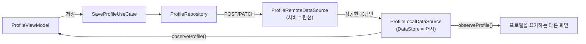

# 데이터 모델: 프로필 설정 및 수정

Phase 1 산출물. 현재 설계 상태만 담는다(개정 시 이 파일은 통째로 대체된다). 결정의 근거는 [`research.md`](research.md), 서버 계약은 [`contracts/profile-api-contract.md`](contracts/profile-api-contract.md), 도메인 표면은 [`contracts/profile-repository-contract.md`](contracts/profile-repository-contract.md)에 있다.

## 1. 도메인 모델 (`core:domain/model/`)

### `Profile`

```kotlin
data class Profile(
    val nickname: String,
    val avatarId: Int,
)
```

| 필드 | 의미 | 규칙 |
|---|---|---|
| `nickname` | 다른 사람에게 보이는 이름 | 앞뒤 공백이 제거된 값만 담는다. 한글 음절·영문 알파벳만, 길이 2 이상, 클라이언트 상한 없음 (FR-002, EC-008) |
| `avatarId` | 아바타 12종 중 하나를 가리키는 서버 식별자 | 서버 `Avatar { id: integer }`를 그대로 따른다. 미선택 저장(EC-002)은 기본 아바타의 id로 채워져 들어온다 |

- 기기당 **하나만** 존재한다. 없는 상태는 `Profile?`의 `null`이며 "빈 프로필" 값을 따로 두지 않는다(spec §2.3).
- 서버 `User`의 `id`·`createdAt`은 도메인 모델에 넣지 않는다. spec에 그 값을 쓰는 요구사항이 없다.
- 닉네임 유효성은 생성자에서 강제하지 않는다. 판정은 `ValidateNicknameUseCase`, 정규화(trim)는 `SaveProfileUseCase`가 한다(research.md D7).

## 2. 원천과 캐시



- **원천은 서버다.** 캐시는 앱 재시작 후 프리필과 앱 전역 표기(SC-003)를 위한 것이며, 원격 응답이 성공했을 때만 갱신된다(research.md D13).
- 오프라인 저장·나중에 동기화는 다루지 않는다(spec §4).

## 3. 캐시 계층 (`core:data`)

| 항목 | 내용 |
|---|---|
| 저장소 | 공유 `DataStore<Preferences>`(`storage/DataStoreModule`) — 새 인스턴스를 만들지 않는다 |
| 키 | `nickname`(String) · `avatar_id`(Int) |
| 미저장 판정 | 두 키 중 하나라도 없으면 프로필 없음(`null`) |
| 갱신 시점 | `registerProfile`·`updateProfile`·`refreshProfile`의 응답을 받은 직후 |

## 4. 아바타 목록 (`core:design-system` + `:feature:profile`)

```kotlin
enum class MinoProfileAvatar { /* 12항목 */ }   // :core:design-system
```

- 12항목의 이름과 에셋 대응은 구현 단계에서 Figma [프로필 이미지 선택 그리드](https://www.figma.com/design/5P3HE7q8MGc6yAr4rTOSZn/MU_%EB%94%94%EC%9E%90%EC%9D%B8?node-id=2314-95672&m=dev) 대조로 확정한다.
- **기본 아바타**는 목록의 첫 항목이다. 미선택 상태의 상단 썸네일과 미선택 저장 값(EC-002)이 모두 이 값을 쓴다.
- enum은 그림과 크기만 안다. 서버 식별자·"미선택"·그리드 배치는 갖지 않는다([방 색상 팔레트 ADR](../../adr/2026-08-14-room-color-palette-in-design-system.md)의 경계를 따른다).

### enum ↔ `avatarId`(Int) 매핑 — `:feature:profile`이 소유

| 방향 | 규칙 |
|---|---|
| enum → id | **선언 순서를 1부터 매긴 값**(임시). 서버 대응표가 나오면 이 매핑 한 곳만 고친다(research.md D18) |
| id → enum | 목록에 없는 id는 기본 아바타로 대체한다 — 서버가 모르는 아바타를 주더라도 화면이 비지 않는다 |

## 5. 화면 상태 (`:feature:profile`)

```kotlin
data class ProfileUiState(
    val entryPoint: ProfileEntryPoint = ProfileEntryPoint.Onboarding,
    val nickname: String = "",
    val selectedAvatar: MinoProfileAvatar? = null,
    val isNicknameValid: Boolean = false,
    val isNicknameTouched: Boolean = false,
    val isSaving: Boolean = false,
) : UiState
```

| 파생 값 | 계산 | 근거 |
|---|---|---|
| 상단 썸네일 | `selectedAvatar ?: 기본 아바타` | FR-003, UX-005 |
| `저장` 활성 | `isNicknameValid && !isSaving` | FR-004, UX-003 |
| `지우기` 활성 | `isNicknameValid && selectedAvatar != null && !isSaving` | FR-005, EC-012 |
| 오류 표시 | `isNicknameTouched && !isNicknameValid` | FR-011, TS-001 |
| 뒤로가기 노출·동작 | `entryPoint == MyPage` | FR-010, EC-001 |

- `selectedAvatar`의 `null`은 "고르지 않음"이다. 기본 아바타로 초기화하지 않는다 — 그러면 `지우기` 활성 조건(FR-005)이 첫 화면부터 참이 된다.
- `isNicknameTouched`는 진입 직후(TS-001)에 오류 문구가 뜨지 않게 하는 값이다. 첫 입력에서 참이 되고 `지우기`로 거짓으로 돌아간다.
- 마이페이지 진입의 프리필(FR-006)은 `observeProfile()`의 첫 값으로 `nickname`·`selectedAvatar`를 채우고 `isNicknameValid=true`, `isNicknameTouched=false`로 둔다.
- 화면은 등록/수정 중 무엇이 호출되는지 모른다. 그 판단은 `SaveProfileUseCase`가 한다(research.md D14).

```kotlin
enum class ProfileEntryPoint { Onboarding, MyPage }
```

- Intent extra 문자열(`onboarding` / `edit`)과의 변환은 `:feature:profile`이 갖는다. 알 수 없는 값은 **`MyPage`로 해석한다** — 뒤로가기를 막는 쪽이 더 강한 제약이라, 잘못된 값 때문에 사용자가 화면에 갇히는 것을 피한다.

## 6. 검증 규칙

| 규칙 | 판정 | 근거 |
|---|---|---|
| 정규화 | 앞뒤 공백 제거 후 판정하고, 저장 값도 제거된 값이다 | FR-002, EC-008 |
| 문자 | 한글 음절(`가`–`힣`)과 영문 알파벳만. 숫자·특수문자·이모지·공백·낱자(`ㄱ`) 불가 | FR-002, spec §4·§5 |
| 길이 | 2자 이상, 클라이언트 상한 없음 | FR-002, TS-017 |
| 공백만 입력 | 정규화 결과가 빈 문자열이므로 무효 | EC-009 |
| 아바타 | 선택 입력. 미선택 저장은 기본 아바타로 보관 | FR-003, EC-002 |

> **서버 규칙과 어긋나는 구간**: 서버 `Nickname`은 `공백 포함 한글/영문 2~15자`다. 16자 이상이거나 가운데 공백이 있는 값은 클라이언트 판정과 서버 판정이 갈리며, 어긋난 요청은 저장 실패로 사용자에게 알려진다(research.md D19). 어느 규칙이 옳은지는 spec 개정이 정할 문제다.
