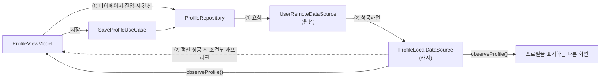

# 데이터 모델: 프로필 설정 및 수정

Phase 1 산출물. 현재 설계 상태만 담는다(개정 시 이 파일은 통째로 대체된다). 결정의 근거는 [`research.md`](research.md), 도메인 표면은 [`contracts/profile-repository-contract.md`](contracts/profile-repository-contract.md), 서버 계약은 [`contracts/profile-api-contract.md`](contracts/profile-api-contract.md)에 있다.

> **범위**: 프로필의 원천은 서버이고 로컬 DataStore는 캐시다([research.md D36](research.md#d36-원격-연동-착수--원천은-서버-로컬-datastore는-캐시)).

## 1. 도메인 모델 (`core:domain/model/`)

### `Profile`

```kotlin
data class Profile(
    val nickname: String,
    val avatar: ProfileAvatar,
)
```

| 필드 | 의미 | 규칙 |
|---|---|---|
| `nickname` | 다른 사람에게 보이는 이름 | 앞뒤 공백이 제거된 값만 담는다. 한글 음절·영문 알파벳만, 길이 2~15자 (FR-002, FR-014, EC-008) |
| `avatar` | 고정 13종 중 하나 | 항상 값이 있다. 미선택 저장(EC-002)은 기본 아바타로 채워져 들어온다 |

- 하나의 익명 세션(앱 설치)에 **하나만** 존재한다. 없는 상태는 `Profile?`의 `null`이며 "빈 프로필" 값을 따로 두지 않는다(spec §2.3).
- 닉네임 유효성은 생성자에서 강제하지 않는다. 판정은 `ValidateNicknameUseCase`, 정규화(trim)는 `SaveProfileUseCase`가 한다([research.md D7](research.md#d7-닉네임-검증의-위치--coredomain의-usecase)).
- **상한 15자는 판정이 아니라 입력 차단이라 도메인에 없다.** `ProfileViewModel`이 입력 시점에 잘라 16자 이상이 도메인에 도달하지 못하게 한다([research.md D51](research.md#d51-닉네임-15자-상한의-강제-지점--viewmodel이-자른다)). 모델·UseCase·Repository 어디에도 상한 검사가 없는 것은 누락이 아니라 그 설계의 결과다.
- 서버 응답의 `id`(uuid)·`createdAt`은 도메인에 올리지 않는다. spec의 어느 요구사항도 그것을 쓰지 않으며, 필요해지는 화면이 생길 때 그 스펙이 판단한다.

### `ProfileAvatar`

```kotlin
enum class ProfileAvatar {
    /* 선택 12항목 — 선언 순서는 디자인 목록의 좌→우·상→하 */
    /* 기본 아바타 1항목 — 마지막에 선언한다 */
    ;
    companion object { val Default: ProfileAvatar = /* 기본 아바타 */ }
}
```

- **아바타는 도메인 개념이다** — spec §2.3이 "사용자가 고를 수 있는 12종과, 아무것도 고르지 않았을 때 쓰이는 기본 아바타 1종을 합쳐 모두 13종. 프로필은 언제나 이 13종 중 하나를 가리킨다"로 정의하고, spec §4가 목록을 서버에서 내려받지 않는다고 확정했다.
- **13번째가 기본 아바타다**(FR-015). 선택 목록에 놓이지 않고, 미선택 상태의 상단 썸네일·미선택 저장 값(EC-002)·서버가 모르는 값이나 `null`을 보냈을 때의 대체값이 모두 이것이다. **"값 없음"이 아니라 고르지 않은 프로필이 갖게 되는 값이다** — [`RoomColor.GRAY`](../../../core/domain/src/main/kotlin/team/mino/core/domain/model/RoomColor.kt)와 같은 성격이며, 근거는 [research.md D53](research.md#d53-기본-아바타의-자리--도메인은-13항목-디자인-시스템-팔레트는-12종-그대로)이다.
- **`selectable` 목록을 두지 않는다.** 선택 가능한 12종을 순회하는 곳은 아바타 그리드 하나인데, 그리드는 도메인이 아니라 `MinoProfileAvatar.entries`(12종)를 순회하므로 필터가 필요 없다. `RoomColor`가 `selectable`을 가진 것과 갈리는 지점이다.
- 그림·에셋을 갖지 않는다. **무엇인지**만 알고 **어떻게 보이는지**는 `:core:design-system`의 `MinoProfileAvatar`가 안다([아바타 ADR](../../adr/2026-08-25-profile-avatar-assets-in-design-system.md)). 서버 문자열도 알지 않는다 — 그 표는 `:core:data`의 `ProfileMapper`가 소유한다.
- 구조는 [`RoomColor`](../../../core/domain/src/main/kotlin/team/mino/core/domain/model/RoomColor.kt)와 동형이다(도메인 enum / 디자인 시스템 표현 / feature 대응 / 매퍼의 서버 표). 근거는 [research.md D37](research.md#d37-아바타-식별자--도메인-profileavatar-enum-서버-표현은-avatarcolor-문자열).
- **기본 아바타의 단일 출처는 `ProfileAvatar.Default`다.** 어느 레이어도 그 값을 다시 유도하지 않는다 — feature에 `DefaultProfileAvatar` 같은 사본을 두지 않는다(plan 5.x까지 있던 상수는 이 개정에서 없어진다).

## 2. 데이터 흐름



- **원천은 서버, 로컬은 캐시다.** 저장은 `원격 성공 → 캐시 갱신` 순서이고, 원격이 실패하면 캐시를 건드리지 않는다([repository 계약 §저장의 불변식](contracts/profile-repository-contract.md)).
- 읽기는 언제나 `observeProfile()` 하나다. 캐시가 있어 앱 재시작 후에도 프리필이 서고, 값이 바뀌면 표기 지점이 한꺼번에 갱신된다(SC-003, [D9](research.md#d9-앱-전체-즉시-반영--observeprofile-flowprofile)).
- `refreshProfile()`은 **마이페이지 진입 시** 한 번 돈다. 프리필의 원천을 서버로 맞추고(FR-006), 등록 여부를 캐시에 확정한다([D38](research.md#d38-등록수정-분기--서버에-직접-묻고-캐시가-그-답을-들고-있는다)).
- 온보딩 진입에서는 갱신하지 않는다. 스플래시가 같은 `GET /api/v1/users/me`로 미등록을 확정해 연 화면이라, 갱신은 같은 401을 한 번 더 받고 이미 빈 캐시를 다시 비우는 것으로 끝난다 — 앱 시작 경로에 결과가 0인 왕복이 얹힌다. 판정은 `ProfileEntryPoint.needsRefresh`가 소유한다.
- **그때 캐시가 비어 있다는 것은 보장이다.** 스플래시의 `ProfileRegistrationRepository.isRegistered()`가 미등록으로 판정하며 캐시를 비운다 — 서버가 모르는 세션의 캐시는 정의상 맞지 않는 값이다. 이 보장이 없으면 위 등록·수정 분기가 낡은 캐시를 보고 `PATCH`로 갈라진다([D50](research.md#d50-진입-시-갱신--마이페이지-진입에서만-건다)).
- 오프라인 저장·나중에 동기화는 다루지 않는다(spec §4). 네트워크가 없으면 저장은 실패하고 입력값은 화면에 남는다(FR-012).
- **원천 자리의 `UserRemoteDataSource`는 이 feature가 만든 타입이 아니다.** splash-screen이 먼저 만들었고 이 feature가 세 함수를 더한다([D49](research.md#d49-develop-통합-재대조--user-태그-엔드포인트의-소유자는-userapiservice-하나다)). 같은 인터페이스의 `isRegistered()`는 스플래시의 진입 판정용이고 이 흐름에 끼지 않는다.

### 등록·수정 판정

| 캐시 상태 | 저장 시 호출 | 어떻게 그 상태가 됐나 |
|---|---|---|
| 비어 있음 | `POST /api/v1/users` (등록 + 개인방 생성) | `refreshProfile()`이 `401 USER_NOT_REGISTERED`를 받아 비웠거나, 스플래시의 `isRegistered()`가 미등록으로 판정하며 비웠다 |
| 값 있음 | `PATCH /api/v1/users/me` (수정) | `refreshProfile()` 또는 직전 저장이 채웠다 |

- 등록이 `409 USER_ALREADY_REGISTERED`로 실패하면 저장 실패로 다룬다. 다음 진입의 `refreshProfile()`이 캐시를 복구해 `PATCH`로 돌아온다.
- 진입점(`ProfileEntryPoint`)은 이 판정에 쓰지 않는다. 뒤로가기와 저장 후 목적지에만 쓴다.

## 3. 저장 계층 (`core:data`)

### 원격 DTO (`network/dto/`)

| 타입 | 형태 | 비고 |
|---|---|---|
| `ProfileRequest` | `nickname: String` · `avatar: AvatarRequest(color: String)` | 등록·수정이 같은 본문을 쓴다. 언제나 두 값을 함께 보낸다 |
| `ProfileResponse` | `id` · `nickname` · `avatar: AvatarResponse?(color)` · `createdAt` | `avatar`가 `null`일 수 있다(서버 문서상 nullable) |
| `MinoResponse<T>` | `data: T` | **이미 있는 타입을 쓴다 — 만들지 않는다.** 봉투 해제는 `ApiService`에서 끝난다([ADR 2026-08-27](../../adr/2026-08-27-response-envelope-unwrapped-in-apiservice.md)) |
| `ErrorResponse` | `errorCode: String` · `message: String?` | 공용. 읽는 곳은 `UserApiService`의 `401` 판정 헬퍼 하나이고 `hasProfile()`·`getMe()`가 공유한다 |

원문 스키마와 협의 항목은 [API 계약](contracts/profile-api-contract.md)이 소유한다.

**세 DTO를 부르는 서비스는 `UserApiService`다** — `ProfileApiService`를 만들지 않는다. `user` 태그 엔드포인트의 소유자가 이미 있고 splash-screen이 그것을 쓰고 있다([D49](research.md#d49-develop-통합-재대조--user-태그-엔드포인트의-소유자는-userapiservice-하나다) · [API 계약 §3](contracts/profile-api-contract.md)). DTO 자체의 형태는 이 결정에 영향받지 않는다.

### 로컬 캐시 (`datasource/` + `storage/`)

| 항목 | 내용 |
|---|---|
| 저장소 | 공유 `DataStore<Preferences>`(`storage/DataStoreModule`) — 새 인스턴스를 만들지 않는다 |
| 키 | `profile_nickname`(String) · `profile_avatar`(String) |
| 아바타 저장 값 | **`ProfileAvatar`의 이름**이지 서버 문자열이 아니다. 캐시가 서버 표현을 들면 서버가 표현을 바꿀 때 고칠 곳이 매퍼 밖으로 하나 더 생긴다 |
| 미저장 판정 | 두 키 중 하나라도 없으면 캐시 없음(`null`) |
| 갱신 시점 | `saveProfile()`(원격 성공 후)과 `refreshProfile()`(조회 성공 후) 두 곳. 두 키를 같은 `edit {}` 블록에서 함께 쓴다 |
| 비움 | `refreshProfile()`이 미등록을 확인했을 때만. 두 키를 같은 `edit {}`에서 지운다 |
| 마이그레이션 | 두지 않는다. 앱이 배포된 적이 없어 기기에 남은 `profile_avatar_id`(Int)를 지킬 이유가 없다 |

- 두 키를 한 트랜잭션에서 쓰는 이유는 닉네임만 반영되고 아바타가 이전 값으로 남는 중간 상태를 만들지 않기 위해서다.
- 키 이름의 `profile_` 접두어는 같은 DataStore를 쓰는 다른 값과 섞이지 않게 한다.

### `ProfileEntry` (`:core:data` 내부 DTO)

```kotlin
internal data class ProfileEntry(val nickname: String, val avatarName: String)
```

- 로컬 DataSource가 도메인 모델을 반환하지 않게 하는 자리다. 이것으로 [`core:data` README](../../../core/data/README.md) §5·§2("DataSource는 DTO만 반환, 변환 없음")를 지킨다([D42](research.md#d42-로컬-캐시-datasource는-profileentry-dto를-반환한다)).
- `ProfileEntry` ↔ `Profile` 변환은 `ProfileMapper`가 하고, 경계는 `ProfileRepositoryImpl`이다.

### 아바타 문자열 표 — `ProfileMapper`가 소유

서버가 `avatar.color`를 **13개 `enum`**으로 확정했고, 그 목록은 방 대표 색 팔레트와 같다. 12종 아바타는 그중 12색(`gray` 제외)에 1대1로 대응한다.

> **값 표의 소유자는 [API 계약 §2 아바타 값 표](contracts/profile-api-contract.md) 하나다.** 여기에 옮겨 적지 않는다 — 서버가 색 하나를 바꿀 때 고칠 곳이 둘이 되면 반드시 갈라진다([헌법 원칙 I](../../constitution.md)).

- 대응의 근거는 추정이 아니라 **에셋 실측**이다 — 아바타 배경 원 색 11개가 디자인 시스템 토큰과 hex 단위로 일치하고, 12개가 선택 가능한 12색을 중복 없이 덮는다([research.md D44](research.md#d44-아바타-서버-문자열--12종이-방-팔레트-12색에-1대1로-대응한다)). `Person10` → `brown`만 소거법이라 디자인 확인 항목으로 남아 있다.
- **표를 선언 순서에서 파생하지 않는다.** 위 대응은 `RoomColor`의 선언 순서와 어긋나므로 `ordinal`로 이으면 조용히 틀린 값이 나간다. 도메인 이름이 바뀌었을 때 서버 계약이 따라 바뀌어서도 안 된다([`RoomMapper`](../../../core/data/src/main/java/team/mino/core/data/repository/mapper/RoomMapper.kt)와 같은 판단).
- **13번째 색은 기본 아바타가 갖는다.** plan 5.x까지 "보내지 않는다"로 두었던 것이 이 개정에서 뒤집혔다 — 프로필에도 "고르지 않음" 상태가 실재하고(FR-015), 서버 `enum`에 그 자리가 이미 있다([D53](research.md#d53-기본-아바타의-자리--도메인은-13항목-디자인-시스템-팔레트는-12종-그대로)). [`RoomMapper`](../../../core/data/src/main/java/team/mino/core/data/repository/mapper/RoomMapper.kt)가 미선택 방을 13번째 색으로 확정해 보내는 것과 같다.
- **받는 쪽**: 표에 없는 문자열과 `null` 아바타는 기본 아바타로 읽는다. 서버가 팔레트를 넓혔다는 이유로 프로필 조회가 실패하면 안 된다. 13번째 색과 `null`이 같은 곳으로 모이므로, 서버가 둘 중 무엇을 주든 화면은 같게 선다.

## 4. 아바타 그림 (`core:design-system` + `:feature:profile`)

```kotlin
enum class MinoProfileAvatar { /* 12항목 */ }   // :core:design-system — 이 개정에서도 그대로다

@Composable
fun MinoProfileAvatarImage(avatar: MinoProfileAvatar?, /* ... */)   // null이면 기본 그림
```

- 12항목은 **`Person1`~`Person12`**이고 드로어블은 `profile_avatar_person_01`~`_12`다. 선언 순서는 Figma [그리드](https://www.figma.com/design/5P3HE7q8MGc6yAr4rTOSZn/MU_%EB%94%94%EC%9E%90%EC%9D%B8?node-id=2314-95672&m=dev)의 좌→우·상→하 배치 순서다.
- enum은 그림만 안다. 저장 식별자·"미선택"·그리드 배치를 갖지 않는다. 소유 근거는 [ADR](../../adr/2026-08-25-profile-avatar-assets-in-design-system.md)이다.
- **기본 아바타는 이 열거에 들어가지 않는다.** 그림은 모듈이 갖되(에셋 한 장 추가) 항목이 아니라 `MinoProfileAvatarImage`의 `avatar == null` 갈래가 그린다. [`MinoRoomColor`](../../../core/design-system/src/main/java/team/mino/core/designsystem/component/roomcolorchip/MinoRoomColor.kt)가 회색 기본값을 팔레트에서 빼고 소비처의 `null`에 맡기는 것과 같은 형태다([D53](research.md#d53-기본-아바타의-자리--도메인은-13항목-디자인-시스템-팔레트는-12종-그대로)).
- 덕분에 **아바타 그리드는 이 개정에서 한 줄도 바뀌지 않는다** — `entries`가 여전히 12개라 4열 × 3행이 그대로 서고, 기본 아바타를 걸러 내는 필터가 필요 없다.
- **선택 상태의 시각 표시는 없다.** 원본에 표현이 없어 `selected`는 접근성 시맨틱만 싣는다([research.md D28](research.md#d28-아바타-선택-상태의-시각-표시를-만들지-않는다)).

### `ProfileAvatar` ↔ `MinoProfileAvatar` 매핑 — `:feature:profile`이 소유

| 방향 | 시그니처 | 규칙 |
|---|---|---|
| 도메인 → 그림 | `ProfileAvatar.image: MinoProfileAvatar?` | 13항목을 전수 `when`으로 적고 **기본 아바타만 `null`** 로 간다 |
| 그림 → 도메인 | `MinoProfileAvatar.profileAvatar: ProfileAvatar` | 12항목 전수 `when`. 기본 아바타로 가는 입력이 없다 |

- **선언 순서에서 파생하지 않는다.** `ordinal`로 이으면 어느 한쪽에 항목이 끼어들어도 컴파일이 통과해 그 지점부터 조용히 어긋난 그림이 나온다. 전수 `when`은 목록이 늘면 컴파일을 깨 두 목록을 함께 고치도록 강제한다(§4 서버 문자열 표와 같은 판단).
- 이 매핑은 서버를 모른다. 서버 문자열은 `:core:data`에 갇혀 있고 feature까지 오지 않는다.
- **`image`가 `null`을 내는 것이 프리필을 옳게 만든다.** 서버가 기본 아바타로 저장된 프로필을 주면 `selectedAvatar = null`, 즉 "고르지 않음"으로 복원된다 — 실제 상태가 그러하므로 `지우기` 활성 조건(FR-005)도 옳게 계산된다.

## 5. 화면 상태 (`:feature:profile`)

```kotlin
data class ProfileUiState(
    val entryPoint: ProfileEntryPoint = ProfileEntryPoint.Onboarding,
    val nickname: String = "",
    val selectedAvatar: MinoProfileAvatar? = null,
    val isNicknameValid: Boolean = false,
    val isNicknameTouched: Boolean = false,
    val isSaving: Boolean = false,
) : UiState
```

| 파생 값 | 계산 | 근거 |
|---|---|---|
| 상단 썸네일 | **파생 값이 아니다** — `selectedAvatar`를 `MinoProfileAvatarImage`에 그대로 넘기고, `null`이면 컴포넌트가 기본 그림을 그린다 | FR-003, FR-015, UX-005 |
| `저장` 활성 | `isNicknameValid && !isSaving` | FR-004, UX-003 |
| `지우기` 활성 | `isNicknameValid && selectedAvatar != null && !isSaving` | FR-005, EC-012 |
| 오류 표시 | `isNicknameTouched && !isNicknameValid`. 이 값이 참이면 필드가 오류 상태가 되고 **안내 문구 자리의 글자도 함께 갈린다**(§7) | FR-011, TS-001, TS-025 |
| 닉네임 상한 | 파생 값이 아니라 **쓰기 시점의 불변식**이다 — `nickname`에는 15자를 넘는 값이 들어가지 않는다(`NicknameChanged` 처리가 자른다). 화면에 카운터·상한 안내를 그리지 않는다 | FR-014, UX-007 |
| 뒤로가기 노출 | `entryPoint == MyPage` — **거짓이면 버튼을 그리지 않는다**(비활성이 아니라 숨김) | FR-010, [D29](research.md#d29-온보딩-진입에서-뒤로가기를-노출하지-않는다) |

- **UiState의 필드는 원격이 붙어도 바뀌지 않는다.** 화면은 저장이 어디로 나가는지 모른다 — 등록인지 수정인지도, 서버가 응답했는지도 UiState에 흔적을 남기지 않는다.
- `selectedAvatar`의 `null`은 "고르지 않음"이다. 기본 아바타로 초기화하지 않는다 — 그러면 `지우기` 활성 조건(FR-005)이 첫 화면부터 참이 된다.
- **`displayedAvatar` 파생 프로퍼티는 없다.** plan 5.x까지 `selectedAvatar ?: DefaultProfileAvatar`로 썸네일 값을 계산하던 자리인데, 컴포넌트가 `null`을 직접 다루게 되면서 필요가 없어졌다. 저장이 넘기는 도메인 값도 같은 이유로 `selectedAvatar?.profileAvatar ?: ProfileAvatar.Default`가 되어, **기본 아바타의 단일 출처가 도메인 하나로 모인다**([D53](research.md#d53-기본-아바타의-자리--도메인은-13항목-디자인-시스템-팔레트는-12종-그대로)).
- `isNicknameTouched`는 진입 직후(TS-001)에 오류 문구가 뜨지 않게 하는 값이다. 첫 입력에서 참이 되고 `지우기`로 거짓으로 돌아간다.
- **프리필(FR-006)은 두 번 돈다**([research.md D45](research.md#d45-프리필과-갱신의-순서--캐시로-먼저-채우고-갱신이-성공하면-조건부로-한-번-더)).
  1. 진입 즉시 `observeProfile()`의 **첫 값**(캐시)으로 `nickname`·`selectedAvatar`를 채우고 `isNicknameValid=true`, `isNicknameTouched=false`로 둔다.
  2. 마이페이지 진입이라 `refreshProfile()`이 돌고 그것이 성공하면, **`isNicknameTouched == false && !isSaving`일 때만** 갱신된 캐시 값으로 한 번 더 채운다. 온보딩 진입에서는 1번만 돈다.
- **흐름을 계속 구독하지 않는다.** 구독하면 저장 직후 흘러나온 값이 그 사이 사용자가 입력한 것을 덮어쓴다. 그래서 "계속 듣기"가 아니라 "갱신이 성공한 그 시점에 한 번 더 읽기"다. 두 가드는 각각 사용자가 이미 타이핑을 시작한 경우와 갱신 응답이 저장 왕복 중에 도착한 경우를 막는다.
- **`isSaving`은 이제 눈에 보인다.** 네트워크 왕복만큼 지속되므로 중복 저장 차단(UX-003·EC-004)이 기기에서도 확인된다([D25](research.md#d25-저장-실패-경로--통로는-지금-배선하고-발화-원천은-후속-작업에-남긴다) 보정).
- 진입 시 갱신이 도는 동안 별도 로딩 상태를 두지 않는다. 캐시가 있으면 그것이 즉시 프리필되고, 없으면 빈 화면이 정상 상태(온보딩)이기 때문이다. spec에 진입 로딩 표현이 없으므로 만들지 않는다 — 갱신을 기다렸다가 프리필하지 않는 이유도 같다.

```kotlin
enum class ProfileEntryPoint { Onboarding, MyPage }
```

> **JVM 단위 테스트에서 `entryPoint`는 통제되지 않는다.** `savedStateHandle.toRoute<ProfileMain>()`이 스텁 `android.jar`에서 항상 `null`을 돌려주므로 ViewModel의 진입점은 늘 `MyPage`다([research.md D31](research.md#d31-viewmodel-단위-테스트는-isreturndefaultvalues로-열고-진입점은-통제하지-않는다)). 진입점별 분기는 위 파생 값이 순수 계산이므로 `ProfileUiState(entryPoint = ...)`를 직접 세워 검증한다.

- Intent extra 문자열(`onboarding` / `edit`)과의 변환은 `:feature:profile`이 갖는다. 알 수 없는 값은 **`MyPage`로 해석한다** — 뒤로가기를 막는 쪽이 더 강한 제약이라, 잘못된 값 때문에 사용자가 화면에 갇히는 것을 피한다.

## 6. 검증 규칙

| 규칙 | 판정 | 근거 |
|---|---|---|
| 정규화 | 앞뒤 공백 제거 후 판정하고, 저장 값도 제거된 값이다 | FR-002, EC-008 |
| 문자 | 한글 음절(`가`–`힣`)과 영문 알파벳만. 숫자·특수문자·이모지·공백·낱자(`ㄱ`) 불가 | FR-002, spec §4·§5 |
| 길이(하한) | 2자 이상 — `ValidateNicknameUseCase`가 판정하고 미달은 **오류 상태** | FR-002, TS-012 |
| 길이(상한) | 15자 — `ProfileViewModel`이 입력 시점에 자르고, 초과는 **오류가 아니다**. 카운터도 없다 | FR-014, UX-007, TS-017·TS-020·TS-021 |
| 공백만 입력 | 정규화 결과가 빈 문자열이므로 무효 | EC-009 |
| 아바타 | 선택 입력. 미선택 저장은 **기본 아바타(선택 12종 밖의 값)** 로 보관하며 12종 중 하나로 바꿔치지 않는다 | FR-003, FR-015, EC-002, TS-023 |

> **서버 규칙과 이제 완전히 같다**: 서버는 `minLength 2 · maxLength 15 · pattern ^[가-힣A-Za-z]+$`다(2026-08-31 조회). 4.x가 들고 있던 두 어긋남이 **서로 다른 쪽에서** 닫혔다 — **상한**은 [spec 3.0.0](spec.md)이 15자를 채택해서, **공백**은 서버가 `pattern`에서 공백을 빼서다([research.md D52](research.md#d52-서버-문서-재조회2026-08-31--닉네임-pattern에서-공백이-빠졌다)). **클라이언트가 통과시킨 닉네임을 서버가 길이·문자로 거절하는 경로가 없다.** 경위는 [API 계약 §2](contracts/profile-api-contract.md)의 소멸 항목이 소유한다.

## 7. 닉네임 안내 문구 (`:feature:profile`)

필드 아래 안내 문구 자리는 **하나**이고, 그 자리에 놓이는 글자가 오류 여부로 갈린다(FR-011).

| 상태 | 문구 | 색 |
|---|---|---|
| 평상시 | `최대 15자까지 입력할 수 있어요.` | 평상시 |
| `isNicknameErrorVisible` | `한글·영문 2글자 이상을 입력해주세요.` | 오류 |

- 두 문자열은 `:feature:profile`의 `strings.xml`이 갖고, **고르는 것은 화면**이다. `ProfileUiState`에 문구 필드를 두지 않는다 — 갈림의 조건이 이미 있는 파생 값과 같고, 상태가 리소스 식별자를 알 이유가 없다([research.md D54](research.md#d54-닉네임-안내-문구--평상시와-오류를-다른-문구로-가른다)).
- **상한용 오류 문구는 없다.** 상한 초과는 입력 차단이 막아 오류 상태가 생기지 않으므로(FR-014), 상한은 평상시 문구가 **미리** 알려 주는 것으로만 드러난다(UX-007).
- 플레이스홀더 `한글·영문 2글자 이상`은 그대로다 — 값이 비었을 때만 보이므로 위 두 문구와 자리가 겹치지 않는다.
