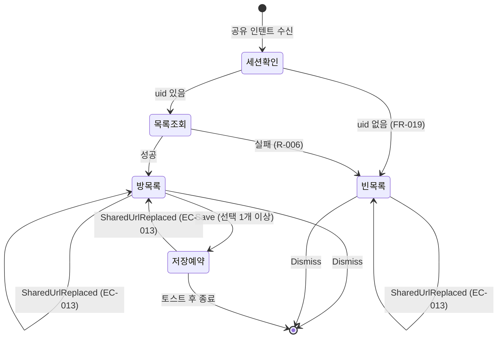

# 데이터 모델: 외부 공유 수신 방 선택 바텀시트

**대상 스펙 경로**: `docs/specs/shared-link-receiver`

**명세서**: [spec.md](./spec.md) · **계획**: [plan.md](./plan.md)

이 문서는 [plan.md](./plan.md)에 종속된 부속 산출물이며 독자 버전을 갖지 않는다. 현재 설계 상태만 담는다.

레이어별 자리는 [`core/domain/README.md`](../../../core/domain/README.md) §5와 [`core/data/README.md`](../../../core/data/README.md) §3이 소유한다. 이 문서는 **이 feature가 더하는 타입**만 정의한다.

---

## 1. 도메인 모델 (`:core:domain/model`)

### 1.1 `RoomType`

방의 두 갈래. 목록 정렬(FR-005)의 판정값이다.

| 값 | 의미 | 서버 표현 |
|---|---|---|
| `PERSONAL` | 개인방. 목록 최상단에 고정된다 | `"personal"` |
| `GROUP` | 공동방 | `"shared"` |

- 서버 문자열과 도메인 값의 대응은 `RoomSummaryMapper`만 안다([`core/domain/README.md`](../../../core/domain/README.md) §5).
- 알 수 없는 문자열은 `GROUP`으로 흡수한다 — 개인방은 사용자당 하나뿐이고 서버가 새 종류를 더하더라도 최상단 고정 대상이 아니다.

### 1.2 `RoomSummary`

방 선택 목록의 한 항목. 기존 `Room`(방 생성·편집 폼 전용)과 별개의 타입이다 — 근거는 [research.md R-009](./research.md).

| 필드 | 타입 | 의미 | 근거 |
|---|---|---|---|
| `id` | `String` | 저장 요청에 실리는 방 식별자 | FR-010 |
| `name` | `String` | 방 이름 | FR-006 |
| `description` | `String` | 방 설명. 개인방은 빈 문자열 | FR-006 |
| `type` | `RoomType` | 목록 최상단 고정 판정 | FR-005 |
| `color` | `RoomColor` | 썸네일 폴백 배경 | FR-006, [research.md R-003](./research.md) |
| `placeCount` | `Int` | 그 방에 저장된 장소 수 | FR-006 |
| `thumbnailImageUrls` | `List<String>` | 썸네일 콜라주 이미지. 최대 4장, 서버 미대응 구간에서는 빈 목록 | FR-006 |

**검증 규칙**

- `description`은 nullable이 아니다. 서버의 `null`은 `RoomSummaryMapper`가 빈 문자열로 흡수한다 — 기존 `Room`과 같은 규칙이다.
- `placeCount`는 0 이상이다. 이 값은 방 전체의 장소 수일 뿐 **이번 공유의 중복 여부를 뜻하지 않는다**(spec §4 가정).
- `thumbnailImageUrls`는 **이미지 URL만** 담는다. 서버 `thumbnailList`에는 저장된 핀이 없을 때 색상 키가 1개 섞여 오는데, `RoomSummaryMapper`가 URL 스킴으로 걸러 버린다([contracts/room-list-api.md §2](./contracts/room-list-api.md), [research.md R-022](./research.md)).
- `thumbnailImageUrls`가 4장을 넘으면 앞 4장만 쓴다. 판정은 `RoomSummaryMapper`가 한다.

### 1.3 `SharedPlaceSaveRequest`

한 번의 공유에서 사용자가 확정한 **예약 단위**. spec §2.3의 「저장 선택(Save Selection)」에 대응한다.

**이 타입이 곧 실행 단위다.** 서버 계약이 `roomIds` 배열을 받으므로 `SharedPlaceRepositoryImpl`이 이 타입을 **쪼개지 않고** 워커 하나에 그대로 싣는다([research.md R-021](./research.md)).

| 필드 | 타입 | 의미 | 근거 |
|---|---|---|---|
| `url` | `String` | 공유받은 원문 URL | FR-002 |
| `roomIds` | `List<String>` | 사용자가 고른 방들 | FR-007, FR-010 |

**검증 규칙**

- `roomIds`는 비어 있지 않다. 비어 있으면 `[저장하기]`가 비활성이라 이 타입이 만들어지지 않는다(FR-009).
- `url`의 도메인을 클라이언트가 검사하지 않는다 — 판정은 서버가 한다([research.md R-002](./research.md)).

---

## 2. Repository 계약 (`:core:domain/repository`)

### 2.1 `RoomRepository` — 함수 추가

기존 인터페이스에 목록 조회 하나를 더한다. 기존 세 함수는 그대로 둔다.

```
suspend fun getRooms(): List<RoomSummary>
```

- 정렬 책임을 갖지 않는다. 개인방 최상단 고정(FR-005)은 UseCase가 판정한다.
- 실패는 `MinoDomainException`으로 던진다 — 기존 세 함수와 같은 규칙이다.

### 2.2 `SharedPlaceRepository` — 신설

```
fun scheduleSave(request: SharedPlaceSaveRequest)
```

- **`suspend`가 아니다.** 예약은 즉시 반환하고 전송 결과를 기다리지 않는다 — FR-011·UX-006이 요구하는 "토스트 후 즉시 물러남"이 여기에 걸린다.
- 반환값이 없고 던지지도 않는다. 이 함수가 확정하는 것은 "요청이 예약됐다"까지이며, 서버는 `202`로 접수만 하고 결과는 비동기로 갈린다([contracts/shared-place-save-api.md](./contracts/shared-place-save-api.md)).
- **예약은 방 개수와 무관하게 1건이다.** 방 단위 분해는 서버가 한다([research.md R-021](./research.md)).
- **전송용 함수를 도메인에 두지 않는다.** 워커는 `:core:data` 안에서 `PinRemoteDataSource`를 직접 호출한다([research.md R-017](./research.md)).

### 2.3 `AnonymousAuthRepository` — 함수 추가

기존 인터페이스에 조회 하나를 더한다. `ensureSession()`은 그대로 둔다.

```
suspend fun currentSession(): AnonymousSession?
```

- 로컬에 유지된 세션을 **네트워크 왕복 없이** 돌려주고, 없으면 `null`이다. 던지지 않는다.
- 확보(`ensureSession`)와 조회(`currentSession`)가 짝을 이룬다. **이 진입점은 조회만 쓴다** — 세션이 없어도 새로 확보하지 않고 빈 목록으로 넘긴다(FR-019, [research.md R-012](./research.md)).
- feature 모듈이 `:core:data`의 `internal` 제공자에 직접 닿을 수 없어 도메인 표면으로 올린 것이다. 근거는 [research.md R-020](./research.md).

---

## 3. UseCase (`:core:domain/usecase`)

| UseCase | 시그니처 | 규칙 | 근거 |
|---|---|---|---|
| `ExtractSharedUrlUseCase` | `operator fun invoke(sharedText: String): String?` | 텍스트에서 URL을 훑어 **가장 앞의 하나**만 반환. 하나도 없으면 `null` | FR-002, EC-002, EC-003 |
| `GetRoomPickerRoomsUseCase` | `suspend operator fun invoke(): List<RoomSummary>` | `RoomRepository.getRooms()`를 호출하고 **`PERSONAL`을 최상단으로** 정렬. 나머지는 서버가 준 순서를 유지 | FR-005, spec §4 가정(정렬 기준 없음) |

- 두 UseCase 모두 정렬·추출이라는 비즈니스 규칙을 가지므로 ViewModel 직접 호출 조건([`core/domain/README.md`](../../../core/domain/README.md) §4)을 만족하지 않는다.
- 저장 요청은 UseCase를 두지 않는다. ViewModel이 `SharedPlaceRepository.scheduleSave()`를 직접 호출하며, 그 사이에 판단이 없다 — 선택된 방을 `roomIds`로 옮기는 것이 전부다.
- **워커는 `SharedPlaceRepository`를 거치지 않는다.** 전송은 `:core:data` 안에서 `PinRemoteDataSource`로 곧장 간다([research.md R-017](./research.md)).

---

## 4. 데이터 레이어 DTO (`:core:data/network/dto`)

| DTO | 방향 | 대응 계약 |
|---|---|---|
| `MinoResponse<T>` | 응답 봉투 | 모든 엔드포인트 공통 — [research.md R-018](./research.md) |
| `RoomSummaryResponse` | 응답 | [contracts/room-list-api.md](./contracts/room-list-api.md) |
| `PinCreateRequest` | 요청 | [contracts/shared-place-save-api.md](./contracts/shared-place-save-api.md) — `url` + `roomIds` |

- DTO는 서버 계약만 표현하고 도메인 모델을 의존하지 않는다. 변환은 `repository/mapper/RoomSummaryMapper.kt`가 맡는다([`core/data/README.md`](../../../core/data/README.md) §7).
- 응답에 서버가 필드를 더해도 `ignoreUnknownKeys = true`가 흡수한다 — 썸네일 필드가 붙는 경로가 이것이다([contracts/room-list-api.md §2](./contracts/room-list-api.md)).
- `MinoResponse<T>`는 `ApiService`에서만 쓰인다. `DataSource` 위로는 알맹이만 올라간다.

### 4.1 워커 입력 (`androidx.work.Data`)

`SharedPlaceSaveWorker` 하나가 요청 하나를 담당하므로 입력도 요청 하나 몫이다.

| 키 | 타입 | 의미 |
|---|---|---|
| `url` | `String` | 공유받은 원문 URL |
| `roomIds` | `Array<String>` | 사용자가 고른 방 전부 |

- 두 값 중 하나라도 없거나 `roomIds`가 비어 있으면 워커를 예약한 쪽의 버그다. 도메인 예외로 감싸지 않는다([research.md R-016](./research.md)).
- **워커를 방 개수만큼 만들지 않는다.** 서버가 배열을 받으므로 분해가 서버 몫으로 돌아갔다([research.md R-021](./research.md)).

---

## 5. UI 상태 (`:feature:sharereceiver`)

MVI 기반 타입의 정의는 [`core/common/android/README.md`](../../../core/common/android/README.md)가 단일 출처다. 여기서는 이 화면의 슬롯만 적는다.

### 5.1 `ShareReceiverUiState`

| 필드 | 타입 | 의미 | 근거 |
|---|---|---|---|
| `rooms` | `ImmutableList<RoomPickerItem>` | 표출할 방 카드 목록 | FR-005 |
| `selectedRoomIds` | `ImmutableSet<String>` | 체크된 방. 단계 전환·스크롤에도 유지된다 | FR-007, TS-016 |
| `sheetStep` | `SheetStep` | `Peek` / `Full` | FR-008 |

**파생 값** — 상태로 저장하지 않고 계산한다.

- `isSaveEnabled = selectedRoomIds.isNotEmpty()` (FR-009)
- `isEmpty = rooms.isEmpty()` — 방 0개와 조회 실패가 같은 화면으로 수렴한다(FR-013, [research.md R-006](./research.md))

### 5.2 `RoomPickerItem`

`RoomSummary`를 카드가 그릴 수 있는 형태로 옮긴 UiModel.

| 필드 | 타입 | 비고 |
|---|---|---|
| `id` | `String` | |
| `name` | `String` | |
| `description` | `String?` | 빈 문자열은 `null`로 접어 카드의 `Show memo=off`에 대응시킨다 |
| `placeCountLabel` | `String` | `"장소 N개"` 포맷은 UI 레이어가 정한다 |
| `thumbnailImageUrls` | `ImmutableList<String>` | |
| `color` | `MinoRoomColor?` | 썸네일 폴백. `null`은 회색 방 |

- **`color`는 도메인 값이 아니라 팔레트 값이다.** `RoomSummary.color`(`RoomColor`)를 이 UiModel로 옮기면서 `:core:design-system`의 `MinoRoomColor?`로 바꾼다. `RoomColor.GRAY`가 `null`이 되며, 이 변환이 [방 색상 팔레트 ADR](../../adr/2026-08-14-room-color-palette-in-design-system.md)이 "매핑은 feature가 소유한다"고 정한 그 자리다. `placeCountLabel`을 포맷된 문자열로 담는 것과 같은 성격 — 카드가 그릴 수 있는 형태로 옮긴다.
- **중복 여부 필드를 두지 않는다.** FR-016·FR-017에 따라 시트를 그리는 시점에는 어떤 장소인지조차 모르므로 판정 자체가 성립하지 않는다.
- **멤버 아바타 필드를 두지 않는다.** FR-006이 명시적으로 제외한다.

### 5.3 `SheetStep`

`PEEK`·`FULL` 두 값을 갖는 `enum`이다. **각 단계의 dp 값과 방 개수별 분기는 [contracts/room-picker-sheet-ui.md §3.1](./contracts/room-picker-sheet-ui.md)이 소유한다** — 이 타입은 어느 단계인지만 들고 높이를 알지 않는다.

방 개수와 무관하게 단계 구성은 같다. 방이 적으면 카드 아래 공간이 빌 뿐 값이 줄지 않는다(EC-005, TS-020).

### 5.4 `ShareReceiverIntent`

| 의도 | 발생 | 결과 |
|---|---|---|
| `ToggleRoom(roomId)` | 카드 영역 어디든 탭 | `selectedRoomIds` 토글 (UX-003) |
| `Save` | `[저장하기]` 탭 | 선택한 방 전체를 담은 워커 **하나** 예약 → `SideEffect.SavedAndFinish` ([research.md R-021](./research.md)) |
| `Dismiss` | 뒤로가기·딤 탭·아래 드래그 | `SideEffect.Finish` (FR-012, EC-001) |
| `ChangeStep(step)` | 드래그 | `sheetStep` 갱신 |
| `SharedUrlReplaced(url)` | 시트가 떠 있는 동안 새 공유가 도착 | `savedStateHandle[KEY_SHARED_URL]`을 덮고 `selectedRoomIds`를 비운다. `rooms`는 유지한다 (EC-013 · [research.md R-024](./research.md)) |

### 5.5 `ShareReceiverSideEffect`

| 효과 | 의미 | 근거 |
|---|---|---|
| `SavedAndFinish` | 저장 완료 토스트를 띄우고, 사라지면 Activity를 종료한다 | FR-010, FR-011, UX-006 |
| `Finish` | 토스트 없이 Activity를 종료한다 | FR-012 |

---

## 6. 상태 전이



- `세션확인`은 `AnonymousAuthRepository.currentSession()` 한 번이다(§2.3). 네트워크 왕복이 없어 이 구간이 시트 표출을 붙잡지 않는다.
- `세션확인`·`목록조회` 구간에 로딩·대기 표현을 두지 않는다(UX-009, TS-009). 시트는 이미 떠 있고 카드 자리만 나중에 채워진다.
- `저장예약` 이후의 성공·중복·실패는 이 화면이 알지 못한다. 결과는 알림함으로 전달된다(FR-014, FR-015, UX-007).
- `SharedUrlReplaced`는 **새 상태를 만들지 않는다.** 어느 상태에 있든 링크와 선택만 갈아끼우고 그 자리에 머문다 — `저장예약`에서 들어오면 토스트를 걷고 `방목록`으로 되돌아간다. 이미 예약된 워커는 취소하지 않는다([contracts/share-intent.md §2.3](./contracts/share-intent.md)).
- `저장예약`은 방 개수와 무관하게 요청 하나다. 한 방의 실패가 다른 방을 되돌리지 않는다는 보장(spec §4 가정, TS-019)은 **서버가** 방마다 갈라 처리하는 것으로 성립한다([research.md R-021](./research.md)).
