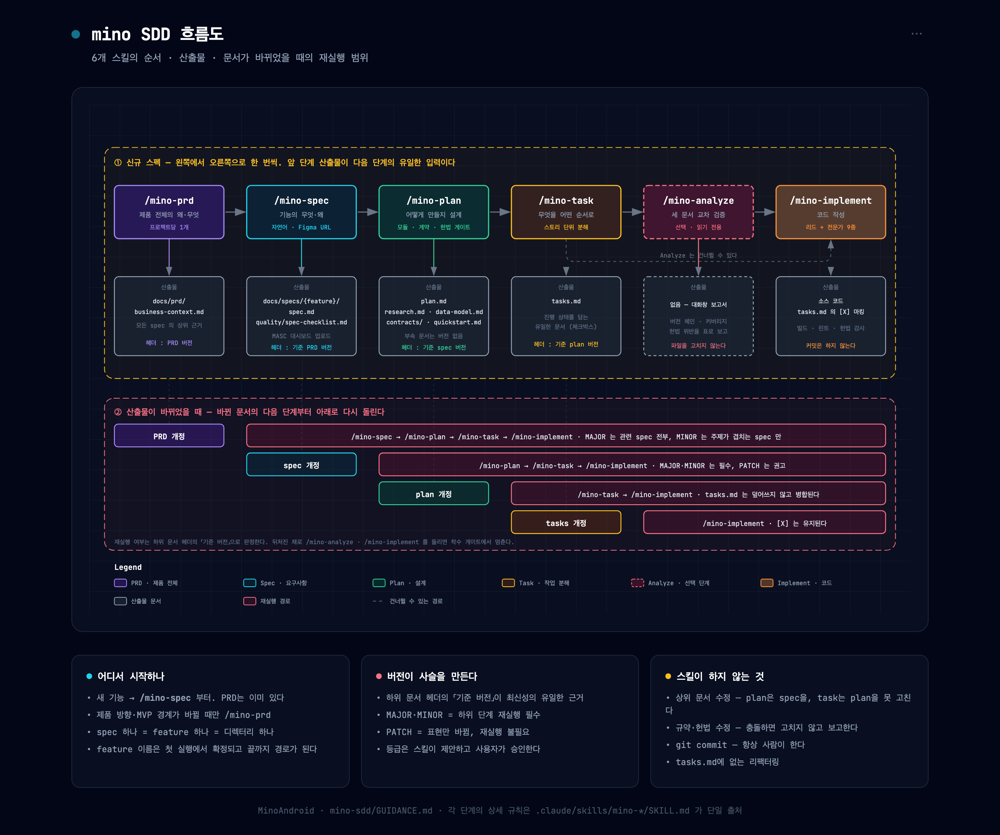

# mino SDD 사용 가이드

## 1. 개요

기능을 바로 만들지 않고 **문서로 먼저 확정한 뒤 그 문서를 따라 만드는** 방식(Spec-Driven Development)이다.
`/mino-` 로 시작하는 6개 스킬이 각 단계를 담당하고, Claude Code 대화창에서 슬래시 커맨드로 부른다.

세 가지만 기억하면 된다.

- **앞 단계의 산출물이 다음 단계의 유일한 입력이다.** plan은 spec만 보고, task는 plan만 본다. 대화에서 한 말은 힌트일 뿐 근거가 아니다.
- **각 스킬은 자기 산출물만 고친다.** plan 단계에서 spec이 잘못된 걸 발견해도 스킬이 spec을 고치지 않는다. 보고만 하고, 고치려면 `/mino-spec`을 다시 돌린다.
- **문서 헤더의 「기준 버전」이 사슬을 만든다.** `plan.md`에는 "기준 spec 버전"이 적혀 있고, 이 값이 상위 문서의 현재 버전과 어긋나면 뒤처진 것이다. 재실행이 필요한지는 이 값으로 판정한다.



## 2. 스킬별 요약

각 스킬의 상세 규칙은 `.claude/skills/mino-*/SKILL.md`가 단일 출처다. 이 표는 "언제 부를지" 고르기 위한 것이다.

| 스킬 | 하는 일 | 전제조건 | 산출물 |
|---|---|---|---|
| [`/mino-prd`](../.claude/skills/mino-prd/SKILL.md) | 제품이 왜 존재하고 무엇을 성공으로 보는지, MVP 경계를 확정 | 없음. 대신 **인자(설명·초안 링크)가 반드시 있어야 한다** | `docs/prd/business-context.md` (프로젝트당 1개) |
| [`/mino-spec`](../.claude/skills/mino-spec/SKILL.md) | 기능 하나의 **무엇·왜**를 요구사항으로 확정 | PRD가 있으면 읽어서 근거로 삼는다(없어도 동작). feature 이름 승인 게이트를 통과해야 파일이 생긴다 | `docs/specs/{feature}/spec.md`<br>`docs/specs/{feature}/quality/spec-checklist.md` |
| [`/mino-plan`](../.claude/skills/mino-plan/SKILL.md) | spec의 무엇·왜를 **어떻게**로 옮기는 설계 | 같은 디렉터리에 `spec.md`. 헌법(`docs/constitution.md`)으로 게이트 검사 | `plan.md`<br>`research.md` · `data-model.md` · `contracts/` · `quickstart.md` |
| [`/mino-task`](../.claude/skills/mino-task/SKILL.md) | 설계를 **무엇을 어떤 순서로**의 작업 목록으로 분해 | `plan.md` 필수. `spec.md`는 커버리지 검증 기준 | `tasks.md` (T001… 체크박스) |
| [`/mino-analyze`](../.claude/skills/mino-analyze/SKILL.md) | spec·plan·tasks 교차 검증 — 누락·중복·모호·헌법 위반 탐지 | 세 문서가 **모두** 있어야 한다 | 없음. 대화창 보고서만 (읽기 전용, 파일을 고치지 않는다) |
| [`/mino-implement`](../.claude/skills/mino-implement/SKILL.md) | tasks.md의 작업을 실제로 구현 | `tasks.md` + 버전 체인 통과 + `quality/` 체크리스트 완료 | 소스 코드, `tasks.md`의 `[X]` 마킹 |

몇 가지 부연:

- **인자 없이 불러도 된다.** `/mino-plan` 처럼 대상 없이 부르면 `docs/specs/` 목록을 보여주고 고르게 한다. 단 `/mino-prd`와 `/mino-spec`은 설명이 곧 입력이라 인자가 필요하다.
- **`/mino-spec`은 Figma URL을 입력으로 받을 수 있다.**
- **`/mino-analyze`는 선택이다.** 바로 `/mino-implement`로 넘어가도 되지만, `/mino-task`가 미결 사항이나 커버리지 공백을 보고했다면 먼저 돌리는 게 좋다.
- **`/mino-implement`는 혼자 일하지 않는다.** 메인 세션이 리드가 되고 레이어별 전문가 서브에이전트에게 작업을 배정한다. 구조는 [ADR 2026-08-09](../docs/adr/2026-08-09-implement-agent-orchestration.md) 참고.

## 3. 흐름

### a. 새 기능을 만들 때

```
/issue → /mino-spec → /mino-plan → /mino-task → (/mino-analyze) → /mino-implement → /done → /pr
```

1. **[`/issue`](../.claude/commands/issue.md)** — GitHub 이슈를 만들고 develop에서 작업 브랜치를 딴다.
2. **`/mino-spec <기능 설명>`** — 먼저 feature 이름을 제안하고 승인을 받는다. 이 이름이 이후 모든 산출물의 경로(`docs/specs/{feature}/`)가 되므로 여기서 확정한다.
   중간에 `[TBD]` 질문이 3개씩 끊어서 온다. 답하면 spec에 기록되고, 판단이 어려우면 `검토`로 답해 미결로 남길 수 있다.
   완료되면 **MASC 대시보드 업로드 안내**가 나온다 — 업로드는 사람이 직접 한다.
3. **`/mino-plan`** — 리서치와 설계를 하고 헌법 게이트를 검사한다. 다른 feature에도 구속력을 갖는 결정이 나오면 ADR 승격을 제안한다.
4. **`/mino-task`** — 사용자 스토리 단위로 작업을 쪼갠다.
5. **`/mino-analyze`** (선택) — 세 문서를 맞대 본다. CRITICAL이 나오면 구현 전에 해소한다.
6. **`/mino-implement`** — 착수 게이트(버전 체인 + 체크리스트)를 통과하면 구현이 시작된다. 진행 상황은 로그로 실시간 알림이 온다.
7. **[`/done`](../.claude/commands/done.md) → [`/pr`](../.claude/commands/pr.md)** — 커밋과 PR. **스킬은 절대 커밋하지 않는다.**

PRD는 이 흐름에 없다. 이미 있는 문서이고, 제품 방향이나 MVP 경계 자체가 바뀔 때만 `/mino-prd`를 부른다.

### b. 중간 산출물이 바뀌었을 때

이미 만든 문서를 고쳐야 하면 **파일을 직접 수정하지 말고 같은 스킬을 다시 부른다.** 재실행이 개정 모드로 동작하면서 기존 내용 위에 제자리 편집을 하고, 아래 것들을 보존한다.

- `tasks.md`의 체크 상태 (`[X]`) — 재실행해도 진행 기록이 살아남는다
- `research.md`의 기각 이력 — 지우지 않고 누적한다
- `spec.md`의 TBD 문답 기록

바뀐 문서 아래로 다시 돌린다.

| 바뀐 것 | 다시 돌릴 것 |
|---|---|
| PRD | `/mino-spec` → `/mino-plan` → `/mino-task` → `/mino-implement` |
| spec | `/mino-plan` → `/mino-task` → `/mino-implement` |
| plan | `/mino-task` → `/mino-implement` |
| tasks | `/mino-implement` |

어디까지 다시 돌릴지는 **개정 등급**이 정한다. 등급은 스킬이 근거와 함께 제안하고 사용자가 승인한다.

- **MAJOR** — 확정된 경계가 바뀐 변경. 하위 단계 재실행 필수.
- **MINOR** — 기존 것을 유지한 채 늘어난 변경. 하위 단계 재실행 필수.
- **PATCH** — 표현·오타·링크 수준. 재실행 불필요.

뒤처진 상태로 다음 단계를 부르면 `/mino-analyze`와 `/mino-implement`가 착수 게이트에서 멈춘다. MAJOR 뒤처짐이면 중단하고 재실행을 안내하며, MINOR면 계속할지 물어본다. **PRD가 뒤처진 것은 게이트가 아니다** — 다른 feature의 개정으로도 PRD 버전은 오르기 때문이다.

## 4. 자주 막히는 지점

- **"spec이 잘못됐는데 plan 단계에서 고쳐주지 않아요"** — 의도된 동작이다. 각 스킬은 상위 문서를 고치지 않는다. `/mino-spec`을 다시 돌린다.
- **"규약이랑 spec이 충돌해요"** — 스킬이 설계로 봉합하지 않고 보고한다. 규약을 바꿀지 spec을 바꿀지는 사람이 정한다.
- **"체크리스트가 미완료라고 구현이 안 시작돼요"** — `docs/specs/{feature}/quality/` 아래 체크리스트에 `- [ ]`가 남아 있는 상태다. 진행 여부를 물어보므로 답하면 되지만, 남은 항목을 먼저 확인하는 게 낫다.
- **"작업 ID 순서가 문서 순서랑 달라요"** — 정상이다. 한 번 부여한 ID는 바뀌지 않으므로 개정을 거치면 순서가 어긋난다. 실행 순서는 Phase 구분과 "의존성" 섹션이 말한다.
